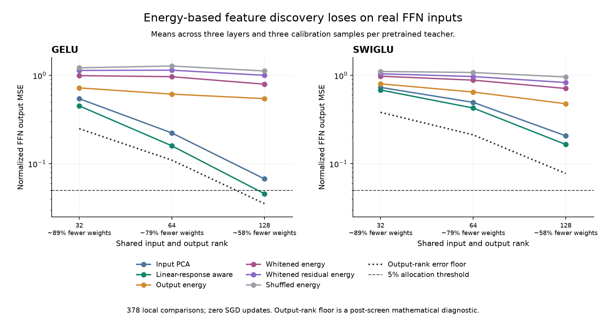

# H105: synthetic label-energy discovery does not transfer to these FFNs

All three fixed energy/projection recipes are **rejected**. The Gaussian
mechanism from H103/H104 does not beat simpler input PCA or activation-aware
linear response on these real Transformer FFN inputs. No neural fitting is
allocated to this branch, and no language-quality improvement is claimed.

The screen completes 378 local comparisons in 82.18 seconds, with zero SGD
updates. An independent process recaptures all 18 input/output datasets through
the full decoder and checks every projection score, matrix, basis and parameter
count. Score tolerance is 1e-7 absolute plus 1e-5 relative, using a different
batch partition and explicit factor algebra; this is not a claim of bitwise scores.

## Primary rank-64 result

Normalized output MSE divides squared error by teacher output variation about
its training mean. Lower is better; zero is the original FP32 FFN function.

| Method | GELU mean error | SwiGLU mean error |
|---|---:|---:|
| pca | 0.2233 | 0.4958 |
| weight_input | 0.1934 | 0.5002 |
| linear_aware | 0.1596 | 0.4279 |
| energy | 0.6146 | 0.6492 |
| white_energy | 0.9670 | 0.8848 |
| white_residual | 1.1471 | 0.9718 |
| white_permuted | 1.2794 | 1.0807 |

Values average three depths and three calibration seeds per teacher.
Whitening and fitting affine residual energy do not repair the failed energy
signal here. Passing a shuffled-label comparison alone is insufficient: the
useful target is a competitive small FFN, not merely nonzero supervision.



## Why a cheap input initializer is insufficient

A full affine fit still leaves appreciable output error, especially for SwiGLU.
The projection must preserve nonlinear behavior, not just high-variance inputs.
The activation-aware linear baseline is stronger than the energy proposals,
but it too exceeds the 5% local reconstruction budget at rank 64.

Post-screen, we measured an output-rank obstruction. Every tested model has
a final r-dimensional linear output subspace. For a finite centered teacher
output matrix, the squared singular-value tail is the best possible error of
any affine rank-r output prediction, regardless of its input-side nonlinearity.
This is the [Eckart-Young identity](https://doi.org/10.1007/BF02288367),
not a novelty-priority claim. Reported bounds are FP64 numerical evaluations
of the analytical result, not interval-arithmetic certificates.

The saved outputs use BF16 teacher execution. We subtract their measured
distance to fresh FP32 outputs using the reverse triangle inequality. If V
is the FP32 output variance, t is the BF16 squared singular-value tail divided
by N*d*V, and delta is BF16/FP32 MSE divided by V, the FP32 lower bound is:

    normalized MSE >= max(0, sqrt(t) - sqrt(delta))^2

The oracle SVD uses reporting outputs solely for this post-screen bound; no
model or hyperparameter is fitted from it. It cannot be reported as a learned
model. It concerns this local function and this dataset, not Transformer
residual outputs, next-token NLL, or what a network can learn from scratch.

| Output rank | GELU mean error floor | SwiGLU mean error floor |
|---|---:|---:|
| 32 | 0.2498 | 0.3823 |
| 64 | 0.1098 | 0.2125 |
| 128 | 0.0353 | 0.0777 |

The rank-64 mean floors are about **11% for GELU and 21% for SwiGLU**.
Consequently, the frozen 5% threshold was unattainable for this output-rank
class on these datasets even with an ideal input-side function. This was
discovered after the screen; it is not an initialization-specific failure.
Energy's additional regression versus simpler controls remains measured.
Future compression screens should check the output-rank floor before a grid.

This bound quantifies a limitation of a global output bottleneck. It does not
reject structured full-rank maps, grouped bottlenecks, or learned models that
change the surrounding network. The original architectural goal remains open.

## Memory, timing and actual cost

Rank-64 GELU/SwiGLU use 247,680 / 248,192 parameters, about 79% fewer than
the corresponding 1,179,648-weight full FFNs. Original hidden widths remain
1536 / 1024, so this does not imply a similar activation-memory reduction.

| Teacher / method | Rank-64 inference ms | Local inference peak MiB | Calibration pipeline peak MiB |
|---|---:|---:|---:|
| gelu / original FFN | 0.333 | 20.12 | — |
| gelu / pca | 0.257 | 17.57 | 109.28 |
| gelu / linear_aware | 0.243 | 17.57 | 109.28 |
| gelu / energy | 0.259 | 17.57 | 109.28 |
| gelu / white_energy | 0.260 | 17.57 | 109.28 |
| gelu / white_residual | 0.255 | 17.57 | 109.28 |
| swiglu / original FFN | 0.486 | 22.12 | — |
| swiglu / pca | 0.375 | 18.70 | 107.47 |
| swiglu / linear_aware | 0.344 | 18.70 | 107.47 |
| swiglu / energy | 0.347 | 18.70 | 107.47 |
| swiglu / white_energy | 0.345 | 18.70 | 107.47 |
| swiglu / white_residual | 0.344 | 18.70 | 107.47 |

Collection retains the full pretrained teacher on GPU. The pipeline peak takes
the maximum of collection and compressed inference, so low student storage
does not erase teacher/calibration costs. Statistics are fitted on CPU FP64.
All methods share collected pairs; per-collection times and full estimator
times are retained. This screen computes all estimators as a diagnostic grid,
not as a claimed optimal single-method preprocessing implementation.

Native inference is batch 256, FP32, after warmup with CUDA synchronization.
Local inference peaks use 512-row evaluation batches and include parameter
storage and temporary tensors. They exclude CPU pairs, CUDA driver/context
and other processes. No training-memory, generation-latency or total-training
cost claim follows. Previous teacher training is reused and was not free.

## Data, correctness and limitations

The teachers are existing audited seed-17, 3,200-update WikiText-2 full GELU
and SwiGLU models. Layers 0, 3 and 7 are tested. Each calibration seed draws
256 nonoverlapping 128-token training-cache windows (32,768 tokens), then
64 disjoint reporting windows (8,192 tokens). Seeds vary sampling, not teacher
training; neighboring tokens within a window are correlated. The teacher
has already trained on this corpus. This is not unseen-corpus evidence.

Capture uses BF16 model execution; all means, bases and weights use calibration
data only. Evaluation compares FP32 models on captured FFN inputs, with
BF16/FP32 target drift separately reported. No validation/test tokens or NLL
evaluation are used. Ranks 32/64/128 are all reported without selecting a winner.

Nineteen initial qualification checks verify exact factorization, input
gradients, full-rank identity, the linear-response optimum and capture parity
with full decoder execution. Finite forward outputs do not certify stable
training gradients; this screen has no optimizer trajectory.

[Frozen plan and algebra](real_subspace_plan.md),
[all-rank statistics and gates](../results/real_subspace_v1/summary.json),
[all 378 rows](../results/real_subspace_v1/metrics.csv.gz),
[independent audit](../results/real_subspace_v1/audit.json),
[rank diagnosis](../results/real_subspace_v1/rank_diagnosis.json).

Source is under results/real_subspace_v1/source; the reusable capture helper
is src/core/ffn_capture.py. The active FFN factory and training defaults are
unchanged. Data/checkpoints stay local; full results are also packed losslessly.

```powershell
uv run --no-sync python -m results.real_subspace_v1.source.audit
uv run --no-sync python -m results.real_subspace_v1.source.diagnose
uv run --no-sync python -m results.real_subspace_v1.source.analyze
uv run --no-sync python -m results.real_subspace_v1.source.plot
```

[ASVD](https://arxiv.org/abs/2312.05821), [SVD-LLM](https://arxiv.org/abs/2403.07378)
and [IO-SVD](https://arxiv.org/abs/2605.15626) are relevant established compression
precedents. This study does not reproduce their full systems or claim SOTA.
