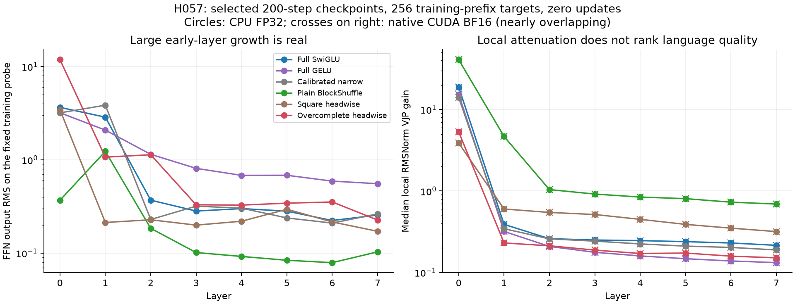

# H057: Local attenuation is real; the proposed causal explanation is unproven

**The diagnosis does not justify a normalization or optimizer repair.** The
candidate has lower local RMSNorm gradient gain than full SwiGLU and narrow,
but full GELU has still lower gain and better held-out quality. Within the
candidate, lower-rate runs have much larger local gains yet worse quality.
The simple claim that the measured attenuation explains H056's loss deficit
is therefore insufficient. H056 remains rejected for promotion.

An exact function symmetry also changes parameter-gradient magnitudes without
changing predictions. This confirms why those raw norms alone cannot diagnose
vanishing gradients or compare functional sensitivity across parameterizations.

## Fixed checkpoint diagnosis

The [frozen plan](residual_geometry_plan.md) specifies six selected H056 endpoints
and their reconstructed initializations, plus two lower-rate candidate endpoints:
**14 CPU FP32 probes and six native CUDA BF16 probes**. Every probe uses the same
first 256 training-prefix inputs and next-token targets at batch 2/context 128.
A disposable candidate copy adds one function-symmetry forward/backward check.
There are **zero optimizer updates and zero validation/test targets scored**.
Probe cross entropy is recorded for diagnosis, not used as a quality ranking.

All eight checkpoint sources and cache hashes verify. Initial narrow width
calibration is applied once; loaded trained weights are not recalibrated. The
sampler state stays unchanged. Parameters are unchanged by probes; the temporary
rescaling is restored exactly. No modified checkpoint is saved.

## The measured local gradient effect

The [derivation](normalization_geometry.md) uses s=sqrt(mean(x^2)+1e-5) and
g, the loss adjoint at one RMSNorm output:

    J_N(x)^T g = (gamma*g)/s - x*mean(x*gamma*g)/s^3.

This is the local VJP through that norm, not the total gradient of the residual
stream. Its independent FP64 formula matches actual module autograd in all
**340 norm invocations**: maximum relative L2 error **9.882e-8 CPU** and
**9.356e-8 GPU**. Tokenwise input-RMS, inverse-scale, radial-gain and actual
adjoint-gain quantiles are retained. The table summarizes geometric means of
median local gains over FFN norms in layers 1-7; layer 0 is excluded by plan.

| Selected recipe | CPU local gain | BF16 local gain | Retained H056 validation NLL |
|---|---:|---:|---:|
| Full SwiGLU | 0.256747 | 0.256803 | 5.907694 |
| Full GELU | 0.175102 | 0.175146 | 5.879278 |
| Calibrated narrow | 0.234474 | 0.234548 | 5.912434 |
| Plain BlockShuffle | 1.061755 | 1.061585 | 5.970604 |
| Square headwise | 0.441467 | 0.441533 | 6.021328 |
| Overcomplete headwise | 0.181615 | 0.181587 | 6.043891 |

Native BF16 candidate/control ratios are **0.7071 vs full SwiGLU**, **0.7742
vs narrow**, **1.0368 vs full GELU**, 0.1711 vs BlockShuffle and 0.4113 vs square
headwise. CPU and BF16 agree on every ordering. The full GELU counterexample
is material: lower local gain coexists with better language quality. These
descriptive endpoint comparisons do not isolate a training cause.

| Candidate peak LR | CPU later local gain | Retained H056 validation NLL |
|---|---:|---:|
| 0.0003 | 5.223436 | 6.303587 |
| 0.0006 | 1.450492 | 6.134152 |
| 0.0012 | 0.181615 | 6.043891 |

The larger gains at lower rates do not rescue their quality. This does not
prove that scale is irrelevant; it rejects using larger gain as a sufficient
quality criterion. Likewise, the residual derivative includes an identity term,
so multiplying isolated norm gains would not prove whole-network vanishing.

Aggregate output RMS also hides substantial token variation. At layer 1's FFN
norm input, candidate tokenwise RMS p10/median/p90 is **1.622 / 4.261 / 22.702**,
versus full SwiGLU **1.408 / 2.481 / 6.263**. Its fixed training-probe layer-0
FFN output RMS is 11.858 versus 3.650. These values differ from H056's recorded
validation-input probe (13.720 versus 3.877); they are different input sets.
One aggregate RMS cannot substitute for the tokenwise derivative formula.

## Exact value/down scaling qualification

For each candidate head, replacing V by 8V and D by D/8 leaves
`D[SiLU(Uq)*(Vq)]` exactly unchanged in real arithmetic. The predicted gradients
with respect to the new V and D are the old gradients divided by 8 and multiplied
by 8, respectively. Input and all other parameter gradients are unchanged.

In the selected trained FP32 candidate, the check observes **zero logit error,
zero loss difference and zero error against every predicted gradient**. All eight
value gradient norms become exactly 0.125 times their old values; all eight
down gradient norms become exactly 8 times their old values. Original weights
are restored exactly. Independent FP64 forward/input/parameter checks pass.

This is a function-preserving coordinate change, not an improved model. It
exposes a measurement ambiguity in raw parameter-gradient magnitudes. It does
not establish invariance of Adam steps, optimizer moments, decay or effective
learning rates, and does not supply a training intervention.

## Learned factor geometry

Actual composed rectangular A/B maps are materialized only for CPU FP64 SVD.
Initial FP32 weights have singular values near 1 for A and .25 for B. Every
initial/trained map retains numerical rank 384 at the stated FP64 SVD tolerance.
Rank retention does not imply good conditioning or nonlinear expressivity.

| Layer, selected candidate | A smallest SV | A largest SV | B smallest SV | B largest SV | B condition |
|---|---:|---:|---:|---:|---:|
| 0 | 0.387325 | 4.488860 | 0.005201 | 3.801311 | 730.93 |
| 1 | 0.286186 | 2.784929 | 0.005278 | 3.341286 | 633.00 |
| 2 | 0.359548 | 3.124330 | 0.007037 | 3.302264 | 469.27 |
| 3 | 0.343054 | 2.136383 | 0.001191 | 2.958813 | 2484.99 |
| 4 | 0.300850 | 2.090094 | 0.008594 | 2.736790 | 318.45 |
| 5 | 0.272886 | 2.086945 | 0.010505 | 2.398878 | 228.36 |
| 6 | 0.277962 | 2.204679 | 0.000743 | 2.956653 | 3978.29 |
| 7 | 0.212911 | 2.081466 | 0.018587 | 2.402540 | 129.26 |

At layer 0, A's largest singular value grows to **4.489** and B's to **3.801**,
from 1 and .25. B's condition reaches **730.93** at layer 0 and ranges from
**129.26 to 3978.29** across layers. Private gate/value/down head-norm medians
at layer 0 grow only about 2%-3%. Thus initialization isometry is lost, but
these spectra are not whole-FFN Jacobians and do not prove the cause of failure.
Lower-rate B conditioning is better (maximum 12.08 / 31.60), with worse NLL.
A conditioning repair is not automatically earned by these correlations.

## Verification, context and next decision

All **248 tests pass** (`248 passed in 35.78s`) in the
[recorded full suite](../results/verification/residual_geometry_tests_v1.json).
Three new mathematical/implementation tests pass. Existing model, trainer,
optimizer, data and configurations remain unchanged, preserving all 32 model
signatures and all 168 retained LM/profile runs. The six phases complete first
attempt without numerical or process failures. CPU diagnosis takes 16.63 s;
native BF16 diagnosis takes 8.87 s including process/import/load work. These
are operational durations, not training/inference speed benchmarks.

[RMSNorm](https://arxiv.org/abs/1910.07467),
[normalization and effective learning rates](https://arxiv.org/abs/1706.05350),
and [AdamP](https://arxiv.org/abs/2006.08217) establish related scale effects.
The local identities here are not claimed as new theory. They help avoid
mistaking a coordinate-dependent diagnostic for a causal training result.

Artifacts: [protocol/source hashes](../results/residual_geometry_v1/protocol.json),
[CPU records](../results/residual_geometry_v1/cpu.json),
[native BF16 records](../results/residual_geometry_v1/gpu.json),
[decision](../results/residual_geometry_v1/result.json),
[source archive](../results/residual_geometry_v1/source.zip), and
[figure inputs](../results/verification/residual_geometry_plot_v1.json).
The [launcher](../results/verification/residual_geometry_launcher_v1.py) uses uv's
current interpreter and fixed phase commands; output guards prevent overwriting.

**Stop this diagnosis branch.** No larger overcomplete run, activation addition,
or normalization/optimizer repair is earned. A distinct [additive sparse/global
architecture hypothesis](additive_block_lowrank_proposal.md) is a different
mechanism at exactly the same FFN budget. Its family has substantial prior art;
it must earn qualification and language evidence, and cannot be called novel
by combining known ingredients. The full research target remains unmet.
