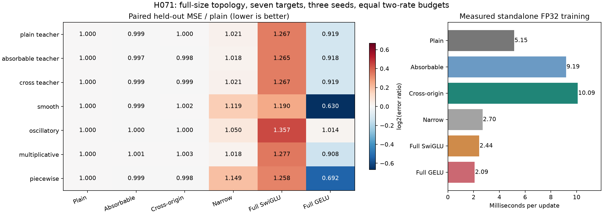

# H071 - Full-size rotated-shuffle fitting results

**REJECTED AT THIS FITTING BUDGET.** The fixed screen completes all 252 cells
at the actual d384/h2048/G8 structured dimensions. This is standalone synthetic
FFN learning. The language-model gold target remains unmet.

| Form | Gain over plain | Gain over absorbable | Gain over narrow | Earns full-model resources |
|---|---:|---:|---:|---|
| Absorbable rotation | +0.0755% | +0.0000% | +5.3167% | No |
| Cross-origin rotation | -0.0025% | -0.0780% | +5.2428% | No |

Gains use paired geometric mean held-out MSE ratios across seven targets and
three optimization seeds; positive means lower error. All forms receive the
same two-rate budget. Seed replications share one dataset and teacher set.

## Decision against the frozen criteria

- Absorbable rotation: fails two percent over plain.
- Cross-origin rotation: fails two percent over plain; every seed better than plain; one percent over absorbable.

Cross-origin needs at least 2% aggregate improvement over plain and 1% over
the absorbable control, wins over plain in each seed, an aggregate narrow win,
no generic task regression above 5%, finite states and at least 70% compression.
The absorbable control uses the same criteria without the extra 1% comparison.

| Form | Seed 17 / plain | Seed 29 / plain | Seed 43 / plain | / full SwiGLU | / full GELU |
|---|---:|---:|---:|---:|---:|
| Absorbable rotation | 0.999139 | 0.999761 | 0.998835 | 0.788157 | 1.180500 |
| Cross-origin rotation | 0.999536 | 1.000595 | 0.999943 | 0.788772 | 1.181421 |

Ratios below one are better. The language-model NLL allowance is not applied
to these synthetic MSE values. No convergence or significance claim follows.

## What was compared

One standalone FFN uses width 384 and groups 8; all structured intermediate
widths are 384. Every canonical block has six original paths, matching the
full-size structure qualified in H070. This avoids H068's 16 missing blocks
at width 48; it does not reopen H068's rejected activation recipes.

All three compressed students share their initial block-factor bytes. Rotation
angles start at zero. Three shared-factor teachers are plain or use the two
pairings with each angle vector set to linspace(-0.3,0.3,192). Four additional
targets are smooth, oscillatory, multiplicative and piecewise vector functions.
The teacher tasks favor these families and cannot establish broad superiority.

There are 4,096 train, 1,024 rate-selection and 1,024 held-out rows. Target
coordinates are divided by training population standard deviation without
centering. The metric is variance-scaled MSE. FP32/TF32-off native eager Torch
uses 300 AdamW updates, batch 256, rates 0.001/0.003, calibrated projection LRs
and angle LR multiplier one. Both rates receive equal work; selection uses
only final selection MSE and is saved before either held-out score.

See the [frozen plan](rotated_shuffle_fit_plan.md) for complete definitions.

## Held-out errors by target

| Target | Plain | Absorbable | Cross-origin | Narrow | Full SwiGLU | Full GELU |
|---|---:|---:|---:|---:|---:|---:|
| plain teacher | 1.270449 | 1.269445 | 1.270859 | 1.296713 | 1.609019 | 1.167870 |
| absorbable teacher | 1.273592 | 1.270242 | 1.271307 | 1.296568 | 1.610673 | 1.169529 |
| cross teacher | 1.271409 | 1.270189 | 1.269900 | 1.298080 | 1.611432 | 1.168271 |
| smooth | 1.010720 | 1.009728 | 1.013183 | 1.131153 | 1.202876 | 0.637188 |
| oscillatory | 1.317418 | 1.316962 | 1.317096 | 1.383084 | 1.787173 | 1.335530 |
| multiplicative | 1.274924 | 1.276377 | 1.278231 | 1.297952 | 1.628251 | 1.157588 |
| piecewise | 0.987871 | 0.987164 | 0.985930 | 1.135002 | 1.242509 | 0.683271 |

Entries are arithmetic means over the three selected seed endpoints. Gate
ratios instead use paired geometric means. All selected rates and individual
endpoints remain in the raw result, including both rates' checkpoints.

## Absolute performance diagnostic

A post-hoc zero-output predictor exposes a limitation of this learning regime.
On all three teacher targets, oscillatory and multiplicative targets, every
selected model/seed is worse on held-out data than predicting zero. Training
errors are lower, indicating a generalization gap under this fixed setting.
Smooth is learned better than zero by every form; piecewise is better for the
three structured forms and full GELU. This limits interpretation of the tiny
relative differences. It does not change the frozen gates or reopen recipes.

| Target | Zero held-out MSE | Plain train MSE | Plain held-out / zero |
|---|---:|---:|---:|
| plain teacher | 0.991286 | 0.700520 | 1.281617 |
| absorbable teacher | 0.992072 | 0.700386 | 1.283770 |
| cross teacher | 0.992233 | 0.700924 | 1.281361 |
| smooth | 2.768342 | 0.613667 | 0.365099 |
| oscillatory | 0.999652 | 0.726113 | 1.317876 |
| multiplicative | 0.991713 | 0.707849 | 1.285577 |
| piecewise | 1.015192 | 0.555690 | 0.973088 |

The zero predictor is a diagnostic, not an added training cell or a predeclared
promotion gate. All target values come from the saved data; no parameters
are fitted for it. [Diagnostic records](../results/verification/rotated_shuffle_fit_baseline_v1.json).

## Actual standalone resources and learning signals

| Form | Parameters | Median update ms | Maximum allocated MiB | Mean clipping | Last 50 / prior 50 loss |
|---|---:|---:|---:|---:|---:|
| Plain BlockShuffle | 350,208 | 5.1483 | 51.1650 | 0.05% | 0.978984 |
| Absorbable rotation | 350,784 | 9.1889 | 51.9287 | 0.05% | 0.979244 |
| Cross-origin rotation | 350,784 | 10.0927 | 52.3037 | 0.05% | 0.979280 |
| Calibrated narrow SwiGLU | 350,208 | 2.6968 | 39.2817 | 0.00% | 0.961892 |
| Full SwiGLU | 1,179,648 | 2.4414 | 55.5864 | 0.00% | 0.853812 |
| Full GELU | 1,179,648 | 2.0870 | 57.7114 | 0.10% | 0.893704 |

Each cell synchronizes CUDA around updates and discards the first 50 timings.
Peaks reset after warmup. These measurements include the standalone GPU data
and index cache, and do not measure Transformer training or serving. No
full-model memory threshold is inferred from them. Narrow matches plain's
parameter count exactly; it has 576 fewer weights than either rotation.

- Absorbable rotation: resetting learned angles changes aggregate held-out error by +0.0106%; maximum absolute angle 0.1050 radians; mean projection sine RMS 0.0263.
- Cross-origin rotation: resetting learned angles changes aggregate held-out error by +0.0653%; maximum absolute angle 0.2128 radians; mean projection sine RMS 0.0525.

Resetting angles after training measures dependence of the final coadapted
model, not the cause of learning gains. The absorbable control adds optimizer
coordinates but no new projection functions. H070's rank witness and component
isometry remain scoped results; neither proves a whole-FFN learning advantage.

## Independent verification and retained evidence

The single scientific fitting process finishes in 494.72 s.
Four isolated harness checks pass before training. All 252 checkpoints have
finite weights and optimizer moments at step 300; all 75,600 updates and
19,353,600 example presentations complete. No corpus targets are scored.
Independent CPU regeneration reproduces the fixed data, target scales and
samplers exactly. The audit reloads every checkpoint, verifies shared initial
weights and rate-selection chronology, recomputes all aggregate gates, and
rescores 126 selected endpoints plus 42 angle-reset ablations on CPU.
Maximum selected-endpoint CPU/GPU relative MSE disagreement is 7.33e-08.

A tool observation of the first CPU-audit call was interrupted after training.
Follow-up OS inspection found no matching live process and no audit result;
execution before interruption is unknown. The completed CPU audit above ran
under a durable coordinator. [Observation record](../results/rotated_shuffle_fit_v1/postprocess_observation.json).
No scientific training cell was repeated.

The prototype stays beside its evidence and adds no active model or recipe.
Both tested recipes close at this allocation. No larger angle set, extra
stage, rate, teacher amplitude, longer run or language allocation is earned.
The active 108-test source state is unchanged. Existing language/profile runs
and prior fitting evidence are preserved; the gold target is still unmet.

- [H070 scoped proof](rotated_shuffle_theory.md) and [local checks](rotated_shuffle_results.md).
- [Raw result](../results/rotated_shuffle_fit_v1/result.json) and [process](../results/rotated_shuffle_fit_v1/fitting_process.json).
- [Independent checkpoint audit](../results/verification/rotated_shuffle_fit_analysis_v1.json).
- [Final preservation audit](../results/verification/rotated_shuffle_fit_final_v1.json).

Result SHA-256: `8f67e4d2b997c57d4c7cd16f90661e325fcbd1f79ecdfda4f83870fc29947910`.
Protocol SHA-256: `6da0aa3bfa13f76445a7947c4e9cd1cd3912f1c389caef3f631f260bea6982d8`.
