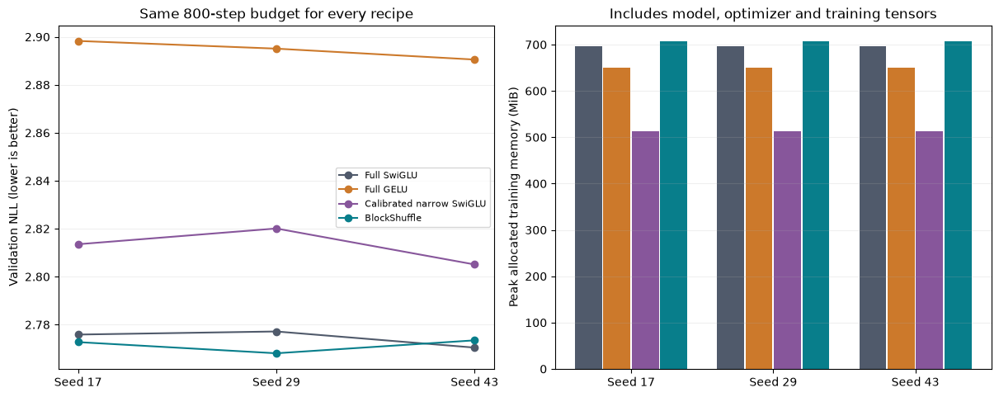

# Larger-model replication: three seeds, four locked recipes

The eight fresh runs add seeds 29 and 43 to the earlier width384/layer8 seed 17 cohort. No recipe was selected or dropped using the new results. All comparisons use 800 steps, 1,638,400 training tokens and 32,768 fixed validation targets. Read the [frozen plan](scale_replication_plan.md).

| Recipe | FFN weights | Total weights | Seed17 NLL | Seed29 NLL | Seed43 NLL | Mean +/- sample SD |
|---|---:|---:|---:|---:|---:|---:|
| Full SwiGLU | 9,437,184 | 15,735,168 | 2.775852 | 2.777143 | 2.770415 | 2.774470 +/- 0.003571 |
| Full GELU | 9,437,184 | 15,735,168 | 2.898301 | 2.895088 | 2.890532 | 2.894640 +/- 0.003904 |
| Calibrated narrow SwiGLU | 2,801,664 | 9,099,648 | 2.813521 | 2.820087 | 2.805083 | 2.812897 +/- 0.007522 |
| BlockShuffle | 2,801,664 | 9,099,648 | 2.772706 | 2.768049 | 2.773442 | 2.771399 +/- 0.002924 |

Both compressed recipes retain 70.3125% fewer FFN weights and logical matrix FLOPs, with 42.17% fewer total model weights. The transformer outside the FFN and the training/data code remain unchanged. Preflight verified matching non-FFN initial tensors within each new seed and finite CPU backward for all eight configurations.

## Paired results and gates

| Seed | NLL change/full SwiGLU | NLL change/full GELU | NLL change/calibrated narrow | BTT/full training peak ratio | All local gates |
|---|---:|---:|---:|---:|---|
| 17 | -0.1134% | -4.3334% | -1.4507% | 1.0152 | PASS |
| 29 | -0.3274% | -4.3881% | -1.8453% | 1.0152 | PASS |
| 43 | +0.1093% | -4.0508% | -1.1280% | 1.0152 | PASS |

Negative NLL change favors BlockShuffle. Each seed must meet the <=1% limits against both full references, beat calibrated narrow, retain >=70% FFN compression and keep training allocated peak <=1.1x full SwiGLU. All final recorded diagnostics and gradients are finite. Per-seed gate fields are retained in the raw summary; averaging cannot hide a failed seed.

The prespecified all-seed decision is **PASS**. Aggregate relative NLL changes are Full SwiGLU -0.1107%, Full GELU -4.2576%, Calibrated narrow SwiGLU -1.4753%.

## Interpretation and outstanding evidence

This is replication of recipe-level comparisons. BlockShuffle uses factor-aware initialization/LR and native gate recomputation, narrow SwiGLU uses width calibration, and full references use the original dense recipe. Historical tuning effort is unequal and remains a limitation. Seed 17 informed selection; 29/43 test the locked choices. Reusing the same small validation prefix across prior experiments does not establish broad generalization.

The separate [fused execution audit](fused_execution_results.md) measured 1.206x throughput versus equally compiled full SwiGLU on the original seed 17 checkpoint. The new training runs do not themselves measure fused serving, and equal shapes are not new timing samples. Training still uses the native FFN. The optional condition floor is also a separate post-training treatment.

An 800-step run sees only about .667 times the training-cache token count in randomly sampled windows; repeated sampling is not an epoch without replacement. This is not convergence. Longer budgets, broader data, equal tuning effort, a credible novelty argument and scoped gradient evidence remain necessary for the original research objective.

Reproduce with `uv run python -m src.core.scale_replication_report`. The report requires all twelve results and rejects partial cohorts.
