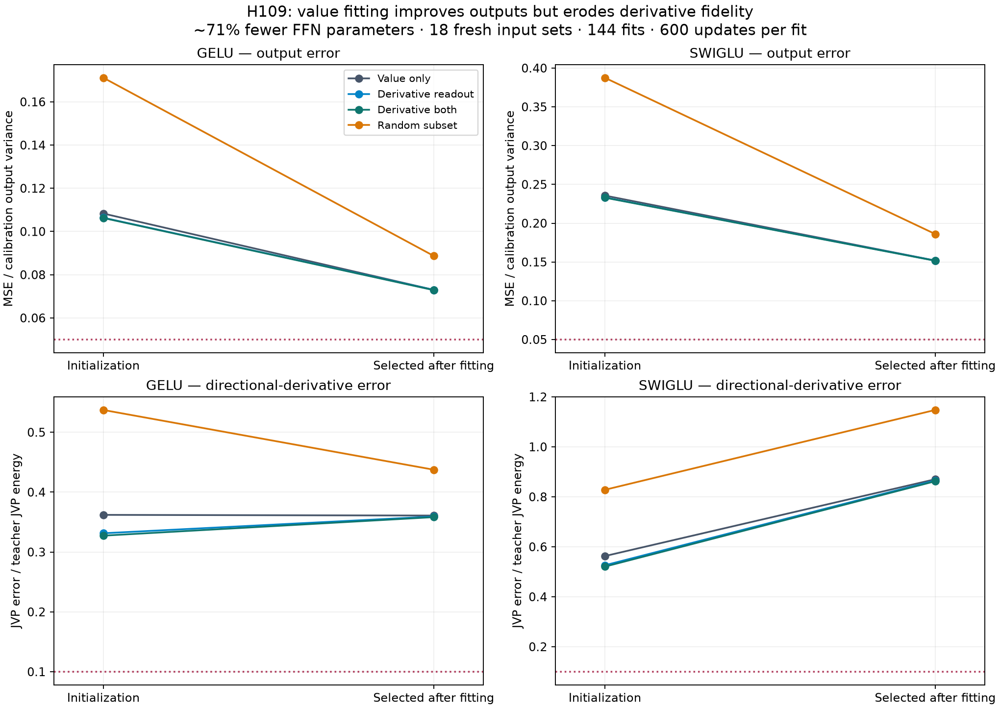

# H109: value-only learning erodes the derivative-aware initialization gain

**Close both fixed derivative-initialization plus value-learning recipes.**
H108's useful zero-SGD calibration result survives as its own finding, but its
advantage mostly disappears after all narrow-FFN weights learn from new value
targets. Neither candidate passes the fixed comparative learning gate, and no
method meets the complete absolute quality gate. The broader goal is unmet.

The screen completes **144 fresh fits, 86,400 updates and 72 selections** in
363.28 seconds. All 216 endpoint states, 648 selection/output/derivative
metrics and 18 exactly recaptured datasets pass independent verification.
The original pre-protocol path-type failure is retained; no training was repeated.

## What changed and what was controlled

The four initializers are exact H108 primary-width exports: value-greedy/value
readout, the same neurons with a derivative-aware readout, derivative-aware
selection and readout, and random neurons with a value readout. The first is the
primary matched control. These are ordinary dense GELU/SwiGLU FFNs with an output
bias, not new activations. GELU h 448 has 344,448 parameters and SwiGLU h 298 has
343,680, respectively **70.80% / 70.87% fewer** than each full FFN.

We sample 960 nonoverlapping 128-token windows, excluding every H105/H107
collection window, split across sampling seeds 71/83/97. The same windows feed
both existing seed-17 teachers at layers 0/3/7. Each dataset has 32,768 training,
4,096 selection and 4,096 reporting rows. Old calibration initializes the models;
the fitting/reporting inputs are fresh. They remain from the teachers' training
corpus: this is not a new corpus, language holdout or teacher-seed replication.

Raw FFN inputs are captured through the BF16 decoder; smooth FP32 teacher
outputs are recomputed with TF32 off. Each model trains on the same saved batch
stream, at constant AdamW LR 0.001 or 0.003 for 600 updates, batch 256, betas(0.9,0.95),
epsilon 1e-8, zero decay and global gradient clip 1. Only output MSE is optimized;
no derivatives are used after initialization. Both rates start from fresh copies
of the same weights with new optimizer states. Inputs/targets stay on CPU.

The positive H108 calibration RMS sy scales both predictions and targets,
so training MSE equals raw output MSE/sy². The adapter introduces no trainable
parameter and leaves raw deployment unchanged. Four qualification groups verify
that algebra, parameter gradients, one-step Adam identity, raw outputs, analytic
JVPs versus autograd and exact counts before real-data access.

Selection compares the original initialization with both final rates, using
selection output MSE only. **All 72 selections choose LR 0.001 after 600 steps.**
Every endpoint is retained. Reporting derivatives use two new independent
Rademacher directions per input, scaled by old calibration input SDs. They are
never used for optimization or endpoint selection. Full FFNs receive 30 LR 0
profile updates per dataset (540 total), allocating Adam/gradient memory while
verified weights remain unchanged. These are resource controls, not fresh teachers.

## Initial and learned errors

| Teacher | Method | Initial output MSE | Learned output MSE | Initial derivative error | Learned derivative error |
|---|---|---:|---:|---:|---:|
| gelu | Value only | 0.108324 | 0.073005 | 0.362032 | 0.360893 |
| gelu | Derivative readout | 0.106385 | 0.072984 | 0.331325 | 0.359267 |
| gelu | Derivative selector + readout | 0.106252 | 0.072869 | 0.327298 | 0.358249 |
| gelu | Random subset | 0.171161 | 0.088727 | 0.537258 | 0.437501 |
| swiglu | Value only | 0.235632 | 0.151855 | 0.562944 | 0.870390 |
| swiglu | Derivative readout | 0.233189 | 0.151785 | 0.526230 | 0.865584 |
| swiglu | Derivative selector + readout | 0.232903 | 0.151562 | 0.520706 | 0.862296 |
| swiglu | Random subset | 0.387523 | 0.186069 | 0.828143 | 1.147666 |

Output MSE is divided by calibration output variance; derivative squared error
is divided by reporting teacher JVP energy. Table entries are arithmetic means
over nine depth-by-sampling cells. Paired decisions use geometric-mean ratios.

| Candidate / teacher | Initial derivative gain vs value only | Learned derivative gain | Learned output gain | Fixed component gate |
|---|---:|---:|---:|---|
| Derivative readout / gelu | 8.73% | 0.48% | 0.005% | Fail |
| Derivative readout / swiglu | 6.06% | 0.41% | 0.054% | Fail |
| Derivative selector + readout / gelu | 9.81% | 0.73% | 0.129% | Fail |
| Derivative selector + readout / swiglu | 6.97% | 0.70% | 0.227% | Fail |

Both candidates miss the fixed 5% derivative improvement and every-seed rule
on both teachers. Value error stays within the 1% allowance; updates are within
10% of value-only and all quantities remain finite. Matching rates does not
restore the gain: the selected comparison is exactly the equal-LR 0.001 comparison,
and LR 0.003 derivative changes are also smaller than 1%. No lucky-rate explanation
rescues the initializer. Neither control/candidate earns language insertion.

| Candidate / teacher | Output change from its own initialization | Derivative-error change from its own initialization |
|---|---:|---:|
| Derivative readout / gelu | -35.11% | +6.99% |
| Derivative selector + readout / gelu | -35.04% | +8.00% |
| Derivative readout / swiglu | -35.22% | +50.92% |
| Derivative selector + readout / swiglu | -35.25% | +51.97% |

These are paired geometric-mean changes. Lower value error does not imply
better derivatives. A simple counterexample is f_e(x)=e sin(x/e²): its uniform
value magnitude is at most e, while its maximum derivative magnitude is 1/e.
That elementary example proves a general non-implication, not a theorem about
this fixed FFN class or the cause of its training trajectory. The experiment
measures the divergence directly; it does not prove vanishing/exploding network
gradients. Ambient probes also differ from actual upstream perturbations through
RMSNorm and the surrounding decoder; no downstream NLL conclusion follows.

## Sampling variation and gradients

| Candidate / teacher | Seed 71 output / derivative | Seed 83 output / derivative | Seed 97 output / derivative | Output median; variance | Derivative median; variance |
|---|---:|---:|---:|---:|---:|
| Derivative readout / gelu | 0.07212 / 0.35603 | 0.07491 / 0.36143 | 0.07193 / 0.36034 | 0.06111; 0.0017726 | 0.31947; 0.0077291 |
| Derivative selector + readout / gelu | 0.07193 / 0.35570 | 0.07487 / 0.36013 | 0.07181 / 0.35891 | 0.06070; 0.0017661 | 0.31985; 0.0076097 |
| Derivative readout / swiglu | 0.14952 / 0.85738 | 0.15413 / 0.86938 | 0.15170 / 0.87000 | 0.15551; 0.00037939 | 0.56836; 0.20199 |
| Derivative selector + readout / swiglu | 0.14935 / 0.85137 | 0.15399 / 0.86905 | 0.15135 / 0.86647 | 0.15504; 0.00039074 | 0.56529; 0.19869 |

Variances span all nine cells and include depth differences; they are not
confidence intervals from independent teacher training. Full summaries retain
mean, median, variance, range and every seed/depth for all four methods.
All 144 fits have finite parameters, Adam moments, losses and gradients; **no
update triggers clipping**. Preclip norms range approximately 0.025-0.567 across
the grid. This excludes gross numerical blowup here, but says little about
long-depth conditioning or convergence. Per-parameter gradients and activation
statistics at 0/50/150/600 are retained in the compressed diagnostic record.

## Actual memory and runtime

| Teacher | Local fitting peak MiB | Full fitting peak MiB | Training saving | Inference peak after training MiB | Full inference MiB |
|---|---:|---:|---:|---:|---:|
| gelu | 24.272 | 42.500 | 42.89% | 19.189 | 24.875 |
| swiglu | 24.159 | 41.250 | 41.43% | 19.100 | 25.875 |

The ordinary value-only control has the same fitting and inference allocation
as the derivative candidates. Mean median update time is approximately 2.65 ms
for GELU and 2.94 ms for SwiGLU. These gains are width savings shared with the
controls; they do not establish an efficiency benefit from derivative fitting.

The original inference profiles run in the process that has already executed
backward passes. A separate, explicitly posthoc fresh process with no gradients
or optimizer gives the following deployment-only values. This does not replace
the frozen gate inputs, and the allocator/context difference is not assigned
a proved low-level root cause. All 90 fresh inference profiles use the same
selected weights and batch 256,10 warmups and 5 x 20 synchronized calls.

| Teacher | Fresh inference candidate / full MiB | Memory saving | Candidate / full median-block mean ms |
|---|---:|---:|---:|
| gelu | 11.064 / 16.000 | 30.85% | 0.0583 / 0.0947 |
| swiglu | 10.975 / 17.000 | 35.44% | 0.2221 / 0.2314 |

The complete preparation/fitting pipeline peaks at **117.908 MiB**,
including prerequisite teacher capture/calibration and fresh capture/targets.
Fresh capture costs 5.55 s and target generation 3.17 s.
The reused H108 statistics plus all selectors cost 83.40 s;
per-method readout times and prerequisite capture are retained in the original
records. Shared all-selector preparation is a conservative accounting quantity,
not the minimum cost of value-only calibration. Original teacher pretraining is
not included. Peak allocated tensors and reserved memory are distinct from whole
process/driver VRAM; CPU data/statistics also consume host RAM.

## Decision, provenance and limits

Both teachers fail the absolute mean value 0.05 and derivative 0.10 gates,
including the seed aggregates. Local training/inference memory, timing and
parameter gates pass, but cannot compensate for lost quality. There is no
automatic language experiment, larger rate/step budget or changed derivative
weight. Close this fixed initializer-plus-value-learning branch.

This is a useful negative learning result: initialization can encode local
sensitivity information that output-only optimization subsequently discards.
H108 remains a qualified zero-SGD component; it does not become a general
training solution. Any future derivative-constrained learning or actual
upstream-sensitivity test would be a distinct hypothesis with its own cost and
qualification, not an earned continuation of this recipe.

The first launch stopped before protocol creation, qualification, data capture
or updates because string paths were supplied to a Path-only hash helper. Its
source, log, exception and exit status remain under preflight_failure and the
recovery manifest. Corrected call sites were then frozen before the first
scientific execution. All 144 actual fits finish on that execution without retry.

The independent auditor exactly recaptures all 18 datasets and smooth value
targets, checks all 216 endpoint states against hashes, all 72 exact H108
initializations, shared streams,144 training records/initial losses and 648
metrics. Student values/JVPs are recomputed from raw tensors at batch 257 with
autograd derivatives. Maximum score discrepancy is 1.09e-08.
The audit performs zero updates and passes on its first execution.

The maintained model tree and tests are unchanged from the preceding 116-test
pass; four isolated qualification groups and this audit provide new evidence.
No novelty priority, new activation, SOTA superiority, long-run convergence,
whole-model memory, broad task transfer or full goal completion is established.

## Evidence

- [Frozen plan](sobolev_learning_plan.md) and [source guide](../results/sobolev_learning_v1/source/README.md).
- [Complete endpoints](../results/sobolev_learning_v1/result.json.gz), [CSV](../results/sobolev_learning_v1/metrics.csv.gz), [summary](../results/sobolev_learning_v1/summary.json), [diagnostics](../results/sobolev_learning_v1/diagnostics.json.gz).
- [Independent audit](../results/sobolev_learning_v1/audit.json.gz), [fresh-process inference](../results/sobolev_learning_v1/inference_only.json), [final receipt](../results/verification/sobolev_learning_final_v1.json).
- [Prior Sobolev training](https://arxiv.org/abs/1706.04859) and [GRAIL](https://proceedings.mlr.press/v328/tang26a.html); this study does not claim their principles as new.

Raw data, model tensors, per-step histories and source ZIP remain local and
ignored. Compact metadata and hashes are not a tensor backup.

