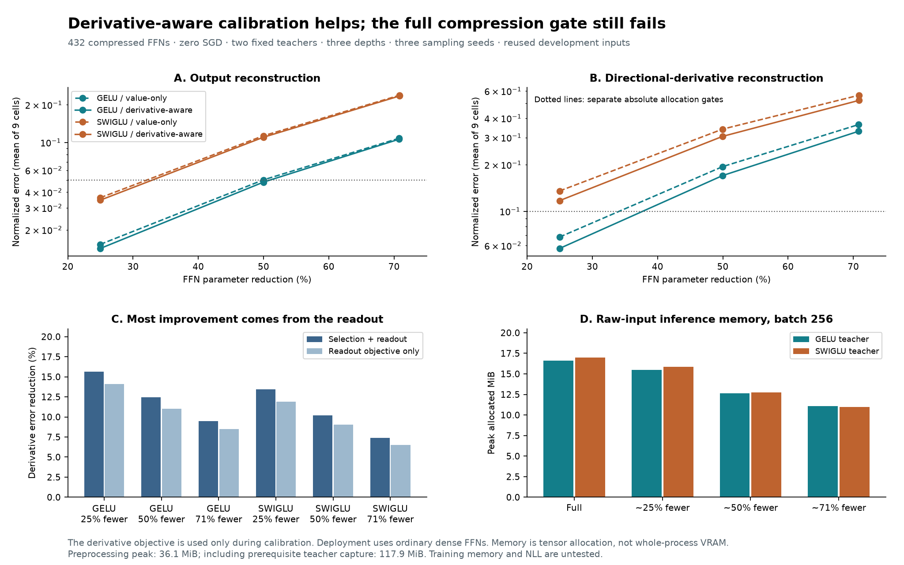

# H108: derivative-aware calibration is useful; complete compression remains unqualified

**Retain derivative-aware calibration as a promising component.** It improves
both output reconstruction and directional derivatives for both teacher families
at every tested width. The effect survives all three sampling-seed aggregates.
The three complete recipes still fail the absolute quality/memory allocation
gates, so none earns language insertion. The original architectural and broader
VRAM/quality goals remain unmet.

The screen produces **432 compressed FFNs with zero SGD updates** in
231.87 seconds. Independent auditing verifies all **864
output/derivative scores**, all 432 exports/readouts, reconstructed sufficient
statistics for 18 datasets and 432 sampled real greedy marginal gains. The
predeclared ablations show that the readout objective alone captures about
88-90% of the combined reduction in derivative error.

## Mechanism and scope of the proof

The deployed model retains selected rows of a teacher's up/gate matrices,
fits its down projection and adds an output bias. It is an ordinary dense GELU
or SwiGLU FFN, with no derivative operation or selection metadata in inference.
All deployed weights remain trainable; this experiment only fits the readout by
linear algebra. It does not test learning a new activation or training from scratch.

Let H be centered/standardized hidden features and Y centered outputs in
training-variance units. Let K and T be directional derivatives in the same
coordinates, without centering. The subset readout minimizes

\[L_S=\|H_SB-Y\|_F^2/N+\beta\|K_SB-T\|_F^2/N+10^{-4}\|B\|_F^2.\]

Beta is zero for value fitting or 0.1 divided by the calibration mean square
of T for derivative-aware fitting. This assigns the derivative target 10% of
the value target's energy. Intercept compensation is unpenalized, and every
normalizer is fitted on calibration rows only.

For the regularized Gram G and cross-target matrix C, conditioning on selected
features S leaves scalar variance g_j and cross-target vector c_j for another
feature j. Completing the square shows that adding j decreases the optimal
objective by exactly ||c_j||²/g_j. The [frozen plan](sobolev_selection_plan.md)
gives the full Schur-complement equations. Positive ridge makes the Gram
positive definite. Greedy maximal one-step gain is not globally optimal subset
selection and does not guarantee generalization.

Independent Rademacher directions satisfy E[vv']=I, hence the expected
squared response of J diag(sx) v is ||J diag(sx)||_F². The input scales sx
come from calibration SDs. This motivates a sampled sensitivity metric, not a
worst-case Jacobian bound or proof against deep-network gradient collapse.
Thirteen qualification groups compare analytic JVPs to autograd and finite
differences, validate exports/counts, enumerate isotropy exactly on a fixture,
and check every small-fixture greedy gain against all alternative least-squares
fits, including rank-deficient features.

## Data and controlled comparison

The 18 H107 input datasets are reused: two existing seed-17 teachers, depths
0/3/7 and sampling seeds 71/83/97. Only the first 8,192 calibration inputs and
last 4,096 reporting inputs are used; the former selection partition is unused.
These are previously inspected development inputs from the teachers' training
corpus, not a fresh confirmation or independent teacher-training seeds.

H108 recomputes smooth FP32 teacher values and derivatives, with TF32 disabled.
It does not differentiate rounded BF16 arithmetic or reuse H107's BF16 labels.
Consequently its MSE is not directly comparable to H107's different targets,
calibration size and fitting budget. All eight H108 methods share the same data,
normalizers, fixed ridge and parameter budget. One direction per calibration
row and two independent directions per reporting row are used. Full input
Jacobians are never materialized.

Controls are random subsets, output-column weight norms, fluctuation scores,
conditional standardized-feature variance and value-greedy selection. The
candidate uses Sobolev-greedy selection and readout. Two cross-combinations
isolate the selector and readout objective. No beta/ridge sweep or SGD is used.

## Numerical results

| Teacher | FFN parameter reduction | Exact parameters | Value-only MSE | Derivative-aware MSE | Value-only derivative error | Derivative-aware derivative error |
|---|---|---:|---:|---:|---:|---:|
| gelu | 70.80% | 344,448 | 0.108066 | 0.106203 | 0.363681 | 0.329263 |
| gelu | 49.97% | 590,208 | 0.050156 | 0.048099 | 0.194443 | 0.170207 |
| gelu | 24.97% | 885,120 | 0.015298 | 0.014186 | 0.068079 | 0.057436 |
| swiglu | 70.87% | 343,680 | 0.238532 | 0.235468 | 0.563318 | 0.521805 |
| swiglu | 49.97% | 590,208 | 0.113006 | 0.109971 | 0.339960 | 0.305214 |
| swiglu | 24.97% | 885,120 | 0.036124 | 0.034534 | 0.135295 | 0.117127 |

Value MSE is normalized by calibration output variance. Derivative error is
normalized by the reporting teacher's mean squared directional derivative.
Means cover nine depth-by-sampling cells. The comparison gate uses paired
geometric-mean ratios, not a ratio of arithmetic means.

| Width budget | Value improvement: GELU / SwiGLU | Derivative improvement: GELU / SwiGLU | Comparative component gate |
|---|---:|---:|---|
| primary | 1.81% / 1.30% | 9.70% / 6.83% | Pass |
| half | 4.12% / 2.69% | 12.87% / 9.43% | Pass |
| three_quarter | 7.23% / 4.42% | 16.15% / 12.14% | Pass |

All six teacher/width groups meet the fixed 5% derivative gain and at-most-1%
value-regression rule, including each seed's aggregate. In fact value error
improves in each seed aggregate. No cheaper static selector dominates the
candidate in both errors. This is a replicated local component result.

| Teacher / budget | Seed 71 value / derivative | Seed 83 value / derivative | Seed 97 value / derivative | Value median; sample variance | Derivative median; sample variance |
|---|---:|---:|---:|---:|---:|
| gelu / primary | 0.10899 / 0.33220 | 0.10549 / 0.33178 | 0.10412 / 0.32381 | 0.08924; 0.0026548 | 0.30130; 0.0030826 |
| gelu / half | 0.04927 / 0.17190 | 0.04746 / 0.17181 | 0.04757 / 0.16692 | 0.04194; 0.00060558 | 0.16139; 0.0012622 |
| gelu / three_quarter | 0.01451 / 0.05805 | 0.01392 / 0.05797 | 0.01413 / 0.05629 | 0.01299; 4.8016e-05 | 0.05569; 0.00013608 |
| swiglu / primary | 0.24004 / 0.52729 | 0.23241 / 0.51669 | 0.23395 / 0.52144 | 0.23448; 0.00024212 | 0.49199; 0.012675 |
| swiglu / half | 0.11267 / 0.30991 | 0.10845 / 0.30228 | 0.10879 / 0.30345 | 0.11082; 1.4309e-05 | 0.28631; 0.0062971 |
| swiglu / three_quarter | 0.03483 / 0.11937 | 0.03422 / 0.11709 | 0.03455 / 0.11492 | 0.03431; 1.094e-05 | 0.10968; 0.0014152 |

Nine-cell variances include depth heterogeneity and are not confidence intervals
from independent teacher training. The summary retains mean, median, sample
variance, range, each depth and each seed for every method. The CSV retains all
432 endpoints and resources, including failed controls.

## Which part caused the gain?

Keeping the value-greedy neuron set and changing only its readout objective
recovers 88.33-90.14% of the combined absolute derivative-error improvement
across the six groups. The share is descriptive: selector/readout interactions
mean the separate fractions need not sum to one. The derivative-aware selector
itself adds a smaller increment. At the primary GELU budget, readout-only even
has slightly better value MSE than the combined method.

This supports retaining the simpler derivative-aware readout as the main
component. It does not prove that the elaborate selector is necessary. The
mechanism is consistent with using additional derivative information to constrain
the readout, but neither these ablations nor a derivative error establishes the
cause of downstream language quality. No downstream language test was performed.

## Actual inference memory and the failed absolute gate

| Teacher / budget | Inference peak MiB | Saving vs full | Inference ms | Full-reference mean ms |
|---|---:|---:|---:|---:|
| gelu / primary | 11.064 | 33.45% | 0.2051 | 0.5620 |
| gelu / half | 12.626 | 24.05% | 0.2284 | 0.5620 |
| gelu / three_quarter | 15.501 | 6.76% | 0.3180 | 0.5620 |
| swiglu / primary | 10.975 | 35.44% | 0.2479 | 0.7185 |
| swiglu / half | 12.751 | 24.99% | 0.2785 | 0.7185 |
| swiglu / three_quarter | 15.876 | 6.61% | 0.3331 | 0.7185 |

The primary models meet the original 70% parameter-count threshold and save
roughly one third of local forward tensor allocation, but their reconstruction
and derivative errors are far above the fixed absolute quality gates. Half-width
also fails quality. Three-quarter width brings both teachers below 5% output
error, but SwiGLU derivative error remains 11.71%, above the 10% gate, and both
families save only about 6.6-6.8% inference allocation, below the required 10%.
Neither candidate nor eligible value-greedy control earns language insertion.

Counts include an output bias: 2dh+d for GELU and 3dh+d for SwiGLU. Nominal
half/quarter reductions are slightly less than 50%/25% after counting that bias.
Compared methods have identical dense shapes at each teacher/width; derivative
calibration adds no inference parameters, gathers, JVPs or kernels. Dense matrix
MACs per token are 2dh/3dh; scalar activation/bias costs remain measured in timing.

The screen's combined calibration preprocessing peaks at
36.125 MiB allocated. Including the
prerequisite full-teacher capture gives a pipeline peak of
117.908 MiB. This capture was reused, not
rerun. Shared value-and-derivative statistics cost 21.89
seconds; all selectors cost 61.51 seconds; all
readout solves cost 11.69 seconds. A value-only
selector does not need the derivative preprocessing, so this shared screen cost
is not its minimum deployment preparation cost.

Memory is peak PyTorch tensor allocation, with reserved values retained
separately, not total process/driver VRAM. Inference uses batch 256, ten warmups
and five synchronized timing blocks of twenty calls, under the recorded
Python allocator/environment. Absolute timings vary across cases on this laptop;
all raw blocks are retained. These are native eager measurements, not compiled
serving throughput. No optimizer is allocated and no training-memory saving,
convergence or long-depth gradient guarantee is claimed.

## Independent verification and preserved failure

The auditor recomputes calibration statistics with centered full matrices and
automatic JVPs, independent of the screen's streamed analytic formulas. It
checks every exported row/readout and reconstructs 864 output/derivative scores
with a different student batch partition. The maximum score discrepancy is
8.49e-09. Eight actual prefixes of each of three greedy
orders are checked per dataset against direct conditioned solves: 432 marginal
checks, maximum gain discrepancy 3.55e-15. These real
checks sample prefixes; the small qualification fixtures check every step and
every competing addition.

The first audit failed on one near-zero teacher output: changing GEMM batch
512 to 257 produced a 2.086e-6 difference against an absolute tolerance of
2e-6. The failure, original source and logs remain intact. A separately recorded
recovery checks teacher references at their original batch 512 while keeping
all student rescoring at 257, automatic derivatives and every tolerance unchanged.
That complete audit passes. No original compressed model, selected subset,
frozen source or recorded metric was replaced.

The maintained architecture remains two model folders and five variants.
No maintained source or test changed in this round; the preceding 116-test result
remains referenced separately. The 13 new isolated qualification groups and
this independent audit provide the new validation rather than inflating the
maintained suite's count.

## Prior work, decision and next evidence

[Orthogonal least squares](https://doi.org/10.1109/72.80341) supplies the
feature-selection precedent; [Sobolev training](https://arxiv.org/abs/1706.04859)
explicitly learns from target derivatives. [GRAIL](https://proceedings.mlr.press/v328/tang26a.html)
precedes Gram/ridge post-compression reconstruction and
[FLAP](https://ojs.aaai.org/index.php/AAAI/article/view/28960) precedes fluctuation
pruning/bias compensation. The exact greedy-gain identity follows from ordinary
Schur complements. This is evidence about a specific combination and its
ablations, not a claim to invent pruning, derivative distillation or a new theorem.

Retain derivative-aware calibration as **PROMISING COMPONENT**. Complete
recipes remain unqualified; no beta sweep, additional probes or automatic
language run follows. A distinct justified next question is whether the simpler
derivative-aware readout gives a better initialization for actual narrow-FFN
learning on fresh data, with a value-only counterpart and all preparation costs
charged. That would need its own frozen fitting protocol. The current result
does not answer it, satisfy the 70%-compression quality goal, or establish broad
capability, scale, independent teacher-seed generalization or novelty.

## Evidence

- [Frozen plan and equations](sobolev_selection_plan.md).
- [Source guide](../results/sobolev_selection_v1/source/README.md).
- [Complete compressed results](../results/sobolev_selection_v1/result.json.gz), [CSV](../results/sobolev_selection_v1/metrics.csv.gz), [summary](../results/sobolev_selection_v1/summary.json), [ablations](../results/sobolev_selection_v1/ablation.json).
- [Independent audit](../results/sobolev_selection_v1/audit.json.gz) and [final receipt](../results/verification/sobolev_selection_final_v1.json).

Raw tensor statistics, original teacher inputs and all compressed checkpoints
remain local and ignored. Their hashes are recorded; compressed metadata is
not a backup of those tensors.
