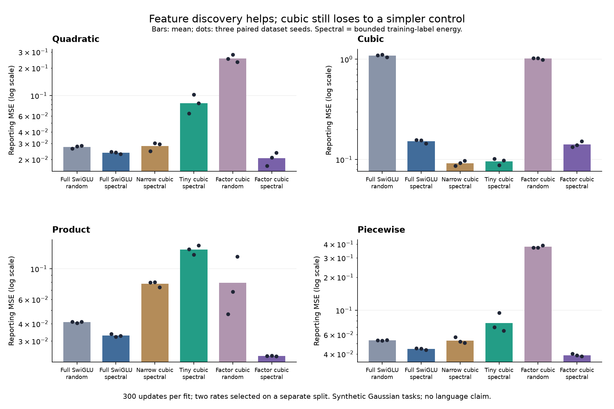

# H103/H104: feature discovery helps; factorization must earn its cost

This study investigates H100's cubic-learning failure with training-label spectral
initialization and 66,048-parameter FFNs. No new activation or novelty is claimed.

## Decisions

The bounded-initialized cubic factorization is a useful **synthetic lead**,
but fails its fixed promotion gates. With 66,048 parameters (94.41% fewer
than either full FFN), it has lower mean error on all four tasks than the
equally initialized full GELU and SwiGLU controls. Its paired aggregate
MSE is 41.01% / 15.97% lower respectively, and 57.48% below tiny cubic.

The failures matter: on cubic alone, tiny cubic is better (0.095797 versus
0.141608 MSE), a 47.82% regression exceeding the 5% cap. Native inference
takes 0.308 ms versus narrow GELU's 0.145 ms, exceeding the 25% allowance.
These gates stay fixed. The GELU factorization also fails full-model quality
and cubic-learning gates. Neither recipe earns automatic language training.

Training-only peak allocation falls about 51-52% versus the full models,
but preprocessing raises the candidate's pipeline peak to **30.77 MiB**.
Including that cost, savings are **25.02% versus full GELU and 22.68% versus
full SwiGLU**, not 50%. Equally initialized narrow/tiny controls have the same
preprocessing peak, so the factorization does not reduce pipeline VRAM below
them at this batch size. This is CUDA tensor allocation, excluding driver
context and other processes; it is not the GPU usage displayed by nvidia-smi.

- **factor_gelu_bounded: REJECTED_AT_THIS_BUDGET**. Failed gates: cubic_halves_zero_each_seed, within_one_percent_fulls, wins_each_seed_over_tinies, per_task_cap, inference_time.
- **factor_cubic_bounded: REJECTED_AT_THIS_BUDGET**. Failed gates: per_task_cap, inference_time.

The primary architectural/VRAM goal remains active. These synthetic, Gaussian
low-rank target families are deliberately favorable to subspace discovery and
polynomial features; they cannot establish language-model or broad task superiority.

## Independent signal screen (H103)

The bounded estimator recovers 88.59%, 88.93% and 88.84% of the cubic input
subspace on three independent datasets. Permuted labels recover 7.63%, 8.34%
and 8.30%; raw moments recover 64.13%, 64.72% and 63.83%. All fixed allocation
gates pass. A separate audit reconstructs all 36 moments with a different chunk
partition and checks eigenpairs, subspace recovery and data hashes.

For Gaussian X and labels depending only on Q^T X, the centered weighted
covariance lies in span(Q). For degree-k normalized Hermite targets, its raw
population eigenvalues are proportional to 2k: the cubic energy has a signal
even though the first label/input cross-moment vanishes. The
[proof and assumptions](spectral_discovery_plan.md) do not guarantee finite-sample
recovery, positive eigengaps or optimization. The bounded transform changes the
spectrum; its improvement here is measured, not assumed.

## Fitting outcomes (H104)

Means over three independent dataset/training seeds after selecting one of two
rates using a separate selection split. Lower reporting MSE is better.

| Form | Parameters | Quadratic | Cubic | Product | Piecewise |
|---|---:|---:|---:|---:|---:|
| full_gelu_random | 1,181,568 | 0.055728 | 1.042472 | 0.071324 | 0.055131 |
| full_swiglu_random | 1,182,080 | 0.027490 | 1.083979 | 0.041049 | 0.053254 |
| full_gelu_bounded | 1,181,568 | 0.035109 | 0.385462 | 0.040258 | 0.040023 |
| full_swiglu_bounded | 1,182,080 | 0.023694 | 0.152723 | 0.032877 | 0.044457 |
| narrow_gelu_bounded | 351,048 | 0.043469 | 0.442895 | 0.066616 | 0.040136 |
| narrow_swiglu_bounded | 351,200 | 0.028277 | 0.159674 | 0.036794 | 0.043474 |
| narrow_cubic_bounded | 351,048 | 0.028075 | 0.092109 | 0.077763 | 0.053111 |
| tiny_gelu_bounded | 65,749 | 0.052313 | 0.783958 | 0.099905 | 0.051447 |
| tiny_swiglu_bounded | 66,162 | 0.036228 | 0.454700 | 0.051754 | 0.053886 |
| tiny_cubic_bounded | 65,749 | 0.082688 | 0.095797 | 0.137594 | 0.076688 |
| tiny_relu2_bounded | 65,749 | 0.039889 | 0.638012 | 0.089434 | 0.066023 |
| factor_gelu_random | 66,048 | 0.166406 | 1.010266 | 0.059153 | 0.166869 |
| factor_gelu_raw | 66,048 | 0.030822 | 0.840710 | 0.045733 | 0.039512 |
| factor_gelu_bounded | 66,048 | 0.031116 | 0.662081 | 0.045037 | 0.035968 |
| factor_cubic_random | 66,048 | 0.255339 | 1.015055 | 0.079265 | 0.378237 |
| factor_cubic_raw | 66,048 | 0.017811 | 0.414542 | 0.023684 | 0.042300 |
| factor_cubic_bounded | 66,048 | 0.020585 | 0.141608 | 0.023406 | 0.039029 |

All 408 runs, 816 checkpoint scores and 204 rate selections are independently
checked. The audit reconstructs datasets and spectral subspaces and exactly
reconstructs every recorded model initialization. Factorized forms share U,
hidden biases and zero readouts across initializer modes; only A differs.

[All-rate compact CSV](../results/spectral_fitting_v1/metrics.csv.gz),
[means/medians/variances, gates and ratios](../results/spectral_fitting_v1/summary.json),
[checkpoint audit](../results/spectral_fitting_v1/audit.json).
The complete maintained suite passes 113 tests after the documented runtime
recovery. [Final verification receipt](../results/verification/spectral_final_v1.json).



## Resource costs

Training data remains on CPU, with the same current-batch transfers for all forms.
Peak allocation includes the model, gradients, optimizer, current batch and
training diagnostics, and excludes later evaluation/export. Reserved memory is
recorded separately. Update time includes gathering/transferring batches; model
forward/backward and inference are separately timed. These are standalone FFN
numbers, not Transformer end-to-end VRAM or autoregressive generation latency.

| Form | Train peak MiB | Pipeline peak MiB | Update ms | Inference ms | Prepass + updates s |
|---|---:|---:|---:|---:|---:|
| full_gelu_random | 41.03 | 41.03 | 3.378 | 0.172 | 1.039 |
| full_swiglu_random | 39.79 | 39.79 | 4.305 | 0.239 | 1.329 |
| full_gelu_bounded | 41.03 | 41.03 | 3.370 | 0.176 | 1.340 |
| full_swiglu_bounded | 39.79 | 39.79 | 4.370 | 0.235 | 1.648 |
| narrow_gelu_bounded | 24.40 | 30.77 | 3.512 | 0.145 | 1.390 |
| narrow_swiglu_bounded | 24.30 | 30.77 | 4.350 | 0.248 | 1.646 |
| narrow_cubic_bounded | 24.74 | 30.77 | 3.895 | 0.246 | 1.507 |
| tiny_gelu_bounded | 19.42 | 30.77 | 3.505 | 0.152 | 1.385 |
| tiny_swiglu_bounded | 19.48 | 30.77 | 4.397 | 0.242 | 1.654 |
| tiny_cubic_bounded | 19.50 | 30.77 | 3.846 | 0.250 | 1.482 |
| tiny_relu2_bounded | 19.42 | 30.77 | 3.610 | 0.191 | 1.420 |
| factor_gelu_random | 19.54 | 19.54 | 4.036 | 0.234 | 1.252 |
| factor_gelu_raw | 19.54 | 30.77 | 4.035 | 0.216 | 1.643 |
| factor_gelu_bounded | 19.54 | 30.77 | 4.033 | 0.219 | 1.543 |
| factor_cubic_random | 19.66 | 19.66 | 4.341 | 0.332 | 1.350 |
| factor_cubic_raw | 19.66 | 30.77 | 4.250 | 0.315 | 1.719 |
| factor_cubic_bounded | 19.66 | 30.77 | 4.387 | 0.308 | 1.642 |

Each spectral recipe also requires a 65,536-example label/input pass and a
384-by-384 moment eigensolve. Per-estimator wall time and peak CUDA memory
are recorded under initializers; they are **not divided by the number of grid
runs**. Random controls do not use the label prepass. Comparisons against
equally initialized controls isolate factorization more fairly, but no matched
total-compute superiority is claimed. Data generation and source/checkpoint I/O
are included in study wall time, not model update time.

Pipeline peak is max(preprocessing peak, training peak), because these phases
run sequentially and preprocessing GPU tensors are released. The last column
charges the complete prepass plus all 300 measured update intervals. It excludes
data generation, checkpoint I/O and diagnostics outside those intervals, so it
is not total study wall time. The frozen memory gate concerns training only;
the stricter pipeline accounting is reported additionally without changing it.

## Mechanism and gradient limits

Cubic error falls from 1.015055 with random factor initialization to 0.141608
with bounded initialization: about 86% less. Full SwiGLU also benefits, falling
from 1.083979 to 0.152723. Giving this initializer to the candidate alone would
therefore greatly exaggerate an architectural advantage.

On the cubic task, the bounded factor begins with about 89% recovered input
subspace. The cubic model finishes near 97-98%; the GELU model loses alignment
and finishes near 65-71%. These checkpoint diagnostics support a feature
discovery/retention interpretation, but do not isolate its causal components.
Random controls do not pay for training-label access: this is an initializer
intervention with additional data processing, not a compute-matched win.

Every recorded weight, optimizer moment, loss and gradient is finite across
408 fits. This only establishes finite short-run behavior under clipping;
the cubic derivative is unbounded, and no nonvanishing-gradient, general
stability or long-horizon learning theorem follows.

## Experimental recipe and limitations

Fresh inputs: 65,536 train / 4,096 selection / 4,096 reporting rows, d=384 and
hidden teacher rank 16. Each seed (17/29/43) regenerates data, rotations and
sampling, so reported variance combines data and optimizer variation. All
initializers use training labels only; teacher directions appear solely in
oracle qualification and post-training diagnostics. Rank 32 is fixed.

Each run: 300 updates of batch 256, AdamW (.9,.95), eps 1e-8, zero decay,
clip 1 and constant LR .001 or .003. Readout LR uses the same width calibration
rule for every model. GPU FP32, TF32 disabled, four CPU threads; UV and one
RTX 4070 Laptop GPU. Timing excludes the first 50 updates. Cubic derivatives
are unbounded; clipping/activation/gradient histories are retained, not hidden.

The candidate is A(384->32), U(32->128), activation, D(128->384), totaling
66,048 parameters including biases. All matrices train. Polynomial oracle
construction and gradient checks establish scoped capacity; training is never
initialized with that construction. The initial 22 qualification checks cover
counts, zero outputs, probe variance, CUDA finiteness, factor gradients and
three polynomial capacity witnesses. Pairing is additionally checked in audit.

Constant-norm one-hot language labels give exactly zero energy signal. Applying
this mechanism to language would require a different source of training signal,
such as teacher-output fitting, and full accounting of teacher cost. No such
application, mixed-precision result, long-run convergence or broader corpus
claim is established here. The previous memory study and its failures stand.

## Reproduction and prior work

[H103 plan](spectral_discovery_plan.md), [H104 frozen plan](spectral_fitting_plan.md),
[model](../results/spectral_fitting_v1/source/model.py),
[shared trainer](../src/core/function_fitting.py). Source hashes and environment
are frozen in each protocol. Raw datasets and all checkpoints stay local and
are ignored in Git; a clean clone must rerun before rescoring them.
Full result JSON is retained losslessly in `result.json.gz`; the original
JSON remains local. Restore it before running historical readers in a clone.

```powershell
uv run --no-sync python -m results.spectral_fitting_v1.source.audit
uv run --no-sync python -m results.spectral_fitting_v1.source.analyze
uv run --no-sync python -m results.spectral_fitting_v1.source.plot
```

Fresh execution uses the study module in a checkout with empty experiment output
directories. Existing completed directories are refused, preserving old evidence.

The first post-audit analysis produced numeric tables but no figure, and its
following pytest process reported a Windows access violation under Python
3.12.12. The [failure record](../results/spectral_fitting_v1/postprocess_failure.json)
is retained. Numeric analysis/testing recovery uses existing UV Python 3.12.9
with the same installed packages. Plotting is isolated from Torch in a separate
process after the first recovery also failed inside Matplotlib layout. Original
training, frozen source and the
816-score checkpoint audit remain unchanged. This is not a training retry.

[Second-order Stein estimation](https://papers.neurips.cc/paper/7190-estimating-high-dimensional-non-gaussian-multiple-index-models-via-steins-lemma.pdf),
[Gaussian multi-index gradient flow](https://proceedings.mlr.press/v258/simsek25a.html),
[The Generative Leap](https://arxiv.org/abs/2506.05500) and
[layerwise neural feature learning](https://arxiv.org/abs/2511.15120) are relevant
precedents. The small factorization and polynomial activation are established
ideas. The contribution here is a controlled experiment and its limitations,
not a certified novel primitive or a breakthrough.
