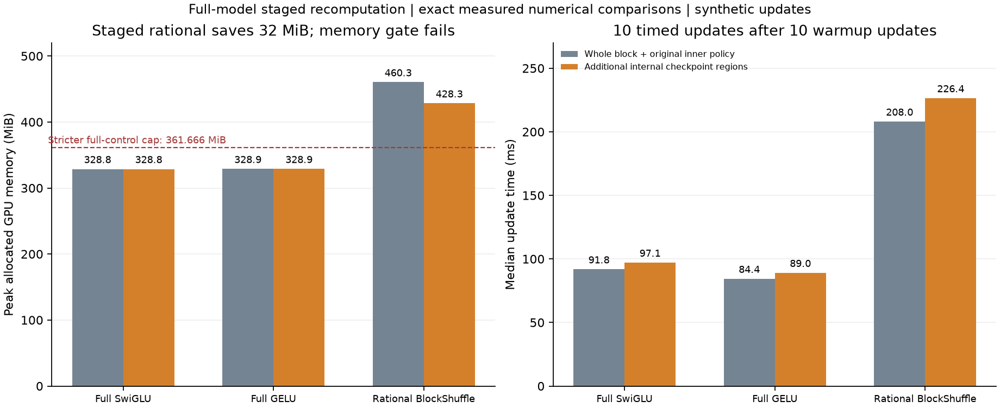

# H066: staged rational execution fails the full-model memory gate

**REJECTED as a memory repair; measured numerical fidelity passes.** Staged
rational reduces peak allocated memory from **460.333 to 428.333 MiB**, exactly
32 MiB or **6.9515%**, at an **8.8451%** median update-time cost. This misses both
the 10% self-reduction requirement and both equally treated full-control memory
limits. No full language repeat or further partition search is earned.

## Measured comparison

The [frozen plan](staged_resource_plan.md) follows H065's local qualification.
All six fresh workers use whole-block native recomputation. Each full dense
control also receives a separate run with an internal activation/product
checkpoint; the candidate's cap uses the lower memory of each full control's
two treatments. This avoids measuring a candidate-only checkpoint advantage.

| Recipe and inner execution | Peak allocated MiB | Peak reserved MiB | Median update ms | Clipped updates |
|---|---:|---:|---:|---:|
| Full SwiGLU, original inner policy | 328.788 | 398.0 | 91.831 | 20.0% |
| Full SwiGLU, product checkpoint | 328.788 | 398.0 | 97.057 | 20.0% |
| Full GELU, original inner policy | 328.866 | 400.0 | 84.371 | 25.0% |
| Full GELU, activation checkpoint | 328.866 | 400.0 | 89.038 | 25.0% |
| Rational, original product checkpoint | 460.333 | 530.0 | 208.045 | 20.0% |
| Rational, four staged inner regions | 428.333 | 482.0 | 226.447 | 20.0% |

The stricter full-control memory allowance is **361.666 MiB** (full SwiGLU);
full GELU allows **361.753 MiB**. Staged rational remains **30.276% / 30.245%**
above the controls themselves. Additional inner checkpointing changes neither
full control's observed allocation peak, while increasing their measured time.
Allocated and reserved memory are different quantities; promotion uses allocated.

[Standalone SVG](figures/staged_resource.svg).

| Frozen gate | Outcome |
|---|---|
| Exact numerical comparisons for candidate and both dense adapters | PASS |
| At least 70% fewer FFN weights | PASS: 70.3091% |
| At least 10% memory reduction versus native rational | FAIL: 6.9515% |
| At most 110% of best full SwiGLU memory | FAIL |
| At most 110% of best full GELU memory | FAIL |
| Additional update-time penalty at most 25% versus native rational | PASS: 8.8451% |

## Fidelity, controls and budget

All three treatment/reference pairs have exact initial full-model logits, loss,
every parameter gradient and gradient diagnostics; all twenty losses/pre-clip
norms; and final weights plus every optimizer state. Token streams and recorded
CPU/CUDA RNG match and remain unchanged. Initial/final layer diagnostics and final
weights/moments are finite. Intermediate weight tensors were not archived after
each update, so this does not claim individually verified equality of those tensors.

The runner directly calls H063's unchanged worker function under isolated
root/plan/model-loader bindings. There is no duplicated or altered optimizer loop.
Adapters bind methods to existing objects; parameter identities, state keys,
loaded values and optimizer references are preserved. The rational residual method
is the exact frozen H065 implementation. Dense extra checkpoints use native GELU
or SiLU/product and bypass evaluation/no-grad. No compiler, dtype, attention,
batch, coefficient, rate, decay or clipping change is introduced.

All workers load their original selected seed-17, 200-step weights and AdamW
moments, at d384/L8/V4096/B16/T128, BF16 with FP32 parameters and four CPU threads.
Each runs one initial synthetic backward probe followed by twenty updates, with
its selected peak rate held constant. Timings use ten synchronized updates after
ten warmup updates on one RTX 4070 Laptop GPU. These short timing windows and
single device do not establish a broad speed result; rational remains slower than
either full control, even though its additional penalty passes the local cap.

All six workers and the analysis finish first attempt. The budget is **120
synthetic updates, 245,760 training targets and 12,288 initial-probe targets**.
Diagnostic forwards add no scored loss targets. No corpus training, validation or
test scoring occurs, and all original LM/profile runs remain at 171. Synthetic
step-220 checkpoints are isolated under this study's result directory.

## Interpretation and closure

H064 located 128 MiB of simultaneously live rational pointwise allocations.
The actual saving from this partition is only 32 MiB. A stack-attributed live cost
is not the amount removable by a particular rewrite: other temporaries and
backward dependencies remain. This study does not collect a new allocator trace,
so it does not assign the remaining peak to specific changed operations.

H065's exact local results survive at full-model scale for these twenty-update
comparisons. They do not establish an adequate memory/compute trade-off. Close the
fixed staged repair, retaining its scoped mathematical identity and numerical
qualification as evidence. No alternate cut, relaxed tolerance, compiler/dtype
change, offload, reduced batch or longer run follows automatically.

The prototype and adapters remain solely in experiment artifacts. They add no
active model folder, variant, recipe or execution default. The native rational
candidate's original 883.174 MiB corpus-memory failure and previous compiled
trajectory failures remain; plain BlockShuffle's longer-training quality failure
also remains. The full research goal is not achieved.

## Artifacts and verification

[H065 local qualification](rational_staged_results.md),
[protocol](../results/staged_resource_v1/protocol.json),
[result](../results/staged_resource_v1/result.json),
[source archive](../results/staged_resource_v1/source.zip),
[worker artifacts](../results/staged_resource_v1/workers/),
[process records](../results/staged_resource_v1/processes/), and
[final audit](../results/verification/staged_resource_final_v1.json) preserve the
experiment. Current active source/configuration/test bytes still match H064 and
its 108-test qualification. H065 contributes twelve separate mathematical/product
comparisons; H066 adds six resource/update workers. Neither is counted as newly
registered unit tests. Lint, source and checkpoint hashes, historical evidence,
frozen plans and local documentation links are checked in the final audit.
