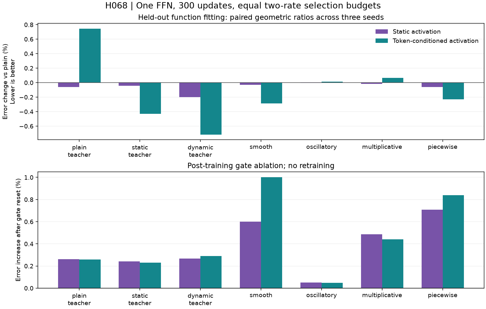

# H068 - Token activation fitting results

**REJECTED AT THIS FITTING BUDGET.** The unchanged H067 forms complete the
fixed seven-target, three-seed, two-rate screen. This result concerns standalone
function fitting; the gold language-model goal remains unmet.

| Form | Error change vs plain | Error change vs static | Error change vs narrow | Earns full-model resource qualification |
|---|---:|---:|---:|---|
| Static activation | -0.0585% | +0.0000% | -14.2927% | No |
| Token-conditioned activation | -0.1213% | -0.0628% | -14.3466% | No |

Changes use geometric means of paired held-out MSE ratios across 21 target/seed
cells, after selecting each cell's learning rate on a separate split. Negative
is better. Gates were frozen before training; three seeds do not establish
statistical significance, convergence or a universal approximation advantage.

## What was compared

FFNs with bias-free projections at d48/h256/G8 preserve the main model's width ratios.
The candidate has 5,521 parameters (70.0467% fewer than either 18,432-weight full
control); static has 5,473, plain and narrow 5,472. These are whole standalone
models, not total Transformer parameter counts. Every output has 48 coordinates.

H070's [routing analysis](rotated_shuffle_theory.md) adds a scale limitation:
k48/G8 has 16 identically zero canonical projection blocks and 48 rank-at-most-1
blocks, whereas k384/G8 has 64 rank-at-most-6 blocks. Relative widths therefore
do not preserve full-size block connectivity. This does not alter H068's frozen
measurements or rejection, and does not automatically reopen its tested recipes.

The three shared-projection teachers are plain, static and token-conditioned.
Four other targets are smooth, oscillatory, multiplicative and piecewise vector
functions with a fixed output rotation. Input/teacher data are shared across
training seeds: these are optimization replications, not dataset replications.

All forms receive 300 AdamW updates at each of two base rates (.001/.003), batch
256, identical sampler streams, FP32 with TF32 disabled, eager native Torch and
the existing structured/narrow learning-rate calibration. Initialization has
a target mean row squared norm of one; narrow down uses its corrected fan-in.
Static/dynamic start with exactly the same projection bytes and outputs as plain.

Each target coordinate is divided by its training standard deviation without
centering. Thus the metric is **variance-scaled MSE**, not centered NMSE or NLL.
The fixed dataset contains 4,096 training, 1,024 rate-selection and 1,024 reporting
rows. Selection uses final checkpoints only and precedes report scoring for both
rates. Both rates' complete artifacts remain available.

## Held-out errors

Values are arithmetic means across the three selected seed endpoints. The gates
use paired geometric ratios, so dividing entries in this table is a different
aggregation. Full controls are reported without treating an NLL allowance as an
MSE threshold.

| Target | Plain | Static | Dynamic | Narrow | Full SwiGLU | Full GELU |
|---|---:|---:|---:|---:|---:|---:|
| plain teacher | 0.658051 | 0.657637 | 0.662938 | 0.741878 | 0.556854 | 0.639152 |
| static teacher | 0.656194 | 0.655921 | 0.653468 | 0.738064 | 0.555516 | 0.639658 |
| dynamic teacher | 0.673968 | 0.672641 | 0.669139 | 0.747010 | 0.564693 | 0.645931 |
| smooth | 0.636983 | 0.636789 | 0.635155 | 0.869157 | 0.602666 | 0.368403 |
| oscillatory | 1.010312 | 1.010282 | 1.010437 | 1.005262 | 1.031023 | 1.017453 |
| multiplicative | 0.809054 | 0.808927 | 0.809576 | 0.936634 | 0.908176 | 0.871333 |
| piecewise | 0.508897 | 0.508598 | 0.507740 | 0.674682 | 0.435336 | 0.199152 |

The dynamic form remains 8.5808% above full SwiGLU and 23.7703% above full GELU
in paired aggregate error. Its gain on its own teacher is 0.7161%, while error
on the plain teacher increases 0.7436%. This supports retaining baseline-favorable
targets when testing an architecture-derived construction.

## Frozen decisions

- Static activation: fails two percent over plain.
- Token-conditioned activation: fails two percent over plain, every seed better than plain, one percent over static.

Close these tested fitting recipes. Neither earns a resource worker or language
training, and neither enters the active factory. No extra rate, longer budget,
larger amplitude or richer router follows automatically. Preserve the prototype
and proof as a scoped negative learning result, not a disproof of all learned
or token-conditioned activations.

## Standalone resource and learning diagnostics

| Form | Weights | Median update ms | Training peak allocated MiB (range) | Mean clip fraction | Selected rates .001 / .003 |
|---|---:|---:|---:|---:|---:|
| Plain BlockShuffle | 5,472 | 5.031 | 20.520..20.520 | 0.0000 | 3 / 18 |
| Static activation | 5,473 | 5.833 | 21.022..21.022 | 0.0000 | 3 / 18 |
| Token-conditioned activation | 5,521 | 6.080 | 21.024..21.024 | 0.0000 | 3 / 18 |
| Calibrated narrow SwiGLU | 5,472 | 2.535 | 19.207..19.207 | 0.0000 | 3 / 18 |
| Full SwiGLU | 18,432 | 2.263 | 19.837..19.837 | 0.0000 | 3 / 18 |
| Full GELU | 18,432 | 1.972 | 19.708..19.708 | 0.0024 | 4 / 17 |

Timing is the median of selected cells' medians after 50 warmup updates, with
CUDA synchronization around each update. Peaks are reset after warmup and include
the small GPU data/index cache. These single-FFN FP32 measurements exclude
attention, embeddings, residual stacks and full-corpus storage. They do not
qualify full-model BF16 memory, training throughput or deployment speed.

Selected last-50-update training losses remain about 3.9% to 8.2% below the
preceding 50-update averages across forms. This fixed-budget screen does not
demonstrate convergence; no longer run is earned by the failed improvement gates.

All 252 final weights and optimizer moments are finite. Every 300-step loss and
pre-clip norm is retained, together with projection/gradient and router statistics.
Resetting only static activation's learned gate raises aggregate held-out error by +0.3740%; maximum measured near-bound fraction is 0.0000.
Resetting only token-conditioned activation's learned gate raises aggregate held-out error by +0.4436%; maximum measured near-bound fraction is 0.0508.
This post-training ablation measures dependence on learned gates after
coadaptation; it does not isolate the cause of a training trajectory difference.

H067's exact-function nonrepresentation proof remains a real-arithmetic result
about one FFN. It supplies no finite-budget approximation rate or learning
guarantee. Small fitting changes cannot be promoted to a breakthrough claim.

## Execution, recovery and verification

The first launch passed four harness checks, then was interrupted before any
completed cell or checkpoint. Its worker and coordinator were absent in two OS
inspections. Its empty first cell, log and stale RUNNING record are preserved
with a separate terminal reconciliation. The number of updates before that
interruption is unknown, bounded by 0..300; it is not recorded as a scientific
failure or silently counted as zero.

A separately documented one-time recovery runs the unchanged frozen study with
only the output directory overridden, under a hidden coordinator. All regenerated
input, target and sampler tensors match the initial attempt before fitting.
The recovery completes 252 trials and 75,600 updates (19,353,600 training-example
presentations). Including the interrupted cell, total work is bounded by
75,600..75,900 updates and 19,353,600..19,430,400 presentations. No corpus targets
or full-model resource workers are used.

Independent CPU rescoring checks all 126 selected checkpoints and 42 gate ablations; maximum relative CPU/GPU MSE difference is 7.93e-08.
The audit also verifies every checkpoint/moment state, shared initializations,
sampler and data hashes, all 252 histories, selected rates and report chronology.
The active model/source/configuration/test bytes remain unchanged; the existing
108-test active suite and H067's 21 local checks are separate prior qualifications.

- [Frozen fitting plan](token_activation_fit_plan.md).
- [Recovery exception](token_activation_fit_recovery_plan.md) and [interruption record](../results/token_activation_fit_v1/interruption.json).
- [Complete recovery results](../results/token_activation_fit_v2/result.json) and [process record](../results/token_activation_fit_v2/process.json).
- [Independent analysis](../results/verification/token_activation_fit_analysis_v1.json).
- [Final preservation audit](../results/verification/token_activation_fit_final_v1.json).
- [H067 proof](token_activation_theory.md) and [local qualification](token_activation_results.md).

Result SHA-256: `abf89a9fc164e68175c475ac2b9071c53170042d15241bdec0be83beac0ee6da`.
Protocol SHA-256: `4650813b8732909dda81c6135263f9601c23fa77774c3a5117c86912d0a939cf`.
