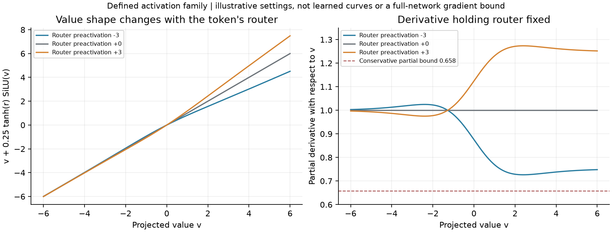

# H067: token-conditioned residual activation is locally qualified

**All 21 fixed checks pass; no learning or resource promotion yet.** The dynamic
prototype uses 2,804,744 FFN weights at d384/L8, **70.2799% fewer** than the full
reference. It starts at the plain BlockShuffle function and adds a scalar
input-dependent activation coefficient. Its simpler static control is retained
within the same experiment, so future gains can be tested for token dependence.
Neither prototype is registered in the active model factory.

## Definition and mathematical result

With the existing u=U(x), v=V(x) and down map D:

    alpha(x) = 0.25*tanh(w^T*x+b)
    F(x) = D[SiLU(u) * (v + alpha(x)*SiLU(v))].

Static learns only b; dynamic also learns w. Zero initialization exactly recovers
the mathematical baseline. Routing uses FP32, or FP64 for double input, and alpha
is cast to the projected dtype before hidden-width arithmetic. Thus CUDA BF16
execution introduces no full-hidden FP32 activation bank. Actual peak memory and
runtime still need measurement; this implementation property is not a memory result.

The [complete proof](token_activation_theory.md) establishes an exact structured
witness that no finite single conventional SwiGLU FFN can represent exactly,
even with dense affine projections. Finite exact-GELU FFNs also cannot represent
it exactly. The proof uses complex continuation and pole residues; the numerical
spot checks do not substitute for that argument. It is **not an approximation
lower bound**, a training advantage, a statement about stacked Transformers, or
a strict separation from the static control. The construction uses the actual
d384/h2048/G8 factor paths and channel permutations.

The modified value stays between 0.75 and 1.25 times its original signed value.
Holding the router independent, its value derivative is at least 0.65803. The
full input Jacobian also contains router derivatives, projections and SiLU gating;
this gives no whole-network nonvanishing-gradient or convergence guarantee.
Token-dependent activation mixing and meromorphic SiLU analysis have existing
primary-source precedents cited in the proof. No novelty or priority is claimed.

[Standalone SVG](figures/token_activation.svg). These are defined, untrained
responses at illustrative router settings, not activation curves learned from data.

## Measured qualification

| Check | Evidence |
|---|---|
| 12 zero-router comparisons | Static/dynamic x CPU FP32/CUDA BF16 x seeds 17/29/43; all 96 output/input/shared-projection gradient comparisons bitwise exact |
| New router learning signals | Finite and nonzero in every fixed zero-router case |
| 4 nonzero-router comparisons | Eager versus product checkpoint; all 38 output/gradient comparisons bitwise exact |
| Parameter count | Static 2,801,672 FFN / 9,099,656 total; dynamic 2,804,744 FFN / 9,102,728 total |
| Independent FP64 gradcheck | Passes for projected values, route input, route weight and bias |
| Sampled envelope/derivative checks | Gain 0.75..1.25; minimum sampled partial derivative 0.725047, above the conservative bound |
| Full-size structured witness | Maximum value error 1.11e-16; router-coordinate derivative error 1.39e-17 |
| Numerical residue identities | 20 spot checks; maximum error 1.27e-10 |

CPU paired cases use shape 2x7x24, hidden48/groups3. CUDA paired cases use
16x128x384, hidden2048/groups8. The three seeds initialize projections and synthetic
inputs; they are not independent trained language models. All comparisons use
the same standard non-reentrant product-checkpoint policy for plain and candidate.
This is distinct from assuming full-training identity to a historical custom
native backward policy. Nonzero tests fix b=.4 and dynamic w to a prescribed
linspace; they do not tune shapes using validation data.

The qualification completes first attempt: **21 passed in 4.86 seconds**. There
are **zero optimizer updates, zero corpus targets and zero full-model resource
workers**. Existing active code, configurations and tests retain their H066 bytes
and prior 108-test qualification. The 21 checks live beside this unregistered
prototype and are not silently added to that active-suite count.

## Qualification decision and completed follow-up

This qualification earned a separately frozen function-fitting/resource comparison of plain,
static and dynamic forms. Include targets favorable to the plain reference as
well as the constructed witness; an architecture-defined target alone would be
biased evidence. Match data, optimization and tuning, and measure actual memory
and throughput before any language allocation. A practical result still needs
both full quality allowances, calibrated narrow, replicated longer training,
convergence, scaling, broader data and strong prior-art comparisons.

The active shortlist remains three model folders and six variants. H063/H066's
checkpoint repairs stay rejected. The research goal is not achieved.

A documentation audit also corrected stale FlashMHF summaries: H046/H047 were
already completed and failed locally, and their variants are archived. The prior
wording incorrectly called them registered or empirically outstanding. Original
document bytes are preserved in
[before_docs.zip](../results/token_activation_v1/before_docs.zip); this correction
does not add or alter experiments.

[Plan](token_activation_plan.md), [protocol](../results/token_activation_v1/protocol.json),
[result](../results/token_activation_v1/result.json),
[prototype and checks](../results/token_activation_v1/source/),
[source snapshot](../results/token_activation_v1/source.zip),
[process record](../results/token_activation_v1/process.json), and
[final audit](../results/verification/token_activation_final_v1.json) preserve the
qualification. Individual checks record hashes, exactness, gradient signals and
witness tensors. A green qualification is not evidence of learned benchmark quality.

The completed [H068 fitting screen](token_activation_fit_results.md) now rejects
both tested activation recipes: dynamic improves only 0.1213% over plain and
0.0628% over static; static improves 0.0585% over plain. Both miss the frozen 2%
gate. The local proof and 21 checks remain intact, but no full-model resource
qualification or language training is earned by these fitting results.
