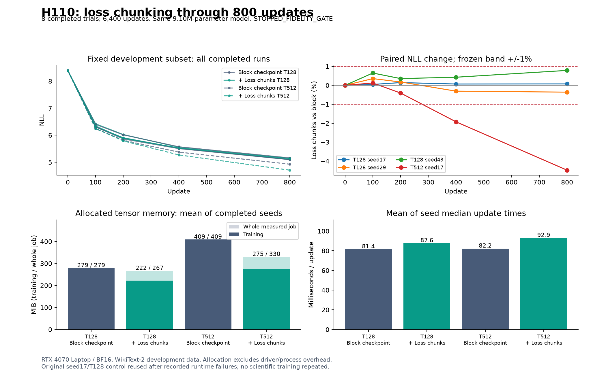

# H110: memory savings through 800 updates

**Narrow GELU with loss chunking qualifies as a training-memory component at
B16/T128 across three seeds. It saves 20.32% of training allocation, with
6.91-8.18% slower updates and at most 0.745% final NLL change. Including
unchunked validation reduces the whole-job saving to only 4.45%.**

The first B8/T512 pair saves 32.83% of training allocation and 19.26% of whole-job
allocation, with **4.32% lower final NLL** and 13.05% slower updates. This is a
positive one-seed quality observation, but it violates the frozen requirement
for execution fidelity within +/-1%. The remaining four trials are therefore
not run. Do not call this a quality regression or discard it as a performance
lead; equally, do not relabel it an equivalent execution or replicated win.

Eight fresh trials complete **6,400 updates and 16,384,000 training-token
presentations**. Every one of 40 independent NLL checks reproduces exactly,
all 24 checkpoints load correctly, and all eight complete sampling streams
replay exactly. No scientific training is repeated. The primary VRAM/quality
goal and the separate architectural parameter-reduction goal remain open.

## Hypothesis, objective and mathematical scope

H102 qualified this execution only through 12 updates. The
[frozen H110 plan](token_memory_duration_plan.md) asks whether it remains within
1% of the original learning trajectory through 800 updates, while saving at
least 15% of training allocation and adding at most 25% to median update time.
Every paired seed must pass. The first failed paired fidelity gate stops the
remaining allocation. No thresholds are adjusted after observing results.

For hidden token rows H, classifier W, valid-target count M and token chunks Ij,
the mathematical objective is

\[
L = \frac{1}{M}\sum_j\sum_{i\in I_j,\ y_i\ne-100}
       \operatorname{CE}(H_iW^T,y_i).
\]

The chunks form a disjoint partition of token rows. This is the same mean loss
and derivative in real arithmetic as evaluating all rows together. Summing
chunk losses before dividing by M handles uneven chunks and masked targets;
averaging chunk means would generally be incorrect. This identity does **not**
prove equality of floating-point GEMMs, gradient reductions, Adam states or
training trajectories. The long-context experiment demonstrates that limit.

Each chunk materializes at most C-by-V logits; checkpointing recomputes their
backward intermediates instead of retaining all N-by-V logits. C=512 and V=4096
here. Persistent model/gradient/Adam state, the CUDA corpus, attention and hidden
representations remain. The ideal local O(CV) workspace bound is not a bound
on the entire job or on driver-visible VRAM.

This uses established [PyTorch checkpointing](https://docs.pytorch.org/docs/2.14/checkpoint.html).
[Cut Your Losses](https://arxiv.org/abs/2411.09009) is a precedent for removing
classifier-memory bottlenecks. Our native PyTorch chunked CE materializes each
chunk's logits and drops no gradient terms; it is not CCE, a new kernel or a
novel activation. No superiority over those implementations is tested.

## Controlled setup

Both policies use the identical narrow GELU Transformer: width 384, hidden 456,
eight layers, six heads, vocabulary 4096, **9,099,648 total parameters** and
**2,801,664 FFN parameters**. Both checkpoint whole blocks; the candidate alone
adds loss chunks of 512 token rows. The unchanged maintained helper and frozen
H101 adapter preserve parameter names, identities and inference forward.
No trainable parameter is added or removed by this experiment.

UV-managed Python 3.12.9, PyTorch 2.14.0+cu132 and one RTX 4070 Laptop GPU are used.
BF16 autocast has FP32 parameters/Adam, TF32 is off, and CPU threads are four.
AdamW uses LR 0.0006, betas(0.9,0.95), epsilon 1e-8, matrix weight decay 0.1 and
global gradient clip 1. The rate is constant. This extends the exact H102
uncalibrated-width recipe; it is not the separately calibrated architectural
baseline and is not claimed convergence-optimal.

Seeds 17/29/43 have paired initial-state and input-stream hashes. The same hashed
WikiText-2 cache remains on CUDA and counts toward allocation. There is no test
split access. The heavily reused development validation is not independent
holdout evidence. Validation always uses native unchunked forward/CE for both
policies: 16 fixed batches at updates 0/100/200/400/800, plus all complete valid
contexts at 800. The latter has 322,688 targets at T128 and 322,560 at T512. Compare
policies within a shape; these two context conventions are not interchangeable.

The original grid was 12 trials / 9,600 updates. Policy order rotates by seed.
The eight completed trials contain six at B16/T128 and two at B8/T512. The four
unrun trials are not assigned outcomes. The continuation's trial loop takes
622.42 seconds, excluding its qualification and the previously completed original
control, which took 75.26 seconds
in its original coordinator. Import diagnosis, preparation and audit time are
separate; synchronized update timings exclude those stages and validation/I/O.

## Every paired outcome

Negative NLL change means improved loss. Training and whole-job savings are
percent reductions versus whole-block checkpointing in the same pair.

| Shape | Seed | Block NLL | Chunk NLL | NLL change | Training saving | Whole-job saving | Update cost | Frozen gates |
|---|---:|---:|---:|---:|---:|---:|---:|---|
| B16/T128 |17|5.183947|5.187383|+0.0663%|20.32%|4.45%|+8.18%|Pass|
| B16/T128 |29|5.232069|5.228879|-0.0610%|20.32%|4.45%|+6.91%|Pass|
| B16/T128 |43|5.157479|5.195913|+0.7452%|20.32%|4.45%|+7.70%|Pass|
| B8/T512 |17|4.993263|4.777630|-4.3185%|32.83%|19.26%|+13.05%|Fidelity fails; stop|

At T128 the largest absolute subset difference is 0.7892%, also within the fixed
limit. At T512 the subset change is -1.9283% at 400 and -4.4823% at 800. Both endpoint
and trajectory fidelity fail. The raw loss improves rather than deteriorates;
we retain that direction in every table and do not describe the failure as
proof of inferior quality. A new quality-oriented replication would require a
separate hypothesis and budget, without changing this stopped result.

### Seed variation at B16/T128

| Quantity | Mean | Median | Sample variance |
|---|---:|---:|---:|
| Block final NLL |5.191165|5.183947|0.001429995|
| Chunk final NLL |5.204058|5.195913|0.000480241|
| Paired NLL change, percentage points |+0.250172|+0.066281|0.187843|
| Block median update time, ms |81.44045|81.64415|0.168316|
| Chunk median update time, ms |87.62532|87.58765|0.130916|

These are three-seed descriptive statistics, not a confidence claim or a
best-seed selection. Mean paired update overhead is 7.596%; median overhead is
7.705%. Allocation counts are identical across these three seeds, with zero
sample variance. T512 has one pair, so its sample variance is undefined and
stored as null. All per-update timing distributions and early/late windows
remain in the complete numeric record.

## Why training memory is not enough

| Shape / policy | Training peak, MiB | Validation peak, MiB | Whole measured job, MiB |
|---|---:|---:|---:|
| T128 block |279.017|264.739|279.017|
| T128 chunks |222.315|266.614|266.614|
| T512 block |408.743|332.817|408.743|
| T512 chunks |274.568|330.005|330.005|

The candidate moves the allocation peak from training to unchunked validation.
At T128 this removes most of the practical whole-job benefit. At T512 a meaningful
19.26% reduction remains, but only for one observed pair whose learning
trajectory is no longer within the fidelity band. Neither shape qualifies a
replicated >=15% whole-job saving with the frozen fidelity requirements.

These are PyTorch allocated tensor bytes, including the corpus and persistent
training state. They exclude driver/context overhead and other processes.
Reserved-memory peaks, parameter/gradient/optimizer bytes and per-step peaks
are retained separately. No inference saving, maximum-capacity batch result,
cross-device speed claim or reduction of model parameters follows.

All 6,400 losses/preclip norms and final model/Adam states are finite. Clipping
fractions range from 1.25% to3.375%, and layer activation/gradient summaries are
preserved at the five fixed checkpoints. Finite gradients alone do not prove
absence of vanishing gradients, optimal conditioning or deep-network stability.

## Independent verification and runtime history

The independent audit uses the maintained native evaluation path, not the
experimental loss wrapper. It reconstructs eight exact initial states, replays
every one of the 800 batches per run, loads all 24 saved checkpoints, checks
finite final optimizer states at step800 and reproduces **40 NLL scores exactly**.
The audit makes zero optimizer updates. The final verifier separately recomputes
all statistics, memory/time ratios, paired gates and the stopping decision.

The first candidate attempt crashed during a SymPy dependency import before
training. An explicit CPU-preload recovery also failed before training, after
two successful dependency probes. A12-process CPU diagnostic found intermittent
failures under both Python versions and no mismatches among 1,572 checked SymPy
source files. Root cause remains unknown. The
[runtime report](runtime_import_diagnosis.md) contains every condition and caveat.

A [recorded continuation](token_memory_duration_recovery_plan.md) then used the
original UV-managed Python with bytecode bypass and CPU dependency preload. It
passed eight fresh qualification cases, reused the independently audited original
control and ran only never-trained trials. The original eight qualification
cases and both failures remain preserved. The original control's timing predates
the other runs and used a different import bootstrap; this temporal difference
limits interpretation of small runtime effects. The scientific code, precision,
data, optimizer and thresholds did not change.

After training, a separate outer `uv` dispatcher panicked before the audit
worker started. Its output is preserved; directly invoking the same UV-managed
interpreter completed the audit. This is postprocessing recovery, not a training
retry or a demonstrated fix for the native failures. Source hashes are verified.
The maintained source/tests are unchanged from the **previous 116-test pass**;
that suite is not claimed as a new H110 run. Current maintained-source lint passes.

## Decision and next question

Retain **B16/T128 as an 800-update, three-seed training-memory component**. It
does not deliver a substantial whole-job saving. Close the fixed claim of
faithful B8/T512 execution through 800 updates. Preserve its lower-loss,
lower-memory endpoint as an unreplicated performance lead, not an eliminated
architecture or a qualified equivalent execution. Do not resume the stopped
grid automatically or tune chunk sizes/rates/precision to rescue its fidelity.

The next justified memory question is whether evaluation can be streamed with
independently verified scores so its allocation no longer erases training
savings. Separately, the positive long-context observation needs a fresh,
quality-oriented replication rather than a retroactive fidelity exception.
Broader data, longer convergence and larger scale remain required. This round
adds no active architecture and establishes no new theorem or SOTA claim.

The active structure stays two model folders, five variants and eight recipes.
All failures and raw states remain local; compact evidence is published without
deleting originals. See the [source guide](../results/token_memory_duration_fresh_v1/source/README.md),
[summary](../results/token_memory_duration_fresh_v1/summary.json),
[all numeric records](../results/token_memory_duration_fresh_v1/result.json.gz),
[independent audit](../results/token_memory_duration_fresh_v1/audit.json) and
[verification receipt](../results/verification/token_memory_duration_final_v1.json).
