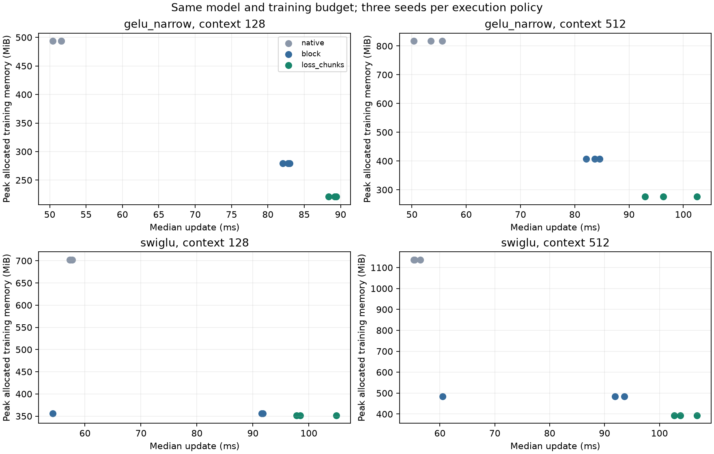

# Token memory results: H101 and H102

**Narrow GELU qualifies for this short memory study at both tested shapes.**
Loss chunking saves 21.01% / 32.23% allocated training memory versus whole-block
checkpointing across three seeds. Updates cost 7.45-22.51% more; the largest
relative final NLL change is +0.189%. Retain this as an experimental option.

This is an execution study, with no new activation, parameter reduction or novelty claim.
H101 was stopped after 22/180 planned cases because a full GELU trajectory failed fidelity.
H102 completed 36 fresh cases; 38 saved checkpoints, including two diagnostic replays,
were independently loaded and their unchunked validation scores reproduced exactly.

## Fixed-gate replication

Each row summarizes three seeds. Changes are relative to whole-block checkpointing;
NLL is relative to native execution of the same model. Lower memory/time/NLL is better.

| Model | Context | Allocated memory change | Median update-time change | NLL change | All seeds pass |
|---|---:|---:|---:|---:|---|
| gelu_narrow | 128 | -21.01% | +7.69% | -0.0009% | Yes |
| gelu_narrow | 512 | -32.23% | +13.88% | +0.0636% | Yes |
| swiglu | 128 | -1.31% | +7.27% | -0.0016% | No |
| swiglu | 512 | -18.72% | +14.13% | +0.0012% | No |

Gates fixed before measurements: >=15% lower allocated training memory, <=25%
update-time increase and <=1% absolute relative final NLL difference, for every seed.
Mean, median, sample variance, ranges and all individual gates are in
[result.json](../results/token_memory_replication_v1/result.json); all 36 rows are in
[metrics.csv](../results/token_memory_replication_v1/metrics.csv).

Full SwiGLU fails the all-seed runtime gate: its worst observed penalties are
+93.34% at context 128 and +71.57% at context 512. The median alone would hide
these failures. Short separate-process GPU timings vary substantially; the raw
forward/backward/optimizer timings are retained. No general speed claim follows.

| Model | Context | Parameters (unchanged) | Block checkpoint MiB | With loss chunks MiB |
|---|---:|---:|---:|---:|
| gelu_narrow | 128 | 9,099,648 | 279.56 | 220.83 |
| gelu_narrow | 512 | 9,099,648 | 406.65 | 275.60 |
| swiglu | 128 | 15,735,168 | 355.98 | 351.32 |
| swiglu | 512 | 15,735,168 | 483.37 | 392.88 |



## The failure is part of the result

At B16/T128, seed 17, full GELU native NLL is 6.935556. FFN-only chunking gives 9.108537;
loss-only gives 8.224111. The latter failure reproduces in a fresh process and an
independent checkpoint rescore. Combined chunking gives 6.939283 in that case, but
saves only 1.25% memory and costs 56.26% more time than block checkpointing.

Tiny full-model qualification passed 40 CPU-double/CUDA-BF16 cases. Full-scale
matched-state gradients differ by up to 0.627% initially and 1.977% at the native
GELU endpoint for loss chunking. Floating-point reduction order changes even when
the real-arithmetic equations agree. These observations show trajectory sensitivity;
they do not establish its exact causal mechanism or a general precision remedy.

FFN-only chunking adds cost without a material memory benefit in the completed
small-shape cases. That fixed recipe is closed. The full GELU loss recipe also
remains closed; H102 does not retroactively repair or hide it.

## What is proved, and what is measured

For deterministic token-independent f, partitioning rows commutes with applying f.
For a linear classifier and CE, summing chunk losses and dividing by the total
number of valid targets gives the same mathematical loss. Differentiating that
finite sum gives the same mathematical gradients. Uneven final chunks must not
receive equal weight as full chunks. The 14 helper tests cover those identities,
numerical gradcheck, masks, noncontiguous inputs and invalid chunk sizes.

Checkpointing retains inputs and recomputes intermediates. Expanded FFN and loss
workspaces change from O(Nh)/O(NV) to O(Ch)/O(CV), with C=512 here. O(Nd) saved
features, parameters, gradients, optimizer and attention costs remain. This bound
is not a prediction that total peak VRAM falls by N/C, nor a proof of faster runtime.

## Reproducible scope

One RTX 4070 Laptop GPU with 8 GiB; UV, PyTorch 2.14.0+cu132, BF16 autocast, FP32 weights
and AdamW, TF32 off, four CPU threads. Width 384, eight layers, six heads, V=4096.
Narrow GELU h=456 and full SwiGLU h=1024. Shapes B16/T128 and B8/T512, chunks of 512.
Seeds 17/29/43; 12 updates from scratch, constant LR 0.0006, matrix decay 0.1,
betas(.9,.95), eps1e-8, clip 1. Four warmup/eight synchronized timed updates.
Data is the existing hashed WikiText-2 cache. All methods share data order;
eight unchunked validation batches score 16,384 or 32,768 targets. Test data is unused.

Allocated training peaks include CUDA corpus cache and optimizer initialization,
but exclude validation/export. Reserved peaks are separately reported. Timing
includes forward, backward, clipping and optimizer, excluding sampling/scoring/I/O.
Native/block checkpointing end with bitwise-identical weights in 6/12 pairs.
Their largest relative NLL difference is 0.00471%; checkpointing itself is not
bitwise identical in every case at the longer context. No deterministic-kernel
guarantee was enabled, so this study does not attribute that difference to one cause.
Loss chunking does not promise identical weights. No convergence, long-duration
language quality, inference-speed or broader-corpus result follows from 12 updates.

Sources and recipes are frozen in the protocols/source archive. Checkpoints remain
local and ignored by Git; a clean clone must rerun to independently rescore them.

```powershell
uv run --no-sync python -m pytest -p no:anyio tests/test_token_memory.py -q
# Reproduce one qualified case in a fresh output directory:
uv run --no-sync python -m results.token_memory_v1.source.diagnose loss_chunks --variant gelu_narrow --context 512 --seed 17 --root results/token_memory_reproduction_example
uv run --no-sync python -m results.token_memory_v1.source.audit
uv run --no-sync python -m results.token_memory_v1.source.analyze
```

The original study and replication refuse to overwrite run directories. For a new
experiment, use a fresh worktree/output root and preserve its own protocol. The
H101 frozen-source hashes intentionally reject changes; do not edit them to force a run.

## Prior work and next research constraint

[Reformer](https://arxiv.org/abs/2001.04451) already uses FFN chunking;
[Cut Your Losses](https://arxiv.org/abs/2411.09009) targets classifier-logit memory
with specialized kernels. This native token-chunk implementation is not CCE and
drops no gradient terms. [PyTorch checkpointing](https://docs.pytorch.org/docs/2.14/checkpoint.html)
supplies recomputation. No novelty or SOTA advantage is established.

The result constrains future architecture research: compare actual memory against
appropriately optimized controls, and qualify training trajectories as well as local
derivatives. Lower FFN parameter counts alone do not identify the memory bottleneck.
The original architectural breakthrough goal remains unmet.
