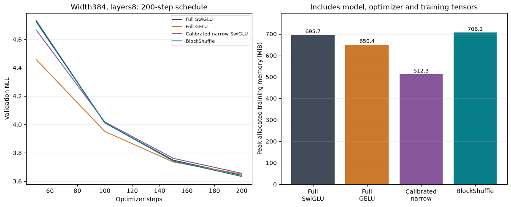
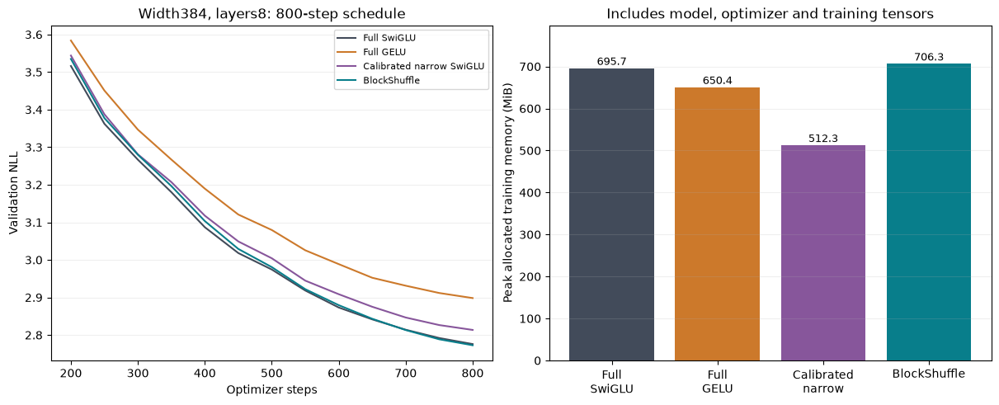

# Trained scale: width384, eight layers

This compares the locked full, calibrated narrow and BlockShuffle recipes at doubled width and depth. It is a trained scale probe of existing architectures, not a new primitive or convergence result. Read the [frozen plan](trained_scale_plan.md).

## 200 steps, seed17

| Recipe | FFN weights | Total weights | NLL | Train peak MiB | Clipped steps |
|---|---:|---:|---:|---:|---:|
| Full SwiGLU | 9,437,184 | 15,735,168 | 3.641419 | 695.69 | 95.0% |
| Full GELU | 9,437,184 | 15,735,168 | 3.649618 | 650.37 | 66.5% |
| Calibrated narrow SwiGLU | 2,801,664 | 9,099,648 | 3.655307 | 512.28 | 100.0% |
| BlockShuffle | 2,801,664 | 9,099,648 | 3.633305 | 706.28 | 88.0% |

Both compressed models use 70.3125% fewer FFN weights and matrix FLOPs, and 42.170% fewer total weights. They use 5603328 FFN matrix forward FLOPs/token versus 18874368 for full models. Pointwise/normalization/optimizer costs are excluded from these arithmetic counts.

## 800 steps, seed17

| Recipe | FFN weights | Total weights | NLL | Train peak MiB | Clipped steps |
|---|---:|---:|---:|---:|---:|
| Full SwiGLU | 9,437,184 | 15,735,168 | 2.775852 | 695.69 | 77.9% |
| Full GELU | 9,437,184 | 15,735,168 | 2.898301 | 650.37 | 75.9% |
| Calibrated narrow SwiGLU | 2,801,664 | 9,099,648 | 2.813521 | 512.28 | 85.8% |
| BlockShuffle | 2,801,664 | 9,099,648 | 2.772706 | 706.28 | 82.4% |

Both compressed models use 70.3125% fewer FFN weights and matrix FLOPs, and 42.170% fewer total weights. They use 5603328 FFN matrix forward FLOPs/token versus 18874368 for full models. Pointwise/normalization/optimizer costs are excluded from these arithmetic counts.

## Frozen continuation decision

- within 2 percent of full swiglu: PASS.
- within 2 percent of full gelu: PASS.
- at least half percent better than calibrated narrow: PASS.
- matched compressed parameter and matrix compute budget: PASS.
- finite training: PASS.
- peak within 10 percent of full swiglu: PASS.
- all models under 6 gib safety limit: PASS.

The four-model 800-step cohort is eligible under the frozen scale-screen gates.

Both optimizer treatment and initialization remain recipe-specific as declared. Full models use the original recipe, narrow SwiGLU uses width calibration, and BlockShuffle uses factor-aware initialization/LR and native gate recomputation. Historical tuning effort is not equalized. This is a comparison of those locked recipes, not an isolated factorization effect.

The same small TinyStories prefix and train-only tokenizer are used. Initial non-FFN parameters match exactly across models; all parameter counts and CPU backward checks passed before GPU training. Gradient clipping and finite checks are recorded, but neither proves a lower bound on trained network Jacobian singular values. These models remain far smaller than frontier language models.

## Equal-execution serving

Serving uses batch16/context128 BF16 and the same 800-step checkpoints, with full SwiGLU as the control. Eager and shared-stream V2 CUDA graph protocols are reported separately. Ratios come from rotating within-round comparisons, not the independent training-run timings.

| Recipe / execution | Mode | NLL | Median speed ratio | Range | Peak MiB | Extra cache MiB | FFN matrix FLOPs/token |
|---|---|---:|---:|---:|---:|---:|---:|
| BlockShuffle / eager | factorized | 2.772706 | 0.752 | 0.628-0.890 | 140.09 | 0.00 | 5,603,328 |
| BlockShuffle / eager | dense_cache_bf16 | 2.772884 | 1.055 | 0.987-1.328 | 175.75 | 36.00 | 37,748,736 |
| BlockShuffle / eager | packed_factors_bf16 | 2.772706 | 0.802 | 0.767-0.917 | 146.80 | 3.56 | 5,603,328 |
| BlockShuffle / eager | dense_reference | 2.775852 | 1.000 | 1.000-1.000 | 183.06 | 0.00 | 18,874,368 |
| BlockShuffle / graph_v2 | factorized | 2.772706 | 0.772 | 0.692-0.781 | 160.36 | 0.00 | 5,603,328 |
| BlockShuffle / graph_v2 | packed_factors_bf16 | 2.772706 | 0.706 | 0.625-0.716 | 164.09 | 3.56 | 5,603,328 |
| BlockShuffle / graph_v2 | dense_cache_bf16 | 2.772884 | 0.711 | 0.684-0.721 | 195.72 | 36.00 | 37,748,736 |
| BlockShuffle / graph_v2 | dense_reference | 2.775852 | 1.000 | 1.000-1.000 | 185.03 | 0.00 | 18,874,368 |
| Calibrated narrow SwiGLU / eager | candidate | 2.813521 | 1.001 | 0.943-1.287 | 145.44 | 0.00 | 5,603,328 |
| Calibrated narrow SwiGLU / eager | dense_reference | 2.775852 | 1.000 | 1.000-1.000 | 183.06 | 0.00 | 18,874,368 |
| Calibrated narrow SwiGLU / graph_v2 | candidate | 2.813521 | 1.428 | 1.385-1.486 | 160.36 | 0.00 | 5,603,328 |
| Calibrated narrow SwiGLU / graph_v2 | dense_reference | 2.775852 | 1.000 | 1.000-1.000 | 185.03 | 0.00 | 18,874,368 |

All added caches remain allocated and are counted. The BF16 dense cache raises BlockShuffle FFN matrix work to twice the full reference, while its factorized/packed modes keep the reduced arithmetic. Full-sequence serving does not establish autoregressive latency or training speed. Raw JSON files retain every round, checkpoint hash and correctness check.

## Trained projection conditioning

| Recipe | Smallest condition number | Largest condition number | Loss-direction backward gain range |
|---|---:|---:|---:|
| Full SwiGLU | 4.75 | 17.28 | 0.070-0.305 |
| Calibrated narrow SwiGLU | 16.20 | 64.40 | 0.125-0.422 |
| BlockShuffle | 3.11 | 30134.46 | 0.115-0.382 |

A subsequent [controlled post-training floor](conditioning_results.md) reduces the larger checkpoint's worst down condition to 26.53 at a .01118% NLL cost and transfers to three smaller checkpoints. Original metrics above remain unchanged. This is projection-level conditioning evidence, not a full-network stability proof.

All recorded gradients are finite and projections have maximum numerical rank at the relative 1e-6 threshold. However, BlockShuffle's layer6 down projection reaches condition number 30134, versus a maximum 17.28 for full SwiGLU. Its flat initialization spectrum does not persist. These CPU FP32 audits use FP64 SVD on materialized weights and one fixed loss direction; neither finite gradients nor a projection spectrum proves full-network nonvanishing gradients.

## Completed compiler probe

Default fullgraph compilation passes BF16 numerical checks but gives a paired compiled BlockShuffle/full speed ratio .632 (.575-.755), failing the .8 floor. General compiled/eager speedups are 3.494 for BlockShuffle and 3.593 for full SwiGLU. Read the [completed compiler result and profiles](compiler_serving_results.md).

## Longer-budget decision and remaining evidence

- within 1 percent of full swiglu: PASS.
- within 1 percent of full gelu: PASS.
- beats calibrated narrow: PASS.
- training peak within 10 percent of full: PASS.

These gates describe one seed at this size and budget. Multiple seeds, convergence, broader data, acceptable serving, equal tuning effort and verified novelty remain necessary. Passing selected local gates does not establish the research goal.

