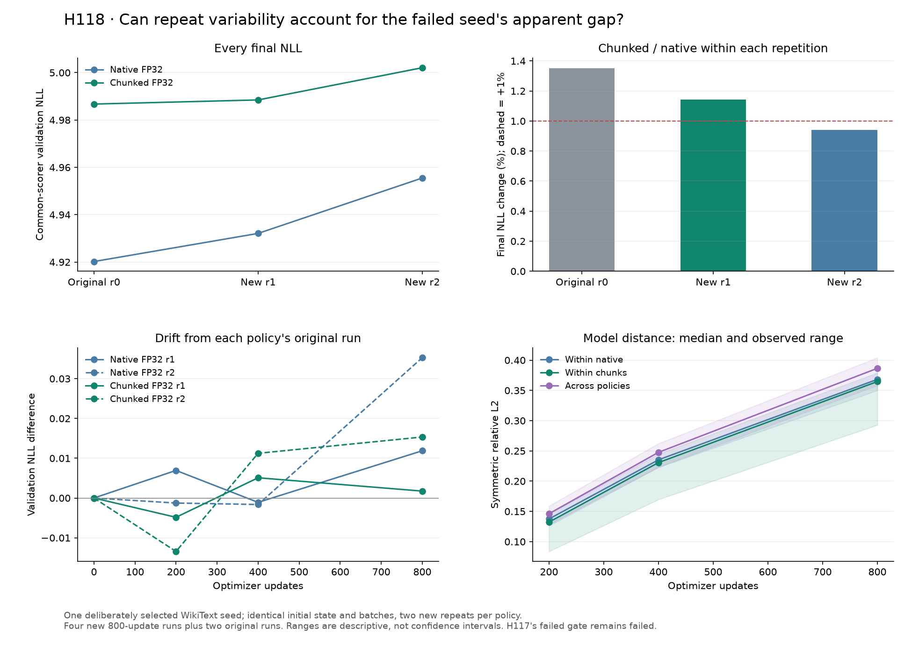

# H118 — repeat variability on the failed WikiText fixture

**Frozen diagnostic verdict: INCONCLUSIVE.** All three observed
chunked endpoints are worse than all three native endpoints, but the smallest
cross-comparison gap is **0.630%**, below the
predeclared 1% material-disadvantage threshold. The two new paired gaps are
**1.143% and 0.940%**.
The original H117 quality failure remains failed.

The ranges do not overlap. The largest within-policy range,
0.035284 NLL, is smaller than the original
pair gap of 0.066509. Thus the observed repeat variability
does not span that entire gap, but these few selected repetitions cannot
uniquely establish its cause or a population-level effect.



## Why this experiment was earned

[H117](fp32_training_replication_results.md) qualified a limited TinyStories
memory component, but its fixed two-corpus claim failed. WikiText seed101 lost
1.55% NLL against BF16 native and 1.35% against FP32 native after 800 updates,
despite tiny initial FP32 gradient error. H118 tests whether that latter gap
repeats beyond ordinary variation between unchanged executions.

The [plan](training_variability_plan.md) selected this failed seed deliberately.
This is **one conditional diagnostic fixture**, not three training seeds, a new
held-out task or an independent sample of model quality. The original two FP32
runs are kept as repetition0. Exactly four additional fresh executions provide
two native and two chunked repetitions, with reversed policy order in repetition2.

Every run loads the same hashed CPU step-zero weights and empty Adam state,
then consumes identical batches. The unchanged H117 common `run_case` function
is imported directly; a temporary output-directory binding is explicitly set
and restored. No copied training loop, altered optimizer, new activation or
backend change is introduced.

The model remains narrow GELU, width 384 / hidden 456/eight layers/six heads,
vocabulary 4096, batch 8, context 512: **9,099,648 total / 2,801,664 FFN parameters**.
All six compared trajectories use FP32 decoder/classifier arithmetic, default
SDPA, whole-block checkpointing, FP32 weights/moments, fixed LR 0.0006, AdamW
betas (0.9, 0.95), epsilon 1e-8, existing matrix-decay groups and norm clip 1.
TF32 remains disabled, with four CPU threads on the same RTX 4070 Laptop GPU.
The UV-managed Python 3.12.9 / PyTorch 2.14.0+cu132 environment is retained.

## Every endpoint and observed variation

Lower NLL is better. All full validation scores use the same streamed BF16
scorer at 0/200/400/800, independently checked with native unchunked scoring.
No best checkpoint or favorable subset is selected.

| Repetition | Native FP32 NLL | Chunked FP32 NLL | Chunked change | Allocation saved | Update-time ratio |
|---|---|---|---|---|---|
| Original H117 | 4.920221 | 4.986730 | +1.3518% | 26.816% | 1.1667 |
| New r1 | 4.932101 | 4.988472 | +1.1429% | 26.816% | 1.1765 |
| New r2 | 4.955505 | 5.002071 | +0.9397% | 26.816% | 1.1265 |

| Policy | Mean NLL | Median | Sample variance | Observed range |
|---|---|---|---|---|
| native | 4.935942 | 4.932101 | 0.00032231 | 4.920221–4.955505 |
| chunks | 4.992424 | 4.988472 | 0.00007055 | 4.986730–5.002071 |

Each group contains three **repeat executions of one seed**. Sample variance
uses n−1 and is descriptive. The median between-policy gap is
0.056371 NLL; the maximum within-policy range is
0.035284; their ratio is
1.598. This ratio is not a significance test.
Native's maximum/minimum NLL differs by 0.717%,
and chunks' differs by 0.308%.

The rule fixed before repeats requires `min(chunks) > 1.01 * max(native)` for
REPEATED MATERIAL DISADVANTAGE. It is not satisfied. OVERLAPPING REPEAT VARIATION
also requires overlapping observed intervals, which do not occur. Therefore
the result is INCONCLUSIVE. A consistent ordering or favorable mean cannot
replace those predeclared criteria.

## Memory, runtime and complete accounting

| Origin | Repeat | Policy | Allocated MiB | Reserved MiB | Update median ms |
|---|---|---|---|---|---|
| H117 | 0 | native | 408.686 | 502.000 | 69.489 |
| H117 | 0 | chunks | 299.091 | 398.000 | 81.076 |
| H118 | 1 | native | 408.686 | 502.000 | 68.835 |
| H118 | 1 | chunks | 299.091 | 398.000 | 80.988 |
| H118 | 2 | chunks | 299.091 | 398.000 | 81.388 |
| H118 | 2 | native | 408.686 | 502.000 | 72.247 |

New chunked runs preserve **26.816% lower allocated job peaks** versus native
FP32. Their warmed update cost is 1.1765x and
1.1265x the paired reference. There is no
parameter-count reduction. These are observations on the selected fixture;
they do not independently requalify quality or the full research target.

Allocation includes optimizer/data caches, probe, all updates, evaluation,
diagnostics and serialization. Reserved bytes are reported separately and
driver/context memory remains excluded. All **6,444 new memory intervals**
are recorded before resetting peaks; five study boundaries and six audit
boundaries return zero allocated/reserved tensor storage. All new losses,
gradient norms, final parameters/moments and sampled diagnostics remain finite.

Twenty updates warm up and all 780 remaining updates contribute timing. The
timed region excludes batch hashing, scalar reporting and disk I/O. The complete
loop also includes intermediate scoring/checkpointing. New study elapsed time is
**286.05 seconds**; audit/initial setup are separate.

New budget: **3,200 updates / 13,107,200 target presentations**, plus four initial
gradient probes =3,204 main backwards. The existing H117 CPU-double qualification
is reused for unchanged code, with zero new qualification backwards. Audit adds
four backward replays: **3,208 new backwards** in total. Original H117's two
compared runs contribute 1,600 historical updates and are counted separately.
No scientific run or postprocessing retry was required in H118.

## How trajectories separate

Initial gradient distances within a policy span 2.590e-10–5.904e-08;
across policies they span 2.671e-07–2.676e-07.
Distances are global symmetric relative L2. The six within-policy pairs first
differ in their recorded training loss at steps 14, 14, 14, 17, 18, 17
(ordered as listed in the compact summary). A recorded scalar loss can remain
equal even when gradients already differ; this is not the first differing bit
of the full state.

The table gives median distances among all unordered checkpoint pairs. Native
and chunked each contribute three within-policy pairs; across policies there
are nine. The figure also shows observed ranges, not confidence intervals.

| Step | Pair type | Pairs | Model distance | First-moment distance | Second-moment distance |
|---|---|---|---|---|---|
| 200 | native | 3 | 0.137488 | 0.667529 | 0.310186 |
| 200 | chunks | 3 | 0.132312 | 0.637907 | 0.272689 |
| 200 | cross | 9 | 0.146189 | 0.695774 | 0.311454 |
| 400 | native | 3 | 0.235247 | 0.760621 | 0.384150 |
| 400 | chunks | 3 | 0.230725 | 0.764845 | 0.369052 |
| 400 | cross | 9 | 0.247635 | 0.821240 | 0.420495 |
| 800 | native | 3 | 0.368260 | 0.936757 | 0.380539 |
| 800 | chunks | 3 | 0.364707 | 0.900552 | 0.355901 |
| 800 | cross | 9 | 0.386554 | 0.970036 | 0.421925 |

Model and Adam-moment distances show that repeat execution can lead to different
states. They do not identify a specific kernel, establish catastrophic gradients,
or prove why one final validation loss is worse. Initial gradients and every
saved checkpoint remain available for a future mechanism-specific experiment.

## Mathematical limit of the initial-gradient test

Let a training update act on the full state s, including parameters and Adam
moments. If its map F_t is K_t-Lipschitz in a chosen norm, and the alternative
implementation differs from it by at most e_t at each relevant state, then:

```text
delta[t+1] <= K[t] * delta[t] + e[t]
delta[T] <= sum over i=0..T-1 of e[i] * product over j=i+1..T-1 of K[j]
```

The second inequality follows by repeatedly substituting the first, starting
from identical initial state. This elementary bound requires control of every
relevant e_t and K_t. A tiny gradient difference measured only at initialization
does not supply those bounds, and this experiment estimates neither. No theorem
of training equivalence, new stability guarantee or novelty follows.

[PyTorch numerical accuracy](https://docs.pytorch.org/docs/2.14/notes/numerical_accuracy.html)
and [reproducibility](https://docs.pytorch.org/docs/2.14/notes/randomness.html)
describe the general distinction between mathematical equivalence, seeding and
bitwise execution. They do not explain our particular NLL difference uniquely.

## Audit and decision

The independent audit passes. It regenerates the shared initial state,
verifies all 12 new trained model/Adam/sampler checkpoints, reproduces all 3,200
new batches, checks six stored initial-gradient hashes (four new, two original),
and computes 13 native full-validation scores. Maximum streamed/native relative
score error is 8.553e-09. All four new initial FP32 gradient replays pass;
maximum global relative L2 is 5.918e-08. Thresholds remain 1e-6 for score/loss,
1e-5 global and 1e-4 per tensor for replay. Fifteen initial-gradient pairs and 45
checkpoint pairs are recorded. No BF16 gradient or full training-trajectory
bitwise reproducibility is claimed.

Keep the classification **INCONCLUSIVE** and retain the consistent observed
ordering as a diagnostic finding. H117's fixed WikiText/two-corpus recipe stays
rejected, while its scoped TinyStories result and resource observations remain.
No extra unchanged 800-update repeats, new default, activation or parameter
reduction are earned here. Further work should test a distinct mechanism locally
before allocating another broad language sweep. The full research goal remains open.

One concrete next question is whether Adam's coordinate-wise normalization
amplifies the small differences already present in the saved initial gradients.
Those six gradient sets allow a bounded first-update comparison without new
language training. Such a diagnostic would still need its own frozen plan and
would not, by itself, explain the full 800-update endpoint or qualify a new recipe.

## Artifacts

[Protocol](../results/training_variability_v1/protocol.json),
[audit protocol](../results/training_variability_v1/audit_protocol.json),
[summary](../results/training_variability_v1/summary.json),
[source guide](../results/training_variability_v1/source/README.md),
[verification receipt](../results/verification/training_variability_final_v1.json).
Compressed metric/curve/update tables include all six compared trajectories;
their 4,800 update rows are explicitly marked H117 or H118. New allocation is
only 3,200 updates. Raw per-run histories/tensors remain local, ignored and intact.

All 137 frozen source/plan hashes and 61 maintained hashes are preserved. The
maintained tree stays at two model folders, five variants and eight recipes.
The prior 116-test suite result is historical; this round does not rerun that
unchanged suite. H117's startup and plotting failures remain preserved, and
successful H118 execution does not establish a Windows native-runtime cure.
