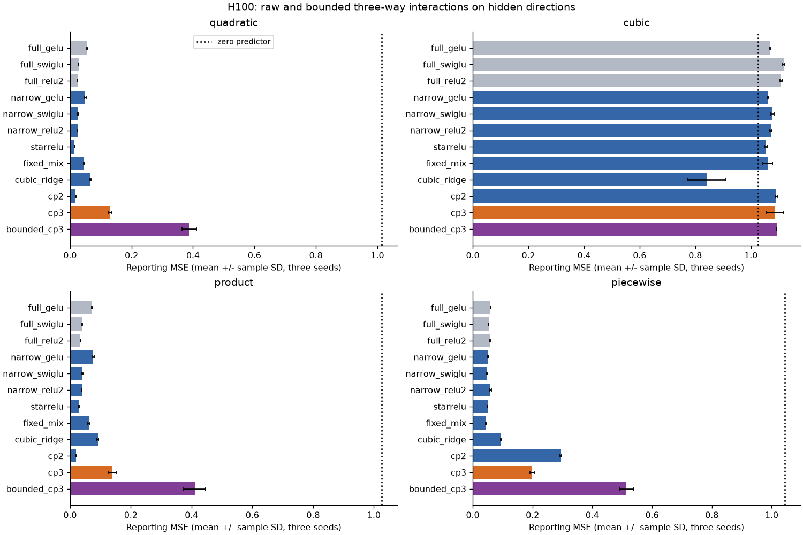
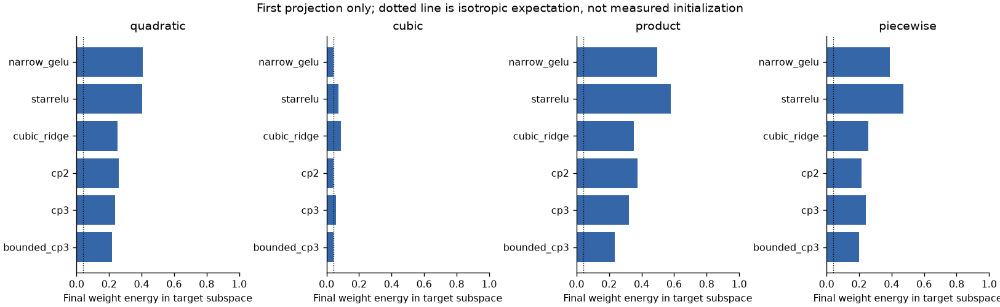
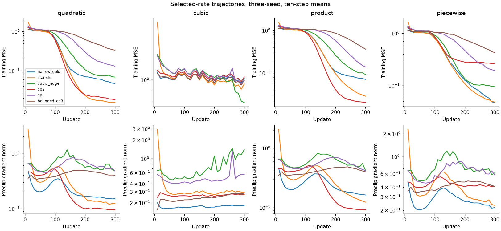

# H100: explicit cubic interactions can represent the target but fail to learn it

**Reject both three-projection recipes at the frozen 300-update budget.**
Raw products have 2.079 times narrow GELU's aggregate reporting MSE; bounded
products have 4.543 times its error. Native updates cost 1.562 and 1.881 times
narrow GELU, respectively. Both reduce total FFN parameters by 70.27%, but fail
the quality, cubic-learning and runtime gates. The gold research goal is unmet.

This is a distinct mechanism from H099's scalar activation adjustment: three
learned projections interact multiplicatively before a single readout. An exact
construction verifies that the raw model can represent three task families,
including cubic. Its training failure therefore cannot be explained by absence
of those functions from its represented class alone.

## Mechanism and proven limits

For affine projections u, v and w, compare:

    raw:      phi = u*v*w
    bounded:  phi = 4*u*v*w / (1+u^2+v^2+w^2)

Both have 228 hidden features, 350,208 matrix weights and 1,068 biases:
351,276 trained parameters. Full GELU/SwiGLU have 1,181,568/1,182,080 including
biases, giving 70.270%/70.283% reductions. Neither candidate has learned scalar
activation parameters. The three projections are learned jointly from data.

The bounded feature has each partial derivative at most two in magnitude and
feature-gradient norm at most sqrt(12). Its magnitude grows at most linearly
with the norm of (u,v,w). The [frozen plan](triadic_interaction_plan.md) gives
the derivation. These are upper bounds on the feature map, not lower gradient
bounds or bounds on a whole learned network. The raw product has cubic growth
and unbounded derivatives. The bounded form cannot represent global cubic growth.

The raw model's privileged construction uses sixteen features:
(q-1)(q+1)*1 for quadratic; q*(q-sqrt(3))*(q+sqrt(3)) for cubic;
and q_i*q_(i+1)*1 for pair products. The actual implementation's outputs and
input gradients agree with those targets at the recorded FP64 tolerance.
Training starts from random projections and zero output, never this construction.

Tensor-factorized polynomial networks are established prior work, including
[Pi-Nets](https://arxiv.org/abs/2006.13026). Prior
[complexity and Lipschitz analysis](https://arxiv.org/abs/2202.05068) motivates
checking stability but does not validate this particular rational formula.
No novelty claim is made.

## Fresh data and controlled budget

Inputs are 384-dimensional Gaussian vectors. A hidden orthonormal projection
maps them to sixteen latent coordinates; an independent output rotation maps
the nonlinear targets to 384 outputs. Unlike H099, the relevant directions are
dense rotations rather than selected coordinates. There are quadratic, cubic,
pair-product and piecewise target families with zero population mean and zero
population linear projection. Output scaling uses training-only standard deviation.

Splits: 65,536 training, 4,096 learning-rate selection, 4,096 reporting examples.
Input/basis/output seeds are 9900/9901/9902. Three optimization/sampling seeds
(17,29,43), two rates (.001,.003), thirteen forms, batch 256 and 300 updates give
**312 runs, 93,600 optimizer updates and 23,961,600 example presentations**.
This includes the privileged known-feature control. Each run draws 76,800
training rows with replacement, about 1.17 training-set exposures.

All comparable forms use name-local N(0,1/384) projection weights, uniform[-1,1]
projection biases and zero readout weights/output biases. Raw/bounded products
share initial weights. AdamW (.9,.95), epsilon1e-8, zero decay, global clip1,
constant LR; narrow readout LR is scaled by reference/actual hidden width.
SwiGLU reference width is 1024; other forms use 1536. Other parameters use base LR.
FP32 CUDA, TF32 off, one RTX4070 Laptop GPU, four CPU threads.

Twelve affine fits use exactly each seed's sampled training multiset. They use
a different solver, reported separately from gradient updates. No candidate
receives the hidden input basis. Only the explicitly privileged positive control
and post-training diagnostics access it. The positive control has 6,144 trained
readout weights plus 6,144 fixed basis entries; it is not a fair compression result.

## Audited outcomes

Mean reporting MSE across three seeds, after independent selection of each
recipe's rate. Median, variance, standard deviation and every seed are retained
in the [audited JSON](../results/triadic_interaction_v1/result.json).

| Form | Quadratic | Cubic | Product | Piecewise |
|---|---:|---:|---:|---:|
| Full GELU | 0.056186 | 1.069327 | 0.072384 | 0.058428 |
| Full SwiGLU | 0.027802 | 1.117707 | 0.040707 | 0.053217 |
| Full squared ReLU | 0.024608 | 1.108226 | 0.034175 | 0.057832 |
| Narrow GELU | 0.050069 | 1.062668 | 0.076921 | 0.051288 |
| Narrow SwiGLU | 0.026160 | 1.078019 | 0.040778 | 0.048260 |
| Narrow squared ReLU | 0.025071 | 1.071066 | 0.039001 | 0.059566 |
| StarReLU | 0.015129 | 1.053922 | 0.028754 | 0.049298 |
| Fixed rational mixture | 0.045107 | 1.060394 | 0.061338 | 0.044942 |
| Cubic ridge | 0.065454 | 0.840187 | 0.091244 | 0.094963 |
| Two-factor product | 0.018737 | 1.092061 | 0.019803 | 0.294696 |
| Raw three-factor product | 0.130157 | 1.086492 | 0.139528 | 0.198939 |
| Bounded three-factor product | 0.387903 | 1.093197 | 0.410634 | 0.514382 |
| Affine fit | 1.025312 | 1.035988 | 1.037695 | 1.055172 |
| Known-feature readout (privileged) | 0.000006 | 0.000084 | 0.000005 | 0.000012 |

All full conventional forms halve zero-predictor error on three tasks, and
the known-feature control learns all four. Thus the overall assay passes its
learnability checks. Both candidates fail the additional requirement to halve
cubic error in every seed. A plain cubic ridge, (z^3-3z)/sqrt(6), reduces mean
cubic error 18.02% below zero prediction, to 0.840187, with seed values 0.831525,
0.912411 and 0.776626. It shows partial learning, not convergence or a passed gate.

Ratios below are geometric means of paired reporting-MSE ratios over four tasks
and three seeds. They are not accuracy changes or significance tests. These
are three optimization seeds on one dataset, not three independent datasets.

| Comparator | Raw / comparator | Bounded / comparator |
|---|---:|---:|
| Narrow GELU | 2.079072 | 4.543237 |
| Narrow SwiGLU | 2.899003 | 6.334971 |
| StarReLU | 3.627978 | 7.927943 |
| Cubic ridge | 1.693869 | 3.701482 |
| Two-factor product | 2.392786 | 5.228773 |
| Affine fit | 0.240795 | 0.526192 |
| Full GELU | 1.980758 | 4.328398 |
| Full SwiGLU | 2.760857 | 6.033089 |

The bounded candidate has no clipping in the selected runs but performs much
worse. A derivative upper bound does not establish useful optimization.
Raw products also lose materially to a plain cubic activation, so the extra
factorization does not earn its parameter or runtime allocation here.

## Did the projections find the relevant directions?

Post-training diagnostics measure ||wQ||^2/||w||^2 for each learned projection
row, where Q is the hidden sixteen-dimensional input basis. The table averages
rows and seeds for the first projection only. Other projections and direction
coverage are retained in the compact diagnostics. An isotropic random direction
has expected fraction 16/384=0.041667; this is not a measured initial value.

| Form | Quadratic | Cubic | Product | Piecewise |
|---|---:|---:|---:|---:|
| Narrow GELU | 0.408725 | 0.043213 | 0.495280 | 0.389276 |
| StarReLU | 0.403341 | 0.072667 | 0.579288 | 0.472218 |
| Cubic ridge | 0.252443 | 0.087317 | 0.351902 | 0.257233 |
| Two-factor product | 0.258447 | 0.044110 | 0.374001 | 0.214728 |
| Raw three-factor product | 0.236325 | 0.058407 | 0.323523 | 0.241116 |
| Bounded three-factor product | 0.216294 | 0.044137 | 0.236474 | 0.201607 |

Weak cubic alignment supports investigating feature discovery. It does not
prove that alignment alone causes the error, that all neurons failed equally,
or that an initializer would fix it. The original proposed initial/final
diagnostic was replaced by a final-only NumPy path after reporting failures;
no measured initial alignment is claimed.

[Gaussian multi-index gradient-flow work](https://proceedings.mlr.press/v258/simsek25a.html)
studies direction search without low-order Hermite components. Its correlation
loss and theoretical assumptions differ from this finite-data AdamW/MSE study.
The next distinct hypothesis is task-blind feature discovery, with matched
controls and explicit accounting for any data-dependent initialization. This
does not reopen either rejected product recipe for automatic refinement.

## Compute, stability and evidence

| Form | Mean median update ms | Forward ms | Backward ms | Peak allocated MiB |
|---|---:|---:|---:|---:|
| Full GELU | 2.760 | 0.339 | 0.587 | 260.366 |
| Full SwiGLU | 3.554 | 0.399 | 0.787 | 257.499 |
| Narrow GELU | 2.751 | 0.338 | 0.599 | 241.434 |
| Cubic ridge | 3.061 | 0.446 | 0.809 | 241.434 |
| Two-factor product | 3.437 | 0.388 | 0.710 | 240.733 |
| Raw three-factor product | 4.298 | 0.498 | 0.911 | 240.811 |
| Bounded three-factor product | 5.175 | 0.787 | 1.478 | 241.256 |

Timings synchronize CUDA and exclude fifty warmup updates. Forward includes
loss computation; it is not isolated inference latency. Peak allocation includes
resident assay data. Matrix-only forward cost is 700,416 FLOPs/example for the
compressed forms versus 2,359,296 for full forms; activation, bias and backward
work are excluded. The selected raw candidate clips 1.889% of updates on average;
all recorded losses, gradients and checkpoints are finite.

The study takes 418.10 seconds (6.97 minutes); independent audit 24.74 seconds.
Study UTC: 2026-09-09 23:52:15 to 23:59:13; audit 23:59:33 to 23:59:58.
Thirty qualification checks and 177 saved pairs pass. Independent audit verifies
all 312 initializations, 624 checkpoint scores exactly, 156 rate selections, all
twelve affine fits and every summary/gate. Frozen numerical sources remain intact.

Post-audit reporting had separate failures. The first command returned exit 1
without a traceback. A Torch-first recovery captured native access violation
0xC0000005 during Torch import. A NumPy path passed saved-pair/formula checks but
its new stream-hash checker omitted the established dtype/shape header; a
separate corrected version preserves that failure. Its first launch then failed
inside Matplotlib import with a Python regex-engine error.

Unchanged corrected diagnostic code completes using installed Python 3.12.9
with the existing packages, replacing the reporting process's3.12.12 runtime.
This succeeds without proving the cause of the import failures. Training and
the original 624-score Torch audit were not repeated or changed. Their runtime
remains the one recorded in the original protocol.

The NumPy path uses a restricted dense-tensor reader for the documented
[PyTorch ZIP format](https://docs.pytorch.org/docs/2.14/notes/serialization.html),
checks all 177 saved pairs, four target formulas, basis orthogonality and three
stream hashes, and verifies checkpoint hashes before measuring 228 projection
records. It does not replace the earlier whole-model audit. BF16 is decoded
exactly into FP32 for these comparisons. Failures, corrections and sources are
preserved alongside the successful diagnostic status.

No new active model is registered. Both candidates are closed at this budget;
the full NLL, convergence, compute, scale and broader-data target remains unmet.
[All endpoints](../results/triadic_interaction_v1/metrics.csv.gz),
[diagnostics](../results/triadic_interaction_v1/diagnostics.json.gz),
[artifact policy](ARTIFACTS.md).
