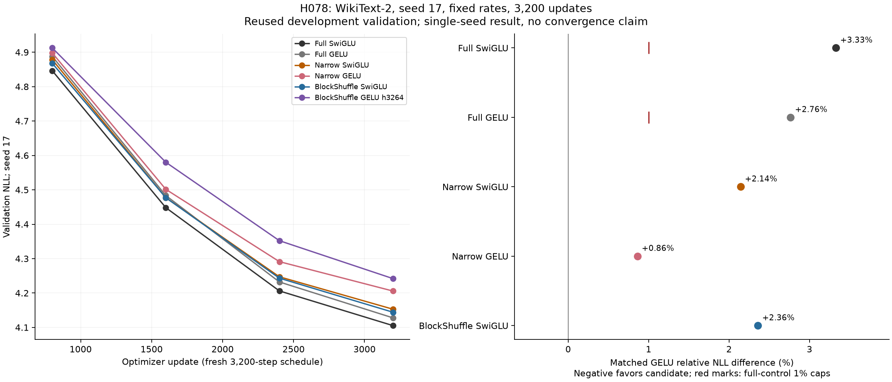

# H078 - Matched GELU at 3,200 steps

**Matched-budget BlockShuffle GELU FAILS the frozen duration gates.** All six fresh seed-17 trials
complete. Matched final NLL is **4.242013727**, with **70.3125%
fewer FFN weights**. This fixed duration recipe earns no automatic extra steps, rates, widths, activations or optimizer repair. The complete research goal remains unmet.

Compared with plain at its fixed selected rate, candidate NLL changes by
**+2.3576%** and mean timed update changes by **-14.46%**;
negative means lower loss or shorter time. This single seed does not establish
consistent plain-quality superiority or replicate long-duration behavior.

## Every allocated endpoint

| Form | Fixed peak LR | Final NLL | FFN weights | Total weights | Peak MiB | Mean timed update ms | Clipped |
|---|---:|---:|---:|---:|---:|---:|---:|
| Full SwiGLU | 0.0012 | 4.105417155 | 9,437,184 | 15,735,168 | 384.558 | 92.600 | 9.41% |
| Full GELU | 0.0012 | 4.127880964 | 9,437,184 | 15,735,168 | 393.245 | 85.931 | 27.53% |
| Narrow SwiGLU | 0.0012 | 4.153047641 | 2,801,664 | 9,099,648 | 279.454 | 90.440 | 11.41% |
| Narrow GELU | 0.0006 | 4.205838479 | 2,801,664 | 9,099,648 | 279.017 | 87.550 | 86.84% |
| BlockShuffle SwiGLU | 0.0006 | 4.144305584 | 2,801,664 | 9,099,648 | 279.767 | 121.954 | 86.56% |
| BlockShuffle GELU h3264 | 0.0012 | 4.242013727 | 2,801,664 | 9,099,648 | 280.017 | 104.317 | 58.75% |

Every model keeps its H077 recipe. Rates originally came from H076's equal
three-rate short screen; they are not newly optimized for this duration.
There is no selected intermediate checkpoint or omitted trial.

| Matched GELU versus | Absolute NLL difference | Relative NLL difference |
|---|---:|---:|
| Full SwiGLU | +0.136596572 | +3.3272% |
| Narrow SwiGLU | +0.088966086 | +2.1422% |
| BlockShuffle SwiGLU | +0.097708143 | +2.3576% |
| Narrow GELU | +0.036175248 | +0.8601% |
| Full GELU | +0.114132763 | +2.7649% |

| Frozen primary gate | Result |
|---|---|
| all cells complete finite | PASS |
| at least 70 percent fewer ffn weights | PASS |
| nll within one percent full swiglu | FAIL |
| nll within one percent full gelu | FAIL |
| nll beats narrow swiglu | FAIL |
| nll beats narrow gelu | FAIL |
| memory within ten percent full swiglu | PASS |
| memory within ten percent full gelu | PASS |

Both full-control NLL allowances are 1%, while BOTH calibrated narrow NLLs must
be beaten strictly. The separate >=0.2% narrow margins are descriptive:
narrow SwiGLU **NO**,
narrow GELU **NO**.
These diagnostics do not alter any primary threshold after results.

## Duration and resources

| Form | Step 2400 NLL | Step 3200 NLL | Relative final-800 change | Final above best logged | Plateau diagnostic |
|---|---:|---:|---:|---:|---|
| Full SwiGLU | 4.206198108 | 4.105417155 | -2.3960% | +0.0000% | FAIL |
| Full GELU | 4.232225822 | 4.127880964 | -2.4655% | +0.0000% | FAIL |
| Narrow SwiGLU | 4.247245238 | 4.153047641 | -2.2179% | +0.0000% | FAIL |
| Narrow GELU | 4.291276701 | 4.205838479 | -1.9910% | +0.0000% | FAIL |
| BlockShuffle SwiGLU | 4.243261289 | 4.144305584 | -2.3321% | +0.0000% | FAIL |
| BlockShuffle GELU h3264 | 4.352207923 | 4.242013727 | -2.5319% | +0.0000% | FAIL |

The operational late-plateau diagnostic passes **0/6** models. It requires
absolute final-800 NLL change <=0.2% and final NLL <=0.2% above the best logged
endpoint. Even a passing plateau diagnostic would not prove optimal convergence.
No confidence interval, significance or replicated long-budget claim follows
from one seed. The earlier three-seed result concerns 800-step schedules only.

The curve panel starts at step 800; initial and step-1 scores remain in each run.
The right panel uses each named reference's NLL as denominator. Red marks apply
only to full controls; narrow references require a strict negative difference.

| Form | Training targets/s | Full-sequence inference targets/s | Inference latency ms | Final preclip norm |
|---|---:|---:|---:|---:|
| Full SwiGLU | 22117 | 119884 | 17.083 | 0.947126 |
| Full GELU | 23833 | 128250 | 15.969 | 1.053286 |
| Narrow SwiGLU | 22645 | 125418 | 16.329 | 0.941987 |
| Narrow GELU | 23392 | 132092 | 15.504 | 1.354030 |
| BlockShuffle SwiGLU | 16793 | 82489 | 24.828 | 1.323566 |
| BlockShuffle GELU h3264 | 19632 | 98432 | 20.806 | 1.130324 |

Allocated peak includes GPU corpus cache, training and intervening/final
validation. Time averages 3,190 updates after ten timing-warmup updates, includes
sampling/optimizer/observer overhead, and excludes validation/checkpoint writes.
Optimizer warmup is 320 updates. The sequential laptop-GPU cohort does not
establish paired hardware-speed gains across sessions. Fewer parameters alone
do not establish faster training. Inference is full sequence B16/T128 without KV
cache, ten warmups and three repeats of 30 forwards; it is not generation.

## Unchanged recipe and explicit scope

The [frozen plan](ungated_duration_plan.md) changes only steps to 3,200 and
log_every to 800 from H077's seed-17 recipes. Shared 10% warmup grows to 320,
then cosine decay ends at 0.1 peak. These are fresh schedules, not checkpoint
continuations; their first 800 updates differ from the shorter schedules.

Keep d384/L8/heads6/context128/vocab4096, batch 16, structured groups 8, native
BF16 with FP32 parameters, TF32 off, four CPU threads, name-local initialization
and down residual scale 1/4. AdamW (0.9,0.95), epsilon 1e-8, base decay 0.1 and clip 1
are unchanged. Structured factors retain fan-in LR and parameter decay. Both
narrows retain exactly-once down initialization/LR calibration and product decay.
Whole-block checkpointing is fixed except narrow GELU's block-plus-inner mode.

The unchanged H076 constructor/observers/operation counter call the unchanged
src/core trainer, attention, normalization, data, loss and evaluation. Full models
have 9,437,184 FFN / 15,735,168 total weights; compressed forms have
2,801,664 / 9,099,648, a 70.3125% FFN and 42.1700% total reduction. Approximate
FFN matrix forward FLOPs are twice FFN weights across eight layers per token;
nonlinearities, shuffles, norms, loss, optimizer and other costs are excluded.
All norms, clipping, gradient/activation diagnostics and finite moments are
retained. These checks supply no whole-network gradient lower bound.

The frozen cache is Salesforce/wikitext revision
f776294184f13b8ff2337b3841cf9269a6216d1e, train-only 4096-token BPE, 3,083,650 train
and 322,802 validation tokens. CUDA sampler seed 10017 and exact policy/order are
unchanged. Full validation is 322,688 targets in 158 batches, last nine windows;
113 suffix tokens lie outside complete windows. Official test is not fetched or
scored. This heavily reused development split is not an independent holdout.

Each run presents 6,553,600 training targets, about 2.125 cache token exposures
with replacement, not ordered epochs. Total scientific work is **19,200 updates
and 39,321,600 training targets**. Seven full-validation passes per run produce
**13,552,896 validation exposures**. Worker processes total **2054.76 s**.

## Independent verification and remaining work

Five isolated checks pass with zero optimizer updates. They verify all six
initial states/counts/calibration, the complete schedule, primary boundaries,
separate diagnostics and a read-only 3,200-batch CUDA sampler reconstruction.
The latter constructs 6,553,600 unscored target elements with zero model forwards;
its state after 800 matches every H077 seed-17 trial.

Independent audit checks all six final checkpoints and AdamW moments at step 3,200,
all 3,200 loss/norm/rate records per run, exact initial weights/NLL/first training
loss against H077, data/source hashes, parameter/operation counts, optimizer
calibration and regenerated final sampler state. Every final BF16 validation NLL
rescores exactly: **1,936,128 additional validation targets and zero updates**.
All primary and descriptive decisions are independently rederived.

See [run metrics](../results/ungated_duration_v1/result.json),
[independent audit](../results/verification/ungated_duration_analysis_v1.json) and
[final preservation audit](../results/verification/ungated_duration_final_v1.json).
All trials finish first attempt, with no scientific retry or active model addition.
All 171 original language/profile runs, 21 H076 and 18 H077 trials, 798 fitting
cells, prior resource pairs/failures and frozen plans remain preserved.

[H051's longer plain failure](long_duration_replication_results.md),
[H077's finite-budget replication](ungated_lm_replication_results.md), the
[local proof limits](ungated_blockshuffle_results.md) and
[remaining published comparators](ungated_comparator_note.md) remain part of
the evidence. Additional long-budget seeds, duration-specific rate sensitivity,
convergence, scale, broader data and comparator/novelty evidence remain open.
A fixed-budget pass does not establish state-of-the-art or arbitrary-data superiority.
