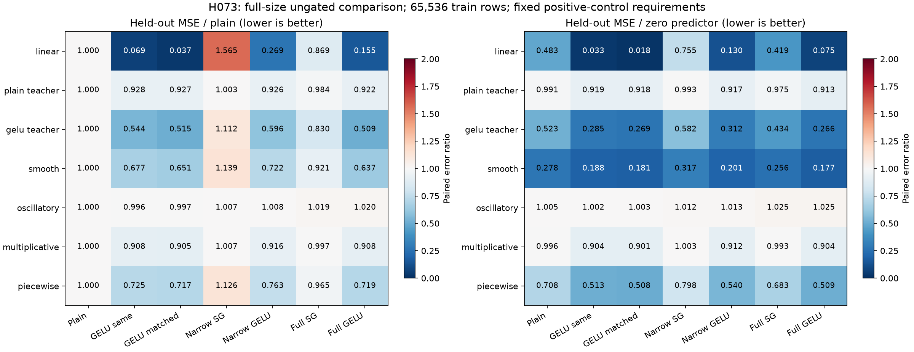

# H073 - Ungated fitting with positive controls

**EARNS RESOURCE QUALIFICATION.** All 294 fixed cells complete at width384,
with seven forms, seven targets, three seeds and equal two-rate budgets.
The frozen positive-control assay passes; the gold language-model goal remains unmet.

| Ungated form | Gain over plain | Gain over narrow GELU | Gain over narrow SwiGLU | Gain over same-width GELU | Earns full-model resource test |
|---|---:|---:|---:|---:|---|
| Same-width BlockShuffle GELU | +44.893% | +20.283% | +50.986% | +0.000% | Yes |
| Matched-weight BlockShuffle GELU | +50.271% | +28.062% | +55.769% | +9.759% | Yes |

Positive gains mean lower held-out variance-scaled MSE. Ratios are paired
geometric means across 21 equally weighted task/seed endpoints. Rates are
selected on a separate split before either rate's report score is computed.

## Assay validity and absolute performance

The positive control must learn, rather than merely participate in the table.
Full GELU must reduce linear held-out error by at least 50% versus zero in
every seed, and improve at least two generic tasks by 2% versus zero.

| Positive-control criterion | Result |
|---|---|
| full gelu linear half zero every seed | PASS |
| full gelu two generic tasks two percent better than zero | PASS |

| Form | Linear / zero, seed17 | Seed29 | Seed43 |
|---|---:|---:|---:|
| Full GELU | 0.074883 | 0.074282 | 0.074567 |
| Same-width BlockShuffle GELU | 0.033338 | 0.032928 | 0.033355 |
| Matched-weight BlockShuffle GELU | 0.018103 | 0.018064 | 0.018023 |

| Task | Plain / zero | Same-width GELU / zero | Matched GELU / zero | Narrow SwiGLU / zero | Narrow GELU / zero | Full SwiGLU / zero | Full GELU / zero |
|---|---:|---:|---:|---:|---:|---:|---:|
| linear | 0.482509 | 0.033206 | 0.018063 | 0.755288 | 0.129637 | 0.419470 | 0.074577 |
| plain teacher | 0.990504 | 0.919198 | 0.917961 | 0.993492 | 0.917097 | 0.974896 | 0.912961 |
| gelu teacher | 0.523385 | 0.284748 | 0.269403 | 0.581795 | 0.312083 | 0.434486 | 0.266420 |
| smooth | 0.278099 | 0.188391 | 0.180955 | 0.316748 | 0.200721 | 0.256225 | 0.177073 |
| oscillatory | 1.005455 | 1.001630 | 1.002566 | 1.012064 | 1.013187 | 1.024664 | 1.025436 |
| multiplicative | 0.995850 | 0.904193 | 0.901381 | 1.003297 | 0.912410 | 0.992731 | 0.904036 |
| piecewise | 0.708100 | 0.513279 | 0.507799 | 0.797650 | 0.540403 | 0.683410 | 0.508868 |

Ratios below one beat the zero predictor. A failed assay earns no model
allocation even if a candidate looks better than another weak fit. Candidate
gates also cap each generic target's ratio at 1.05 versus both plain and zero.

## Frozen candidate decision

- Same-width BlockShuffle GELU: passes every fitting gate.
- Matched-weight BlockShuffle GELU: passes every fitting gate.

Both need a passing assay, at least 2% aggregate gain over plain, a gain in
each seed, wins over both calibrated narrows, generic regression caps, a
50% linear improvement versus zero in each seed, finite states and at least
70% FFN reduction. Matched GELU also needs 1% over same-width GELU to justify
its extra weights. These are fitting gates; no language NLL allowance is
transplanted onto MSE. Three optimization seeds do not establish significance.

| Form | Seed17 / plain | Seed29 / plain | Seed43 / plain | / full GELU | / full SwiGLU |
|---|---:|---:|---:|---:|---:|
| Same-width BlockShuffle GELU | 0.552389 | 0.549668 | 0.551153 | 0.906328 | 0.587127 |
| Matched-weight BlockShuffle GELU | 0.498222 | 0.496488 | 0.497167 | 0.817883 | 0.529831 |

## Descriptive checks on the headline gain

The simple linear positive-control task contributes heavily to the aggregate
gain. These post-hoc subsets show the remaining effect; they change no frozen
gate, selected rate, training allocation or result. Teacher tasks are excluded
from the generic-only subset. This is not a new promotion criterion.

| Form | Subset | Gain over plain | Gain over narrow GELU | Gain over full GELU | Gain over full SwiGLU |
|---|---|---:|---:|---:|---:|
| Same-width BlockShuffle GELU | without linear | +22.055% | +3.677% | -2.031% | +18.009% |
| Matched-weight BlockShuffle GELU | without linear | +23.470% | +5.426% | -0.178% | +19.497% |
| Same-width BlockShuffle GELU | generic only | +18.364% | +3.329% | -1.189% | +16.263% |
| Matched-weight BlockShuffle GELU | generic only | +19.442% | +4.605% | +0.148% | +17.369% |

In particular, an overall win over full GELU must not be read as a comparably
large advantage on the generic nonlinear targets. Oscillatory errors remain
around the zero predictor for all forms. These limits remain part of the
decision to test resources, rather than a claim of complex-pattern mastery.
[Subset records](../results/verification/ungated_fit_subsets_v1.json).

## Matched comparison and interpretation

The existing ungated operator uses h2048 (233,472 weights) or h3264
(350,208 weights). Plain SwiGLU h2048 and both narrows match 350,208 exactly.
Full GELU h1536 and full SwiGLU h1024 each have 1,179,648 FFN weights.
Matched GELU therefore retains 70.3125% FFN reduction; same-width retains
80.2083%. No new activation or active model is introduced.

Fixed uniform-input data has 65,536 train, 4,096 selection and 4,096 report
rows. Each cell samples 76,800 training examples in 300 updates. Increasing
the finite training pool was motivated by H071's generalization gap; this
new task/data cohort does not isolate a causal effect of data quantity.
The three seeds are optimization replications of the same dataset.

Targets are a rotated linear map, fixed plain/ungated structured teachers,
and smooth, oscillatory, multiplicative and piecewise vector functions.
Teacher tasks favor their families. Train-only population standard deviations
scale each output coordinate without centering. This is variance-scaled MSE.
Both rates use 0.001/0.003 with identical update counts, AdamW settings and
calibrated fan-in multipliers. Plain and same-width GELU share up/down initial
factor bytes; activation changes. Matched GELU changes width and factor shapes.

[H072's proof](ungated_blockshuffle_theory.md) still restricts a single bias-free
GELU layer to a linear odd component. Its multiplicative-target population
relative floor is 12/17; this is not an exact bound on this finite report set.
Fitting success would not establish a universal expressivity advantage or
remove that restriction. Read the [frozen plan](ungated_fit_plan.md) for details.

## Actual standalone resources and learning trends

| Form | Parameters | Median update ms | Maximum allocated MiB | Mean clipping | Last50 / prior50 loss | Selected rates .001 / .003 |
|---|---:|---:|---:|---:|---:|---|
| Plain BlockShuffle SwiGLU | 350,208 | 5.5895 | 239.165 | 0.048% | 0.969716 | 6 / 15 |
| Same-width BlockShuffle GELU | 233,472 | 4.4179 | 231.829 | 0.000% | 0.920300 | 21 / 0 |
| Matched-weight BlockShuffle GELU | 350,208 | 4.3979 | 236.950 | 0.000% | 0.936843 | 21 / 0 |
| Narrow SwiGLU | 350,208 | 2.8374 | 228.282 | 0.095% | 0.985605 | 9 / 12 |
| Narrow GELU | 350,208 | 2.5445 | 228.349 | 0.000% | 0.970044 | 12 / 9 |
| Full SwiGLU | 1,179,648 | 2.5981 | 244.086 | 0.000% | 0.971589 | 9 / 12 |
| Full GELU | 1,179,648 | 2.2740 | 245.461 | 0.095% | 0.976235 | 14 / 7 |

Update timings synchronize CUDA and exclude the first 50 warmup updates.
Peak counters reset after warmup. The GPU data/index cache is included; these
standalone FP32 measurements do not qualify Transformer memory, serving speed
or a full-model optimization trajectory. Loss trends are not convergence.

## Independent verification and next step

The scientific fitting process finishes first attempt in 453.13 s.
All 294 cells complete: 88,200 optimizer updates and 22,579,200 example
presentations. Five isolated harness checks pass before fitting. No corpus
targets are scored and no full-model resource worker is dispatched.
Independent CPU regeneration reproduces inputs, all targets/scales and
streams exactly. Every checkpoint has finite weights/moments at step300.
All shared initializations, rate selections, held-out chronology and gates
are independently checked; 147 selected endpoints are rescored on CPU.
Maximum relative CPU/GPU MSE disagreement is 5.85e-07.

Only a passing form earns a separately frozen actual full-model resource
qualification. This result does not authorize language training or add an
active model. Quality, convergence, broader data and novelty remain open.
The active three model folders and six variants remain unchanged. The prior
171 language/profile runs and all older fitting evidence are preserved.

- [Raw result](../results/ungated_fit_v1/result.json) and [process](../results/ungated_fit_v1/fitting_process.json).
- [Independent checkpoint audit](../results/verification/ungated_fit_analysis_v1.json).
- [Final preservation audit](../results/verification/ungated_fit_final_v1.json).

Result SHA-256: `ffe78ba472c08de05ad840ee31ee391a020bf91b5eca4588eb21b24ca364daaa`.
Protocol SHA-256: `97f334185c55aa89a66728ed12b58d8ff8c61d065f4cec19ac325b33f2b332b7`.
