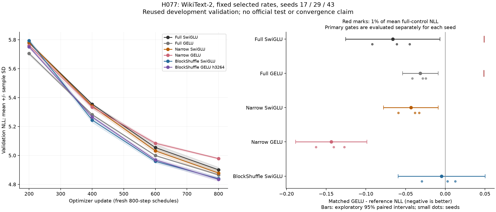

# H077 - Longer three-seed BlockShuffle GELU replication

**Matched-budget BlockShuffle GELU PASSES every seed's primary gates.** All 18 fresh trials complete at
800 updates each. Matched mean NLL is **4.834511375 +/- 0.013382428**
(sample SD), with **70.3125% fewer FFN weights**. This fixed recipe earns a separately frozen duration/convergence study. Scale, broader data and strong published controls remain open.
The full research goal remains unachieved. A replicated fixed-budget comparison
alone establishes neither convergence nor a new architecture.

Against plain BlockShuffle, matched GELU wins **1/3** seeds, with a
**-0.0959%** relative mean NLL difference. Its exploratory paired interval
is [-0.059429, +0.050151]. These plain comparisons must accompany
the full/narrow gate result; a small mean gain does not establish dependable
quality improvement over plain. Resource and timing tradeoffs remain separate.

## Complete cohort and primary decisions

Each form keeps its minimum-final-NLL rate from H076's equal three-rate budget.
No new rate or best-intermediate checkpoint is selected from these results.
Resource means below average the same three seed endpoints; every seed is listed
separately below. A passing mean cannot rescue a failed seed.

| Form | Frozen peak LR | Mean NLL +/- sample SD | FFN weights | Total weights | Mean peak MiB | Mean timed update ms |
|---|---:|---:|---:|---:|---:|---:|
| Full SwiGLU | 0.0012 | 4.900513469 +/- 0.017570252 | 9,437,184 | 15,735,168 | 384.558 | 93.532 |
| Full GELU | 0.0012 | 4.865926171 +/- 0.005094588 | 9,437,184 | 15,735,168 | 393.245 | 86.057 |
| Narrow SwiGLU | 0.0012 | 4.877761282 +/- 0.017970454 | 2,801,664 | 9,099,648 | 279.454 | 90.805 |
| Narrow GELU | 0.0006 | 4.978030276 +/- 0.004905194 | 2,801,664 | 9,099,648 | 279.017 | 88.108 |
| BlockShuffle SwiGLU | 0.0006 | 4.839150217 +/- 0.009617458 | 2,801,664 | 9,099,648 | 279.767 | 123.078 |
| BlockShuffle GELU h3264 | 0.0012 | 4.834511375 +/- 0.013382428 | 2,801,664 | 9,099,648 | 280.017 | 105.271 |

| Primary gate | Seed 17 | Seed 29 | Seed 43 |
|---|---|---|---|
| all cells complete finite | PASS | PASS | PASS |
| at least 70 percent fewer ffn weights | PASS | PASS | PASS |
| nll within one percent full swiglu | PASS | PASS | PASS |
| nll within one percent full gelu | PASS | PASS | PASS |
| nll beats narrow swiglu | PASS | PASS | PASS |
| nll beats narrow gelu | PASS | PASS | PASS |
| memory within ten percent full swiglu | PASS | PASS | PASS |
| memory within ten percent full gelu | PASS | PASS | PASS |

Relative differences below are matched GELU minus the named reference; negative
values favor matched GELU. The full-control allowance is 1% for each seed and
EACH full reference. BOTH calibrated narrow references must be beaten strictly.
The paired intervals use three seeds, sample SD and the df=2 critical value
sqrt(2 * 0.95^2 / (1 - 0.95^2)), approximately 4.30265. They depend on independent,
approximately normal paired differences and are exploratory small-sample summaries,
not a claim of significance or universal superiority.

| Reference | Mean paired NLL difference | Paired sample SD | Exploratory 95% interval | Relative mean NLL difference | Seed 17 | Seed 29 | Seed 43 |
|---|---:|---:|---|---:|---:|---:|---:|
| Full SwiGLU | -0.066002094 | 0.023931915 | [-0.125452267, -0.006551920] | -1.3468% | -0.9204% | -1.8730% | -1.2443% |
| Narrow SwiGLU | -0.043249907 | 0.013879825 | [-0.077729303, -0.008770511] | -0.8867% | -1.2050% | -0.7830% | -0.6706% |
| BlockShuffle SwiGLU | -0.004638842 | 0.022055963 | [-0.059428890, +0.050151206] | -0.0959% | +0.0615% | -0.6081% | +0.2607% |
| Narrow GELU | -0.143518901 | 0.018100958 | [-0.188484173, -0.098553630] | -2.8830% | -2.8226% | -3.2698% | -2.5560% |
| Full GELU | -0.031414796 | 0.009034692 | [-0.053858214, -0.008971377] | -0.6456% | -0.5819% | -0.8555% | -0.4998% |

| Descriptive >=0.2% gain over narrow | Seed 17 | Seed 29 | Seed 43 |
|---|---|---|---|
| Narrow SwiGLU | YES | YES | YES |
| Narrow GELU | YES | YES | YES |

The 0.2% narrow margin remains descriptive and changes no primary gate. The
operational late-plateau diagnostic passes **0/18** cells: absolute
final-200 NLL change <=0.2% and final <=0.2% above the best recorded endpoint.
Even a passing plateau diagnostic would not prove optimal convergence.

The curve panel displays logged steps 200 through 800, with mean +/- sample SD.
Initial and step-1 evaluations are retained in every run. The difference panel's
red marks show 1% of the MEAN full-control NLL for context; the primary decisions
use each seed's own full-control values, as in the gate table.

## Every allocated endpoint

| Form | Seed | NLL | Peak MiB | Mean update ms | Training targets/s | Inference targets/s | Clipped | Final-200 NLL change |
|---|---:|---:|---:|---:|---:|---:|---:|---:|
| Full SwiGLU | 17 | 4.880372198 | 384.558 | 93.198 | 21975 | 117603 | 8.88% | -2.9708% |
| Full SwiGLU | 29 | 4.912696133 | 384.558 | 94.054 | 21775 | 119495 | 7.38% | -3.0813% |
| Full SwiGLU | 43 | 4.908472076 | 384.558 | 93.342 | 21941 | 118344 | 9.88% | -3.0864% |
| Full GELU | 17 | 4.863754941 | 393.245 | 86.138 | 23776 | 130366 | 6.12% | -2.6192% |
| Full GELU | 29 | 4.862276899 | 393.245 | 85.883 | 23846 | 130713 | 6.62% | -2.7441% |
| Full GELU | 43 | 4.871746672 | 393.245 | 86.151 | 23772 | 130118 | 7.38% | -2.6213% |
| Narrow SwiGLU | 17 | 4.894434890 | 279.454 | 91.402 | 22406 | 125714 | 9.88% | -3.0142% |
| Narrow SwiGLU | 29 | 4.858727267 | 279.454 | 90.095 | 22732 | 121022 | 8.62% | -3.1361% |
| Narrow SwiGLU | 43 | 4.880121688 | 279.454 | 90.918 | 22526 | 117196 | 9.12% | -3.0429% |
| Narrow GELU | 17 | 4.975907369 | 279.017 | 87.671 | 23360 | 126990 | 19.00% | -2.0761% |
| Narrow GELU | 29 | 4.983639353 | 279.017 | 88.522 | 23135 | 130456 | 25.62% | -2.1766% |
| Narrow GELU | 43 | 4.974544107 | 279.017 | 88.130 | 23238 | 130128 | 16.62% | -2.0208% |
| BlockShuffle SwiGLU | 17 | 4.832481097 | 279.767 | 122.651 | 16698 | 82343 | 28.12% | -2.3637% |
| BlockShuffle SwiGLU | 29 | 4.850174876 | 279.767 | 123.484 | 16585 | 82370 | 24.62% | -2.4693% |
| BlockShuffle SwiGLU | 43 | 4.834794679 | 279.767 | 123.100 | 16637 | 83119 | 26.00% | -2.4522% |
| BlockShuffle GELU h3264 | 17 | 4.835455069 | 280.017 | 105.792 | 19359 | 97184 | 37.00% | -2.6184% |
| BlockShuffle GELU h3264 | 29 | 4.820682079 | 280.017 | 104.641 | 19572 | 101223 | 23.75% | -2.7932% |
| BlockShuffle GELU h3264 | 43 | 4.847396978 | 280.017 | 105.380 | 19435 | 95990 | 32.88% | -2.7301% |

These timings include sampling, optimizer and scalar-observer overhead across
790 post-timing-warmup updates. Validation and checkpoint writes are excluded.
The timing warmup is ten updates; optimizer warmup is 80 updates. All runs share
one laptop GPU and are sequential, with order reversed/rotated across seeds;
thermal and session variation limit timing interpretation. Fewer weights do not
imply faster training. Inference is full sequence without KV cache, not generation.

## Frozen methods and explicit limitations

The [plan](ungated_lm_replication_plan.md) fixes six forms, seeds 17/29/43, batch 16,
context 128, d384/L8/heads6/vocab4096, structured groups 8, native BF16 with FP32
parameters, TF32 off and four CPU threads. Every trial starts fresh. Only steps,
log interval and seed differ from the selected H076 recipe. The shared 10%
warmup grows from 20 to 80 and cosine decay stretches to 800, ending at 0.1 peak.
The first 200 updates therefore differ from the old short schedule.

Name-local initialization, residual down scale 1/4, AdamW (0.9,0.95), eps 1e-8,
base decay 0.1 and clip 1 are unchanged. Structured factors retain fan-in LR
correction and parameter decay. Both narrows keep exactly-once down initialization/
LR calibration and product decay. Frozen execution is whole-block checkpointing
except narrow GELU's block-plus-inner mode. The unchanged H076 observers and
operation counter call the shared src/core trainer without changing loss or
updates. Active registered code/configurations remain unchanged.

Each full model has 9,437,184 FFN / 15,735,168 total weights; all four compressed
forms have 2,801,664 / 9,099,648, giving 70.3125% FFN and 42.1700% total reduction.
FFN matrix forward FLOPs are twice FFN weights across eight layers per token.
This excludes nonlinearities, shuffles, norms, loss, optimizer and non-matrix work.
Allocated peak includes GPU corpus cache, training and intervening/final validation.
Full-sequence inference uses B16/T128, ten warmups and three repeats of 30 forwards.
Finite parameter/moment checks, preclip norms, clipping and per-layer activation/
gradient diagnostics are retained; they do not prove a whole-network gradient bound.

The immutable cache is Salesforce/wikitext revision
f776294184f13b8ff2337b3841cf9269a6216d1e with train-only 4096-token BPE:
3,083,650 training and 322,802 validation tokens. CUDA sampler seeds are 10017,
10029 and 10043. Full validation covers 322,688 targets in 158 contiguous batches,
last nine windows; 113 suffix tokens lie outside complete windows. All batch
orders and final sampler states are audited. No official test is fetched or scored.
This repeatedly reused development split is not an unbiased holdout evaluation.
Seed 17 influenced H076's rate choice; the two additional training seeds do not
supply new validation data or duration-specific rate optimization.

The [H076 short screen](ungated_lm_screen_results.md), its rejected same-width
recipe, [H051 longer plain failure](long_duration_replication_results.md) and
[local GELU proof and limitations](ungated_blockshuffle_results.md) remain intact.
Conventional GELU and the existing structured factors establish no novelty claim.
A separate [primary-source comparator note](ungated_comparator_note.md) records
BLAST and BTT-MoE scope differences and a count-compatible, unallocated BLAST
control. It changes none of this replication's frozen decisions.

## Execution and independent audit

Five isolated checks pass with zero optimizer updates. They verify all 18 initial
model states, counts, calibration, fixed rates/schedule, every-seed decisions and
statistics. Three read-only 800-batch sampler reconstructions construct 4,915,200
unscored target elements, with zero model forwards; seed 17's 200-step state matches
H076. The prior 108-test active suite and H076 fidelity checks are unchanged.

All 18 scientific trials complete first attempt: **14,400 updates and 29,491,200
training targets**. Seven full-validation evaluations per trial total **40,658,688
validation exposures**. Worker processes total **1964.26 seconds**.
An earlier implementation-write tool observation was interrupted before a file
or live writer was found; that record precedes all scientific launches and is
preserved. It caused no scientific retry or source change after freezing.

Independent analysis reloads every final checkpoint, verifies finite AdamW moments
at step 800, all 800 loss/norm/rate records, actual counts, initial weights, optimizer
calibration, data/source hashes and sampler states. All seed-17 initial NLLs and
first pre-update losses match H076 exactly. All 18 final BF16 validation NLLs rescore
exactly: **5,808,384 additional validation targets, zero updates**. All per-seed
gates, paired statistics and late diagnostics are independently rederived. This
verifies saved scores without supplying independent generalization data.

See [run metrics](../results/ungated_lm_replication_v1/result.json),
[independent audit](../results/verification/ungated_lm_replication_analysis_v1.json)
and [final preservation audit](../results/verification/ungated_lm_replication_final_v1.json).
All 171 original language/profile runs, 21 H076 language trials, 798 fitting
checkpoints, prior resource pairs/failures and frozen plans remain preserved.
