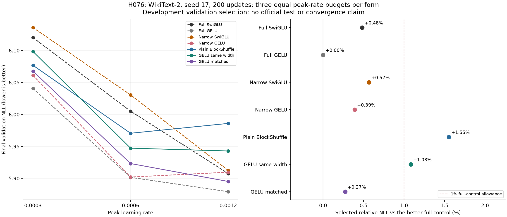

# H076 - Ungated GELU WikiText language screen

**BlockShuffle GELU h3264 passes the frozen short-screen gates; the other form fails.** All 21 fresh trials complete: seven forms, three equal rates,
seed 17 and 200 updates each. Independent analysis audits every checkpoint and
rescores all 21 final validation NLLs exactly. Passing forms earn only a separately frozen longer comparison. Failed fixed recipes receive no automatic tuning or repair.
The matched candidate's selected NLL is **5.895276**, versus narrow GELU's
**5.902164**: a **0.1167%** improvement, below the descriptive 0.2% margin.
It is **0.2721%** above full GELU, with **28.79%** less allocated peak memory
and **21.81%** more mean update time. The selected narrow GELU rate is 0.0006;
its 0.0012 result is not the strongest narrow reference. The same-width recipe
fails full-GELU and both narrow quality gates and earns no longer allocation.

The full research goal remains unachieved: a short single-seed development screen
does not establish convergence, general superiority or a novel architecture.

## Selected endpoints

Selection uses minimum final validation NLL within each form, ties lower rate.
Every count, memory value and timing below comes from that same selected run.

| Form | Selected peak LR | Final NLL | FFN weights | Total weights | Peak MiB | Mean timed update ms | Clipped |
|---|---:|---:|---:|---:|---:|---:|---:|
| Full SwiGLU | 0.0012 | 5.907693898 | 9,437,184 | 15,735,168 | 384.558 | 99.990 | 10.5% |
| Full GELU | 0.0012 | 5.879277652 | 9,437,184 | 15,735,168 | 393.245 | 91.249 | 12.0% |
| Narrow SwiGLU | 0.0012 | 5.912504605 | 2,801,664 | 9,099,648 | 279.454 | 95.918 | 8.5% |
| Narrow GELU | 0.0006 | 5.902164305 | 2,801,664 | 9,099,648 | 279.017 | 93.093 | 17.5% |
| BlockShuffle SwiGLU | 0.0006 | 5.970604333 | 2,801,664 | 9,099,648 | 279.767 | 130.662 | 16.0% |
| BlockShuffle GELU h2048 | 0.0012 | 5.942922671 | 1,867,776 | 8,165,760 | 268.454 | 109.596 | 10.5% |
| BlockShuffle GELU h3264 | 0.0012 | 5.895275541 | 2,801,664 | 9,099,648 | 280.017 | 111.154 | 10.5% |

Relative NLL differences below use selected endpoints; negative values mean lower
candidate NLL. The full-control allowance is 1% against EACH full reference. Both
calibrated narrow references must be beaten strictly; the separate 0.2% narrow
margin remains descriptive and does not alter these gates.

| Candidate | vs full SwiGLU | vs full GELU | vs narrow SwiGLU | vs narrow GELU | vs plain |
|---|---:|---:|---:|---:|---:|
| BlockShuffle GELU h2048 | +0.5963% | +1.0825% | +0.5145% | +0.6906% | -0.4636% |
| BlockShuffle GELU h3264 | -0.2102% | +0.2721% | -0.2914% | -0.1167% | -1.2617% |

| Frozen gate | GELU h2048 | GELU h3264 |
|---|---|---|
| all cells complete finite | PASS | PASS |
| at least 70 percent fewer ffn weights | PASS | PASS |
| nll within one percent full swiglu | PASS | PASS |
| nll within one percent full gelu | FAIL | PASS |
| nll beats narrow swiglu | FAIL | PASS |
| nll beats narrow gelu | FAIL | PASS |
| memory within ten percent full swiglu | PASS | PASS |
| memory within ten percent full gelu | PASS | PASS |

The same-width candidate uses 1,867,776 FFN weights (80.2083% fewer than full),
while matched uses 2,801,664 (70.3125% fewer). Their total counts are 8,165,760 and
9,099,648, respectively. Dense narrow controls match the larger candidate's FFN
budget; they have more weights than the same-width candidate. The width comparison
therefore exposes a parameter/quality/resource tradeoff rather than a pure
activation-only ablation. Results are selected development scores, not test scores.

## Every allocated rate

| Form | Peak LR | Final NLL | Peak MiB | Training targets/s | Full-sequence targets/s | Clipped |
|---|---:|---:|---:|---:|---:|---:|
| Full SwiGLU | 0.0003 | 6.120133530 | 384.558 | 20964 | 116999 | 70.5% |
| Full SwiGLU | 0.0006 | 6.005086924 | 384.558 | 20752 | 114194 | 33.0% |
| Full SwiGLU | 0.0012 | 5.907693898 | 384.558 | 20482 | 114564 | 10.5% |
| Full GELU | 0.0003 | 6.040670479 | 393.245 | 22346 | 131159 | 23.0% |
| Full GELU | 0.0006 | 5.901685481 | 393.245 | 22538 | 131937 | 13.5% |
| Full GELU | 0.0012 | 5.879277652 | 393.245 | 22444 | 128778 | 12.0% |
| Narrow SwiGLU | 0.0003 | 6.135829548 | 279.454 | 21479 | 115058 | 70.5% |
| Narrow SwiGLU | 0.0006 | 6.030559184 | 279.454 | 21370 | 121742 | 39.0% |
| Narrow SwiGLU | 0.0012 | 5.912504605 | 279.454 | 21352 | 117613 | 8.5% |
| Narrow GELU | 0.0003 | 6.061123774 | 279.017 | 21947 | 125533 | 19.0% |
| Narrow GELU | 0.0006 | 5.902164305 | 279.017 | 21999 | 130209 | 17.5% |
| Narrow GELU | 0.0012 | 5.909740145 | 279.017 | 21657 | 126697 | 10.5% |
| BlockShuffle SwiGLU | 0.0003 | 6.076798109 | 279.767 | 15753 | 80382 | 57.5% |
| BlockShuffle SwiGLU | 0.0006 | 5.970604333 | 279.767 | 15674 | 78805 | 16.0% |
| BlockShuffle SwiGLU | 0.0012 | 5.985973683 | 279.767 | 15888 | 81316 | 10.0% |
| BlockShuffle GELU h2048 | 0.0003 | 6.098451544 | 268.454 | 18319 | 90729 | 14.0% |
| BlockShuffle GELU h2048 | 0.0006 | 5.947282384 | 268.454 | 18506 | 92520 | 14.0% |
| BlockShuffle GELU h2048 | 0.0012 | 5.942922671 | 268.454 | 18687 | 93988 | 10.5% |
| BlockShuffle GELU h3264 | 0.0003 | 6.067690197 | 280.017 | 18497 | 94514 | 15.0% |
| BlockShuffle GELU h3264 | 0.0006 | 5.923254896 | 280.017 | 18291 | 92944 | 12.5% |
| BlockShuffle GELU h3264 | 0.0012 | 5.895275541 | 280.017 | 18425 | 95705 | 10.5% |

All rates and trajectories are retained. A winner at 0.0012 is on the search
boundary and does not establish an optimal rate. No later rate is added based on
this result. Same-rate comparisons are available directly in this complete table;
older language runs do not supply the current gate values.

| Selected form | Validation NLL change, step 150 to 200 |
|---|---:|
| Full SwiGLU | -2.0011% |
| Full GELU | -1.7182% |
| Narrow SwiGLU | -1.8947% |
| Narrow GELU | -1.3782% |
| BlockShuffle SwiGLU | -1.4823% |
| BlockShuffle GELU h2048 | -1.4625% |
| BlockShuffle GELU h3264 | -1.5905% |

Endpoint changes describe this short schedule. There is no convergence or
statistical-significance claim from one seed. Historical H051 longer-training
failure for plain BlockShuffle remains part of the evidence; H073's synthetic
GELU advantages and H075's resource pass do not imply language superiority.

## Shared methods and explicit recipe differences

The [frozen plan](ungated_lm_screen_plan.md) sets batch 16/context 128/d384/L8/heads 6/
vocab 4096, structured groups 8, BF16 with FP32 parameters, TF32 disabled, four CPU
threads and one sequential GPU worker. Every trial starts from the original
name-local Transformer initialization at seed 17, with down residual scale 1/4.
All non-FFN tensors match; plain and same-width GELU share common up/down factors.
Initial weights independently reconstruct exactly and match H074/H075.

The shared trainer, sampler, attention, norm, loss, evaluation and schedule source
remain unchanged. Twenty warmup updates lead into cosine decay ending at 0.1 times
peak. AdamW betas (0.9, 0.95), eps 1e-8, base decay 0.1 and global clip 1 are common.
Structured projections use fan-in factor LR correction with parameter decay.
Narrow down initialization and LR receive reference_hidden/actual_hidden exactly
once. Both narrow forms use product-decay correction, weight_decay 0.1/LR_scale
for their larger down LR, following the established narrow language recipe.
H074/H075 used parameter decay for synthetic narrow resource probes; this explicit
change prevents an extra effective down-decay penalty in the language control.

Execution is fixed from H075 before language results: whole-block checkpointing
for all forms except narrow GELU, which uses block plus inner native activation
checkpointing. The isolated constructor correctly labels blockshuffle_gelu and
counts two projections, using the existing operator. The active registry is
unchanged. The operation counter reports 2 times actual FFN weights per token:
full 18,874,368; narrow/plain/matched 5,603,328; same-width 3,735,552 matrix FLOPs
across eight layers. Attention is a dense upper estimate, and nonlinearities,
shuffles, norms, softmax, loss and optimizer costs are excluded.

Scalar observer hooks call the original loss/initialization/clipping functions,
record every training loss/preclip norm/rate, and do not alter parameters or
gradients. Their logging overhead is included for every model. Training timing
excludes first 10 updates, evaluation and checkpoint writes, and includes sampling,
optimizer and occasional gradient diagnostics. Reported update time is the mean
over the 190 timed updates, not H075's short-window median.

Allocated peak includes GPU train/validation cache, training and intervening/final
validation, as the shared trainer measures it. It is compared with fresh controls
under this same harness, not H075's synthetic peaks. Full-sequence inference uses
B16/T128 without a KV cache: 10 warmups and three repeats of 30 forwards. It is not
autoregressive serving. End-of-run layer activations, near-zero fractions,
gradients, clipping, finite weights and optimizer moments are preserved. These
measurements do not prove a whole-network gradient guarantee.

## Data, execution and independent verification

The frozen WikiText-2 cache is Salesforce/wikitext revision
f776294184f13b8ff2337b3841cf9269a6216d1e with train-only 4096-token BPE. It contains
3,083,650 training and 322,802 validation tokens. CUDA sampler seed 10017 and the
200-step final sampler state agree across all 21 trials. Full validation covers
2,521 contiguous 128-target windows: 322,688 targets in 158 batches, last 9 windows;
113 suffix tokens lie outside complete windows. The exact target order is audited.
Official test data is neither fetched nor scored. Repeated adaptive development
on this already-used validation split is not an independent holdout evaluation.

All 21 trials provide **4,200 updates and 8,601,600 training targets**, with seven
shared full-validation evaluations per run: **47,435,136 validation exposures**.
The bounded trial processes total 1107.75 s. Five isolated integration
checks pass first. Their native/selected narrow observer-fidelity comparisons
perform 8 separate CPU updates on a fixed 2x16 training-prefix batch (256 target
presentations). Those temporary states do not initialize or select language runs.
The prior 108 active tests are not rerun solely for isolated adapters.

Independent analysis reloads all 21 final checkpoints, verifies all weights and
AdamW moments at step 200, checks every sidecar/log/schedule/clip record, actual
parameter and operation counts, initial signatures, source/data hashes and
optimizer calibration. It reconstructs the CUDA sampler state and validation
order, then rescores every checkpoint once through the BF16 forward evaluator:
**6,776,448 additional validation targets, zero updates**, all NLLs exact. This
checks the saved development scores and does not create new generalization data.
All selections and original gates are independently rederived.

See [independent audit](../results/verification/ungated_lm_screen_analysis_v1.json),
[all run metrics](../results/ungated_lm_screen_v1/result.json), and
[final preservation audit](../results/verification/ungated_lm_screen_final_v1.json).
Every allocated trial, prior failure, frozen plan and earlier result is preserved.
There is no automatic scientific retry, active-model addition or publication.
