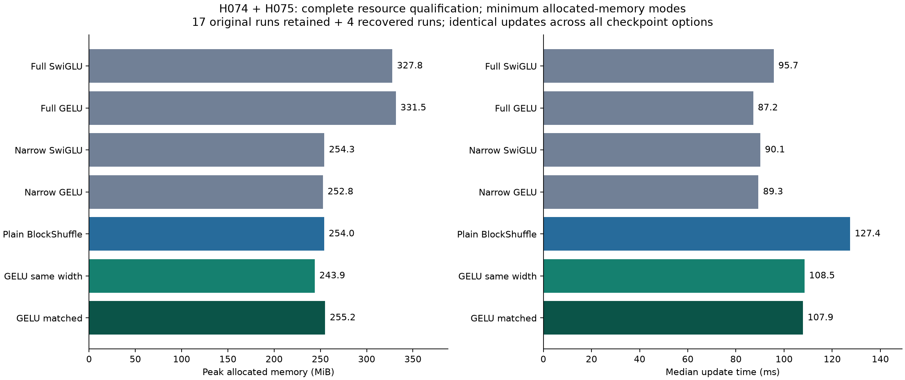

# H075 - Complete ungated Transformer resource qualification

**Both GELU forms qualify for a separately frozen short language-model screen.**
The bounded recovery completes all four missing H074 cells while retaining its17
completed runs. Independent CPU analysis verifies all21 initial/final checkpoint
pairs, all14 execution comparisons exactly, and every original resource gate.
This is a resource and numerical-fidelity result, not language-quality,
convergence, gradient-health, architecture-novelty or breakthrough evidence.

Matched GELU retains **70.3125% fewer FFN weights**, uses
**255.225 MiB** and takes **107.857 ms/update**
in its selected whole-block mode. Same-width GELU retains **80.2083% fewer FFN
weights**, uses **243.913 MiB** and takes **108.476 ms/update**.
All forms receive the same three execution choices. Selection minimizes allocated
memory, ties measured median update time then original mode order.

| Form | Selected mode | FFN weights | Total weights | Allocated MiB | Update ms |
|---|---|---:|---:|---:|---:|
| Full SwiGLU | block | 9,437,184 | 15,735,168 | 327.788 | 95.701 |
| Full GELU | block | 9,437,184 | 15,735,168 | 331.538 | 87.196 |
| Narrow SwiGLU | block | 2,801,664 | 9,099,648 | 254.288 | 90.135 |
| Narrow GELU | block_inner | 2,801,664 | 9,099,648 | 252.788 | 89.343 |
| Plain BlockShuffle | block | 2,801,664 | 9,099,648 | 254.038 | 127.437 |
| GELU same width | block | 1,867,776 | 8,165,760 | 243.913 | 108.476 |
| GELU matched | block | 2,801,664 | 9,099,648 | 255.225 | 107.857 |

Matched GELU's selected peak is 22.14% below full
SwiGLU and 23.02% below full GELU. Its update takes
15.36% less time than plain BlockShuffle, but
12.70% more than full SwiGLU and
23.70% more than full GELU. These are short-window measurements
from one GPU, with a time gap between the original and recovery cohorts. Small
time differences between the two GELU candidates are not evidence of a consistent
speed ordering. Fewer weights do not imply faster dense-kernel execution.

## Original gates, independently rederived

The [H074 plan](ungated_resource_plan.md) is unchanged. Candidates require all21
completed workers and exact within-form comparisons, finite diagnostics/states,
at least70% FFN reduction, peak allocation no greater than110% of EACH full
control's best option, and update time no greater than125% of plain in the same
mode. Both candidates select whole-block checkpointing. The selected full
controls also use block; narrow GELU selects block_inner. The runtime criterion
limits cost relative to the compressed reference, not relative to full dense.

| Gate | Same-width GELU | Matched GELU |
|---|---|---|
| all workers and fidelity exact | PASS | PASS |
| at least 70 percent fewer ffn weights | PASS | PASS |
| all diagnostics and state finite | PASS | PASS |
| memory within ten percent full swiglu | PASS | PASS |
| memory within ten percent full gelu | PASS | PASS |
| time within 25 percent plain same mode | PASS | PASS |

Both earn only a separately specified short language comparison with equal
training/tuning budgets, full and calibrated narrow controls, actual corpus
memory and validation NLL. H073's synthetic gains are not language gains.
Subsequent promotion still requires quality against both full controls, narrow
comparison, three seeds, longer/converged training, scaling, broader data and
strong published alternatives. The overall research goal remains unachieved.

## Every measurement and its origin

| Form | Mode | Origin | Allocated MiB | Reserved MiB | Update ms | Targets/s | Clipped |
|---|---|---|---:|---:|---:|---:|---:|
| Full SwiGLU | none | H074 | 672.483 | 726.000 | 60.479 | 34074 | 30.0% |
| Full SwiGLU | block | H074 | 327.788 | 462.000 | 95.701 | 21470 | 30.0% |
| Full SwiGLU | block_inner | H074 | 328.975 | 462.000 | 102.229 | 20254 | 30.0% |
| Full GELU | none | H074 | 635.858 | 674.000 | 54.307 | 37852 | 5.0% |
| Full GELU | block | H074 | 331.538 | 452.000 | 87.196 | 22864 | 5.0% |
| Full GELU | block_inner | H074 | 333.350 | 452.000 | 92.910 | 22483 | 5.0% |
| Narrow SwiGLU | none | H074 | 491.264 | 528.000 | 56.246 | 37081 | 25.0% |
| Narrow SwiGLU | block | H074 | 254.288 | 304.000 | 90.135 | 22852 | 25.0% |
| Narrow SwiGLU | block_inner | H074 | 254.288 | 304.000 | 98.694 | 21123 | 25.0% |
| Narrow GELU | none | H074 | 468.952 | 518.000 | 53.044 | 38757 | 5.0% |
| Narrow GELU | block | H074 | 254.288 | 304.000 | 86.136 | 23691 | 5.0% |
| Narrow GELU | block_inner | H074 | 252.788 | 304.000 | 89.343 | 22778 | 5.0% |
| Plain BlockShuffle | none | H074 | 752.514 | 790.000 | 78.911 | 26555 | 25.0% |
| Plain BlockShuffle | block | H074 | 254.038 | 302.000 | 127.437 | 16132 | 25.0% |
| Plain BlockShuffle | block_inner | H074 | 254.350 | 302.000 | 132.448 | 15457 | 25.0% |
| GELU same width | none | H074 | 587.545 | 622.000 | 67.150 | 30095 | 5.0% |
| GELU same width | block | H074 | 243.913 | 292.000 | 108.476 | 18565 | 5.0% |
| GELU same width | block_inner | H075 | 243.913 | 292.000 | 113.348 | 18325 | 5.0% |
| GELU matched | none | H075 | 671.389 | 730.000 | 67.563 | 31068 | 5.0% |
| GELU matched | block | H075 | 255.225 | 330.000 | 107.857 | 19545 | 5.0% |
| GELU matched | block_inner | H075 | 255.225 | 330.000 | 112.017 | 18248 | 5.0% |

The unchanged worker uses batch16/context128/d384/L8/heads6/vocab4096, BF16
autocast with FP32 parameters, TF32 disabled, four CPU threads and native eager
Torch. All forms start at seed17 from the standard name-local Transformer
initializer, with down residual scale1/4. All non-FFN tensors match; plain and
same-width GELU also share common up/down factors. The isolated GELU config
correctly counts two structured projections without adding an active variant.

AdamW uses fixed base rate0.0012, betas(0.9,0.95), eps1e-8, decay0.1 and global
clip1. Existing structured-factor LR correction and exactly-once dense narrow
down initialization/LR calibration are preserved. This rate was fixed for
resource qualification, not selected for GELU language quality. CPU token stream
seed60017, shape20x16x129, is shared exactly. No corpus data or cache is used.

Each worker performs one initial probe and20 synthetic updates. First10 updates
warm up; synchronized updates11-20 supply timings, and peak allocation resets
after update10. Model, gradients and AdamW storage are included. Initial probes,
layer/slope diagnostics and serialization are outside the measurement window.
All reported throughput is full Transformer training on synthetic token batches;
it is neither autoregressive serving nor corpus-training throughput.

Projection-only MAC counts per token/FFN are1,179,648 for both full controls,
350,208 for narrow/plain/matched, and233,472 for same-width GELU. These follow
from actual linear weights and exclude attention, activation, shuffle and
backward work. Parameter reduction therefore describes neither full-model FLOPs
nor measured GPU speed. Layer magnitudes, near-zero fractions, sampled activation
slopes, gradient norms and clipping are retained for every worker; finite values
at this budget are not a vanishing/exploding-gradient theorem.

## Diagnostic and operational recovery

H074 stopped at `SystemError: Unmatched paren in format` during AdamW's lazy Torch
configuration import, before its same-width block_inner probe or updates. The
original traceback, terminal failure, empty worker directory and17 completed
runs remain untouched. Its earlier read-only AST/tokenization check passed.

The [H075 recovery plan](ungated_resource_recovery_plan.md) specifies three
construction-only probes in fresh processes: one two-weight CPU optimizer and
two original full-size same-width CUDA model/optimizer constructions. All three
pass. Both full-size probes reproduce the original initial weights, empty
optimizer state and optimizer groups exactly. They perform no forward, backward,
update or scored target. No dependency, cache, machine setting or scientific
source is changed. Successful fresh constructions do not identify or repair the
original failure's cause, which remains unknown.

The plan then permits one explicit retry of the pre-update failed cell and the
first launches of three matched-width cells. All four complete first attempt
under the new coordinator, in 49.41 s total worker process time.
The implementation calls the original frozen worker directly with only its
artifact root rebound. No completed cell is rerun, no source/threshold changes,
and no hidden retry loop is used. Results explicitly retain their old/new origins.

New work adds **80 updates, 163,840 synthetic training targets and8,192 initial
probe targets**. Combined with H074, this is exactly its planned **420 updates,
860,160 training targets and43,008 probe targets**. There are22 scientific worker
launches:21 completed and the original zero-update failure. The three diagnostic
constructions are separate. The original successful cells receive no extra budget.

Independent CPU audit directly compares final weights and all AdamW moments,
initial signatures, all20 losses/preclip norms, token/RNG records, actual counts,
state finiteness and preserved shared initialization. All14 within-form execution
comparisons are exact. The same-width inner comparison spans cohorts; matched
comparisons use the newly completed native baseline. The original H074 five
integration tests and prior108 active tests are not rerun just for orchestration.

A report-writer quoting error occurred before its generator file was created;
the command was corrected with distinct string delimiters. Its record is kept,
and no scientific worker or audit was repeated for this documentation correction.
See [independent audit](../results/verification/ungated_resource_recovery_analysis_v1.json),
[combined result and origins](../results/ungated_resource_recovery_v1/result.json),
and [preservation audit](../results/verification/ungated_resource_recovery_final_v1.json).
The active tree remains three model folders, six variants and nine recipes.
The103 frozen source files, prior plans, checkpoints and archived failures are
preserved. This conventional control remains isolated until language evidence
justifies an active model decision.
