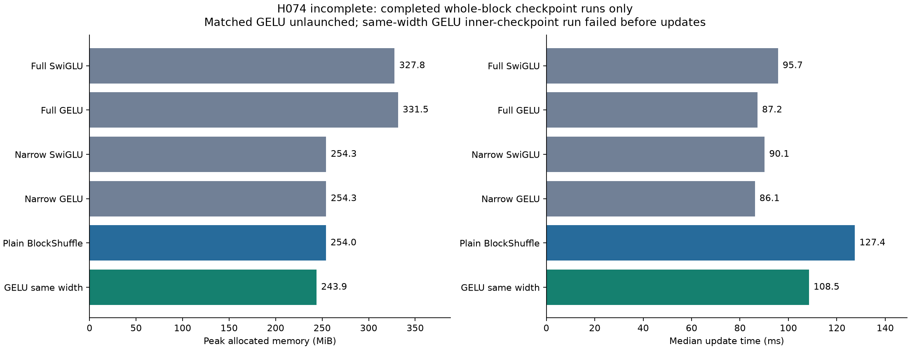

# H074 - Ungated full-model resources: incomplete runtime study

**INCOMPLETE_RUNTIME_FAILURE.** Seventeen of21 planned workers completed;
the eighteenth failed during AdamW construction, before its initial probe or any
optimizer update. The final three were not launched. Neither GELU form earns a
language screen. This is an incomplete qualification, not an architectural
rejection. H073's positive fitting evidence remains unchanged.

The [frozen plan](ungated_resource_plan.md) and [failure record](../results/ungated_resource_v1/failure.json)
preserve the allocation, stopping rule and exact trace. No scientific worker is
retried, no source or threshold is changed after dispatch, and no corpus is used.

## Completed evidence

Whole-block same-width GELU uses **243.913 MiB** at
**108.476 ms/update**, compared with plain BlockShuffle's
254.038 MiB / 127.437 ms and full GELU's
331.538 MiB / 87.196 ms. Same-width GELU is
14.88% faster than plain in this measurement,
but 24.41% slower than full GELU.
Its inner-checkpoint execution remains unmeasured. No matched-width GELU
full-model result exists. Do not select a winning mode or apply the all21-worker
promotion gate to these partial data.

| Form | Mode | Allocated MiB | Reserved MiB | Update ms | Targets/s | Clipped |
|---|---|---:|---:|---:|---:|---:|
| Full SwiGLU | none | 672.483 | 726.000 | 60.479 | 34074 | 30.0% |
| Full SwiGLU | block | 327.788 | 462.000 | 95.701 | 21470 | 30.0% |
| Full SwiGLU | block_inner | 328.975 | 462.000 | 102.229 | 20254 | 30.0% |
| Full GELU | none | 635.858 | 674.000 | 54.307 | 37852 | 5.0% |
| Full GELU | block | 331.538 | 452.000 | 87.196 | 22864 | 5.0% |
| Full GELU | block_inner | 333.350 | 452.000 | 92.910 | 22483 | 5.0% |
| Narrow SwiGLU | none | 491.264 | 528.000 | 56.246 | 37081 | 25.0% |
| Narrow SwiGLU | block | 254.288 | 304.000 | 90.135 | 22852 | 25.0% |
| Narrow SwiGLU | block_inner | 254.288 | 304.000 | 98.694 | 21123 | 25.0% |
| Narrow GELU | none | 468.952 | 518.000 | 53.044 | 38757 | 5.0% |
| Narrow GELU | block | 254.288 | 304.000 | 86.136 | 23691 | 5.0% |
| Narrow GELU | block_inner | 252.788 | 304.000 | 89.343 | 22778 | 5.0% |
| Plain BlockShuffle | none | 752.514 | 790.000 | 78.911 | 26555 | 25.0% |
| Plain BlockShuffle | block | 254.038 | 302.000 | 127.437 | 16132 | 25.0% |
| Plain BlockShuffle | block_inner | 254.350 | 302.000 | 132.448 | 15457 | 25.0% |
| GELU same width | none | 587.545 | 622.000 | 67.150 | 30095 | 5.0% |
| GELU same width | block | 243.913 | 292.000 | 108.476 | 18565 | 5.0% |
| GELU same width | block_inner | failed before updates | - | - | - | - |
| GELU matched | none | unlaunched | - | - | - | - |
| GELU matched | block | unlaunched | - | - | - | - |
| GELU matched | block_inner | unlaunched | - | - | - | - |

All times are fresh-initialization synthetic **training updates**, including
forward, backward, global clipping and AdamW. Synchronization brackets each
update; first10 warm up and the following10 define the timing window. Memory
peaks reset after update10, include model/gradient/optimizer storage and exclude
initial probes, diagnostics and serialization. Reserved memory is reported
separately. No language-quality or autoregressive-serving inference follows.
Each model is a separate sequential process; the short single-device timing
window and fixed run order limit comparisons. All forms were offered the same
three execution modes; missing modes remain missing.

## Model and optimization controls

All use batch16/context128/d384/L8/heads6/vocab4096, BF16 activations with FP32
parameters, TF32 disabled, four CPU threads and native eager Torch. The isolated
ungated configuration explicitly labels two projections; the active factory and
its six variants remain unchanged. Actual parameter counts are checked:

| Form | Hidden | FFN weights, 8 layers | Total weights | FFN reduction | Projection MAC/token/FFN |
|---|---:|---:|---:|---:|---:|
| Full SwiGLU | 1024 | 9,437,184 | 15,735,168 | 0% | 1,179,648 |
| Full GELU | 1536 | 9,437,184 | 15,735,168 | 0% | 1,179,648 |
| Narrow SwiGLU | 304 | 2,801,664 | 9,099,648 | 70.3125% | 350,208 |
| Narrow GELU | 456 | 2,801,664 | 9,099,648 | 70.3125% | 350,208 |
| Plain BlockShuffle | 2048 | 2,801,664 | 9,099,648 | 70.3125% | 350,208 |
| GELU same width | 2048 | 1,867,776 | 8,165,760 | 80.2083% | 233,472 |
| GELU matched (constructor only) | 3264 | 2,801,664 | 9,099,648 | 70.3125% | 350,208 |

MAC counts cover linear projections only; they exclude activation, shuffle,
attention and backward work. Shared seed17 name-local initialization preserves
all non-FFN tensors. Plain and same-width GELU share their common up/down factors.
Transformer down residual scale is1/4. This differs from H073's standalone
unit-row-variance initialization; cross-study resource values are not paired.

All workers use AdamW base rate0.0012, betas(0.9,0.95), eps1e-8, decay0.1 and
clip1. Structured factors use the existing fan-in LR multipliers. Narrow down
weights and learning rates receive their calibrated fan-in corrections exactly
once. The rate is fixed for resource/fidelity qualification, not tuned for GELU
quality. Each form has a different initial function; exactness comparisons are
within forms only. Initial/final layer magnitudes, sampled activation slopes,
near-zero fractions and gradient magnitudes are saved outside timed loops.
Finite measurements are not a whole-network gradient guarantee.

## Independent audit and failure scope

Five isolated harness checks pass before dispatch. Independent CPU inspection
reloads **17 initial/final checkpoint pairs** and verifies finite weights and
all AdamW moments at step20. All **11 available within-form comparisons** are
exact for initial logits/loss/every gradient, all20 losses/preclip norms and final
weights/moments. CPU regeneration reproduces the stream exactly. Shared initial
parameters and adapter identity/optimizer-reference preservation pass.

The completed work comprises **340 updates, 696,320 synthetic training targets
and 34,816 no-update probe targets**. The failed worker performs zero updates or
probe targets; its artifact directory is empty. There are zero corpus targets.
The runtime stops on `SystemError: Unmatched paren in format`, through
`torch._functorch.config`, `torch.utils._config_module` and CPython tokenization.
The source snapshot remains unchanged and no scientific retry occurs.

A separate read-only AST/tokenization probe passes on the implicated configuration
files and tokenizer source. It imports no Torch and does not reproduce the
original process/import state; it establishes neither a cause nor a repair.
The failure cause remains unknown. The prepared full-study audit/coordinator
are retained unexecuted; the partial audit explicitly grants no promotion.

See [independent partial audit](../results/verification/ungated_resource_partial_analysis_v1.json),
[tokenizer probe](../results/verification/ungated_resource_tokenizer_probe_v1.json),
and [final preservation audit](../results/verification/ungated_resource_final_v1.json).
Before continuing the earned resource comparison, investigate the import failure
and explicitly specify any operational recovery while preserving all completed
measurements. No automatic tuning, new architecture, larger budget or language
allocation is justified by an incomplete study. The full research goal remains
unachieved.
