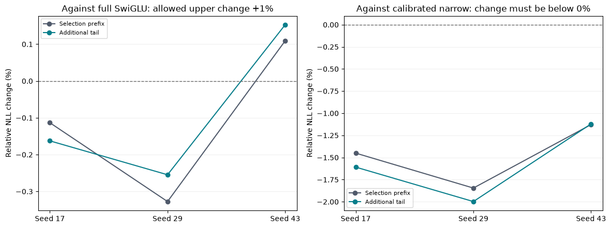

# Previously unscored validation tail: three-seed comparison

All twelve fixed checkpoints were scored on 167,936 additional targets after the replication cohort finished. Every original 32,768-target prefix score reproduced exactly. Read the [frozen plan](validation_tail_plan.md) and [raw measurements](../results/validation_tail_scale384_v1/result.json). This is additional evidence within the same corpus, not a second corpus or convergence result.

| Recipe | Prefix NLL mean +/- SD | Tail NLL mean +/- SD | All complete windows NLL mean +/- SD |
|---|---:|---:|---:|
| Full SwiGLU | 2.774470 +/- 0.003571 | 2.805449 +/- 0.002292 | 2.800391 +/- 0.002431 |
| Full GELU | 2.894640 +/- 0.003904 | 2.926934 +/- 0.005149 | 2.921662 +/- 0.004912 |
| Calibrated narrow SwiGLU | 2.812897 +/- 0.007522 | 2.847873 +/- 0.008354 | 2.842163 +/- 0.008218 |
| BlockShuffle | 2.771399 +/- 0.002924 | 2.802975 +/- 0.004300 | 2.797819 +/- 0.004042 |

| Seed | Tail change/full SwiGLU | Tail change/full GELU | Tail change/calibrated narrow | All tail gates |
|---|---:|---:|---:|---|
| 17 | -0.1626% | -4.4222% | -1.6088% | PASS |
| 29 | -0.2547% | -4.3345% | -1.9977% | PASS |
| 43 | +0.1529% | -3.9480% | -1.1207% | PASS |

The frozen all-seed tail decision is **PASS**. Aggregate tail NLL changes are Full SwiGLU -0.0882%, Full GELU -4.2351%, Calibrated narrow SwiGLU -1.5766%. Negative change favors BlockShuffle.

The tail uses windows 256 through 1567 at context128, with target positions 32769 through 200704 inclusive. These 1312 complete windows form 82 batches of16. Tail targets do not overlap the prefix; the boundary input token is shared. The final98 tokens lack a complete remaining window and are omitted. Every per-window loss and target range is archived and independently checked. The combined NLL weights prefix and tail by32768 and167936 targets, not by equal section weights.

The same four recipes and all three seeds were retained. No strengths, windows or thresholds were changed after tail scores became visible. The result supports transfer beyond the selection prefix within these 1000 validation stories. It does not establish robustness on another corpus, equal historical tuning, convergence, autoregressive speed or architectural novelty. This tail is now scored and cannot be called fresh evidence for future model selection.

Reproduce with `uv run python -m src.core.validation_tail_report`.
