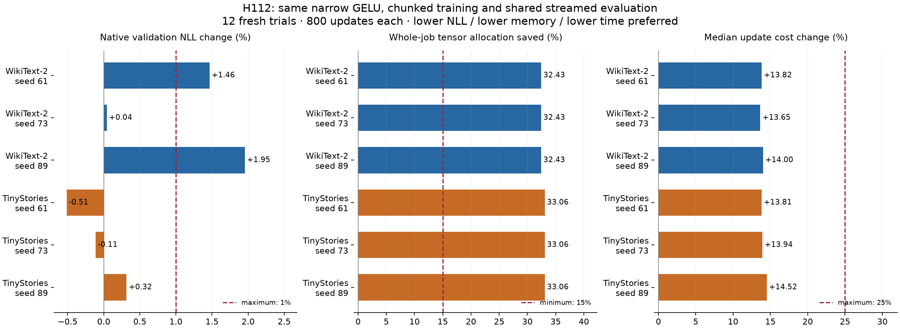

# H112: one-third lower job allocation, with corpus-dependent quality

The fixed recipe **qualifies on TinyStories and fails on WikiText-2**. Twelve
fresh trials complete 9,600 updates. Giving both training policies the qualified
classifier-streaming evaluator retains the training-memory saving throughout
the measured job: **32.43% on WikiText-2 and 33.06% on TinyStories**. Median
updates cost 13.65-14.52% more. All models, Adam states and logged gradients
remain finite.

TinyStories passes every preset gate for all three seeds. Its paired NLL changes
range from -0.514% to +0.316%. WikiText-2 fails the 1% quality allowance for two
seeds, at +1.465% and +1.954%. Its mean paired change is +1.154%. The favorable
single-seed H110 quality observation does not replicate across these fresh
WikiText seeds. The two-corpus claim is rejected, while the TinyStories result
is retained as a scoped memory component. No parameter or architecture changes
are involved, and no breakthrough or general quality-preservation claim follows.

## Controlled comparison

The [prospective plan](whole_job_memory_plan.md) was frozen after
[H111](streamed_evaluation_results.md) qualified the evaluator. H110 remains
closed under its original two-sided execution-fidelity rule. H112 separately
asks about useful quality, using a one-sided allowance and fresh seeds 61/73/89.
No threshold, learning rate, width, chunk size or seed was selected after seeing
these results. The plan requires finishing all twelve trials despite ordinary
gate failures, so both corpora and every seed remain visible.

Both arms use the same narrow GELU decoder: width 384, hidden width 456, eight
layers, six attention heads, vocabulary 4,096, **9,099,648 total parameters and
2,801,664 FFN parameters**. The reference uses whole-block checkpointing and
native mean cross-entropy; the candidate adds 512-token classifier/loss chunks.
Both use H111's classifier-chunk evaluator. Attention context and data order
remain unchanged. This compares execution of an existing FFN, not activation
families or a compressed model against full GELU/SwiGLU.

Each trial uses batch 8, context 512 and 800 updates: 3,276,800 training-token
presentations, or **39,321,600 total**. Constant learning rate 0.0006, AdamW
betas (0.9, 0.95), epsilon 1e-8, matrix weight decay 0.1 and global gradient
clip 1 are identical. Weights and optimizer states are FP32; autocast is BF16,
TF32 is off, and four CPU threads are used. There is no width calibration,
augmentation or rate search. Matching initial tensors and every sampled batch
are verified within each pair. Policy order alternates across seeds/corpora.

Existing frozen caches contain 3,083,650 training tokens for WikiText-2 and
2,457,760 for the 12,000-story TinyStories subset. Each has its own train-only
4,096-token BPE tokenizer. Full validation contains 322,560 / 200,704 scored
targets at context 512. These are previously used development splits, not new
independent test data; no test split is accessed. Losses are compared within
each corpus, never pooled across tokenizers.

## Every seed, using independent native scores

Primary quality is full-validation NLL at update 800, rescored through the
maintained native unchunked evaluator outside the measured training job. Lower
is better. A pair must have NLL ratio <= 1.01, job allocation ratio <= 0.85,
median update-time ratio <= 1.25 and finite training quantities. Every seed must
pass for its corpus to qualify.

| Corpus | Seed | Reference NLL | Chunked NLL | NLL change | Job allocation saved | Update cost change | Decision |
|---|---:|---:|---:|---:|---:|---:|---|
| WikiText-2 | 61 | 4.987338 | 5.060381 | +1.465% | 32.43% | +13.82% | Quality fails |
| WikiText-2 | 73 | 5.059672 | 5.061799 | +0.042% | 32.43% | +13.65% | Pass |
| WikiText-2 | 89 | 4.813881 | 4.907954 | +1.954% | 32.43% | +14.00% | Quality fails |
| TinyStories | 61 | 2.635811 | 2.622268 | -0.514% | 33.06% | +13.81% | Pass |
| TinyStories | 73 | 2.612297 | 2.609421 | -0.110% | 33.06% | +13.94% | Pass |
| TinyStories | 89 | 2.627824 | 2.636129 | +0.316% | 33.06% | +14.52% | Pass |

| Corpus / policy | Mean NLL | Median NLL | Sample variance | Job peak, MiB | Mean of trial median update times, ms |
|---|---:|---:|---:|---:|---:|
| WikiText-2 / reference | 4.953631 | 4.987338 | 0.0159554 | 408.556 | 82.061 |
| WikiText-2 / chunks | 5.010045 | 5.060381 | 0.0078173 | 276.068 | 93.406 |
| TinyStories / reference | 2.625311 | 2.627824 | 0.0001430 | 402.782 | 82.201 |
| TinyStories / chunks | 2.622606 | 2.622268 | 0.0001784 | 269.606 | 93.783 |

The [machine-readable summary](../results/whole_job_memory_workspace_v1/summary.json)
also gives mean, median, sample variance and range for paired ratios, timings,
allocation and clipping. Three seeds do not justify a strong confidence claim.
TinyStories' approximately 0.10% mean NLL improvement is descriptive; the useful
result is its replicated memory saving within the fixed quality allowance.

## Memory, cost and gradient interpretation

These are **actual per-trial PyTorch allocated-tensor peaks**, including CUDA
corpus caches, model/Adam state, training, diagnostics and streamed validation.
They exclude driver/context overhead and other processes. Reserved allocation
is stored separately. The independent native audit is deliberately outside the
measured execution recipe. This is more limited than a whole-process VRAM
measurement, and the same accounting applies to both policies.

For all twelve trials, the training peak is also the overall job peak.
Validation therefore no longer hides the memory benefit, unlike H110's native
evaluation path. H111's earlier fixture-based composed estimates remain
separate; the table above uses only these newly observed jobs. Absolute peaks
from different processes/studies should not be substituted into these pairs.

The full grid takes **922.36 seconds**, excluding initial dependency preload
and qualification. Each update's forward/backward/optimizer time, loss, preclip
norm and allocation are preserved. Timing statistics exclude the first twenty
updates. Clipping affects 1.875-4.0% of WikiText updates and 12.375-19.875% of
TinyStories updates across the two policies. Activation and gradient snapshots
are finite. These facts do not establish convergence, good conditioning or a
general remedy for vanishing/exploding gradients.

Real-arithmetic chunking preserves the CE objective; floating-point execution
can still alter learning trajectories. The experiment establishes the quality
difference but does not isolate its cause. In particular, it does not prove
that autocast caching, gradient summation or any specific kernel caused it.

## Runtime recovery and independent verification

The first fresh-process attempt fails while importing `typing_extensions`
during PyTorch loading, before any update. A recorded single-process
continuation passes qualification but rejects its first zero-allocation
boundary: 17,039,360 bytes remain after garbage collection and empty-cache.
Neither attempt trains a model.

A bounded [workspace diagnosis](../results/cublas_boundary_diagnosis_v1/result.json)
repeats qualification twice without optimization. Both times, the residual is
two 8,519,680-byte active allocations. Clearing only cuBLAS workspaces reduces
allocation to zero. The final [workspace recovery](whole_job_memory_workspace_plan.md)
keeps that strict zero boundary and clears workspaces **only between trials**.
Workspaces are recreated and counted normally during every measurement; zero
workspace bytes are subtracted. All 25 boundaries pass. This diagnoses the
retained workspace allocation, not the native import crashes.

The twelve successful trials run sequentially in one process, with fresh models
and matching seeds, under the absolute UV-managed Python 3.12.9 and installed
PyTorch 2.14.0+cu132 on the RTX4070 Laptop GPU. CUDA context/library state
persists, so these are not fresh-process timing replications. The balanced
policy order and fixed warmup remain intact. The change in process isolation
is explicit in the [recovery plan](whole_job_memory_recovery_plan.md).

The first native-audit launch and first plot launch also encounter access
violations during module loading. Original logs/exits are preserved. A bounded
[audit recovery](whole_job_memory_audit_recovery.md) uses the dependency-preload
order that completed training, then calls the unchanged scorer. Plot recovery
uses that order without initializing CUDA. Neither repeats training or changes
the results. The intermittent native-failure root cause remains unknown.

The independent audit verifies **72 native scores, 48 saved checkpoints, twelve
exact initializations and all 9,600 sampled batches**. It checks finite model/
Adam states, optimizer step 800 and hyperparameters, all histories and every
evaluation's target count/order. Maximum relative streamed/native score
difference is **3.40e-8**, below the fixed 1e-4 tolerance. Therefore evaluator
drift does not explain the observed percent-level quality differences.

The [final receipt](../results/verification/whole_job_memory_final_v1.json)
independently checks frozen hashes, corpus files, paired arithmetic, all gates,
distribution statistics and lossless exports. The 61 maintained files remain
unchanged from the previous **116-test pass**; those tests are not rerun or
recounted as these isolated qualifications. Full local states and histories
remain available, while compact results, source, failures and figures are
retained for review. See the [source guide](../results/whole_job_memory_workspace_v1/source/README.md).

## Research decision and next discriminator

Retain H111 classifier streaming and H112's TinyStories execution result as
scoped components. Close the fixed H112 two-corpus recipe. Preserve WikiText's
negative evidence instead of tuning rates or duration under the same label.
The maintained tree remains two model folders, five variants and eight recipes.

The next justified question is whether the classifier's numerical execution
can be made more faithful at the same memory budget. A cheap matched-state
gradient comparison should first distinguish decoder gradients, classifier
gradients and reduction/cast effects against a higher-precision reference.
Any changed execution policy needs its own frozen correctness, memory and time
gates before further language training. This is a proposed diagnostic, not a
measured mechanism or an allocated new training grid.

Classifier memory reduction is established prior art, including
[Cut Your Losses](https://arxiv.org/abs/2411.09009). These experiments use ordinary
PyTorch chunks, not its specialized kernels. The workspace accounting is
consistent with [PyTorch's CUDA memory documentation](https://docs.pytorch.org/docs/2.14/notes/cuda.html).
Neither the local measurement nor an elementary loss-partition identity is a
new activation, SOTA result or theorem of universal superiority. The broader
VRAM/quality objective and separate parameter-efficient FFN target remain open.
