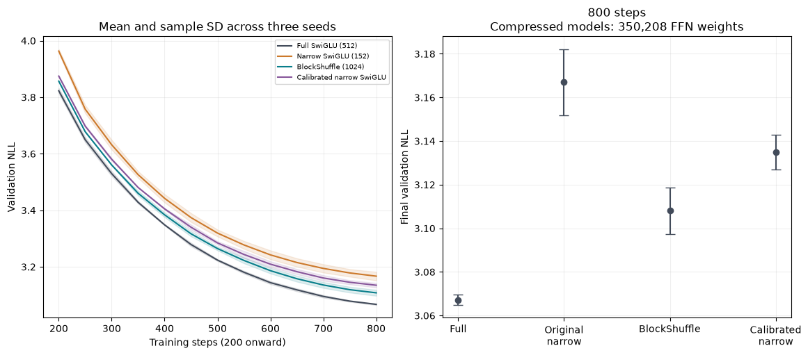

# A stronger narrow SwiGLU reference

Changing the output-projection learning rate improves the conventional narrow control without adding parameters or forward operations. This reduces the apparent advantage of the structured recipe. It does not establish a new nonlinear primitive or satisfy the full research target.

## Frozen ablations

At hidden width 152, calibration uses initial down-weight gain sqrt(64/19) and down-projection LR multiplier 64/19. The matching decay coefficient is 0.1/(64/19), preserving the original pure AdamW shrinkage exactly. Initialization and LR are tested separately. All other weights, optimizer settings, data order and compute budgets stay fixed. See [the calculation and frozen plan](width_calibration_plan.md).

| Seed-17 recipe, 200 steps | NLL | Change versus original narrow |
|---|---:|---:|
| Original narrow | 4.338559 | +0.000% |
| init_only | 4.342113 | +0.082% |
| lr_only | 4.178481 | -3.690% |
| init_and_lr | 4.166703 | -3.961% |

Initialization alone does not improve this screen. Most of the observed gain comes from LR; both together give the lowest NLL and earn the predeclared longer-budget check. The early gain is not extrapolated to 800 steps.

## Three-seed comparison at 800 steps

Every run uses 1,638,400 training tokens, the same frozen TinyStories cache and 32,768 validation targets. Seeds are 17, 29 and 43. The calibrated recipe was selected using seed 17. All compressed methods have 350,208 FFN weights and 1,728,192 total weights: reductions of 70.3125% and 32.43% relative to full SwiGLU. Initialization and optimizer recipes are explicitly different; this does not equalize all hyperparameter-search effort.

| Method | Mean NLL +/- sample SD | Training tokens/s, mean | Peak training MiB, max |
|---|---:|---:|---:|
| Full SwiGLU (512) | 3.067138 +/- 0.002325 | 25,919 | 256.57 |
| Narrow SwiGLU (152) | 3.166971 +/- 0.015172 | 25,734 | 222.50 |
| BlockShuffle (1024) | 3.108014 +/- 0.010612 | 17,652 | 272.37 |
| Calibrated narrow SwiGLU | 3.134833 +/- 0.007913 | 26,111 | 221.66 |

| Seed | Full SwiGLU | Original narrow | BlockShuffle | Calibrated narrow |
|---|---:|---:|---:|---:|
| 17 | 3.065045 | 3.149475 | 3.098956 | 3.126104 |
| 29 | 3.066728 | 3.174935 | 3.119690 | 3.136860 |
| 43 | 3.069640 | 3.176504 | 3.105398 | 3.141535 |

Negative paired differences favor the first method. These exploratory 95% Student-t intervals assume normal differences across three seeds and exclude data/model-selection uncertainty.

- calibrated minus original narrow: mean difference -0.032139, interval [-0.051390, -0.012887], mean paired relative difference -1.014%.
- calibrated minus full: mean difference +0.067695, interval [+0.053250, +0.082139], mean paired relative difference +2.207%.
- blockshuffle minus calibrated: mean difference -0.026818, interval [-0.050388, -0.003248], mean paired relative difference -0.855%.

## Scope and next use

Retain both original and calibrated references. Any new primitive should compare against the stronger conventional recipe. The original structured result remains a measurement against its stated control; it must not be presented as a gain over a fully tuned narrow model. Calibration is an optimization control inspired by prior width-aware parameterization, with an elementary variance/decay calculation. It is not architectural novelty or a universal stability result.

Equal-execution serving appears below; checkpoint diagnostics are linked from the current state. No scaling, broader-corpus, convergence or autoregressive-generation claim follows from these micro-model runs. Regenerate this report with `uv run python -m src.core.width_report`. Raw [summary JSON](../results/width_calibration_summary.json) records all paired differences and metric hashes.

## Equal-execution serving, seed 17

Both modes use batch 16, context 128 and BF16. Ratios are candidate throughput divided by full SwiGLU throughput within rotating timing rounds; this is full-sequence inference, not autoregressive generation.

| Execution | Median throughput ratio | Range | Candidate peak MiB | Full peak MiB |
|---|---:|---:|---:|---:|
| Eager | 1.051 | 0.808-1.149 | 103.02 | 107.76 |
| CUDA graph, corrected memory | 1.159 | 1.140-1.177 | 131.99 | 135.17 |

Graph memory includes context workspaces and live model/output storage; it uses the corrected [shared-stream protocol](graph_memory_correction.md). Raw [eager](../results/serving_width_calibrated_eager.json) and [graph](../results/serving_width_calibrated_graph_v2.json) records retain all rounds and correctness checks. Training-memory measurements are separate and unaffected by the graph correction.
