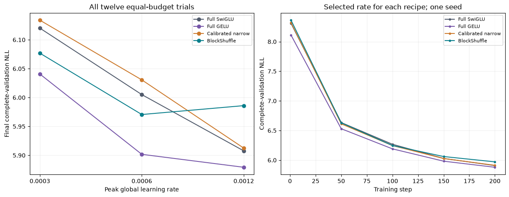

# WikiText-2: equal-budget transfer screen

The frozen promotion decision is **FAIL**. Every recipe received the same three-rate, 200-step tuning budget on the new corpus. Selection uses final complete-validation NLL. Read the [frozen plan](wikitext_screen_plan.md), [source/cache design](broader_corpus_design.md), [raw cohort](../results/wikitext_screen_v1/result.json) and [cache reconstruction](../results/verification/wikitext_reconstruction_v1.json).

## Selected recipe comparison

| Recipe | Selected peak LR | Final NLL | Unique FFN weights | Total weights | Peak allocated MiB | Clipped steps |
|---|---:|---:|---:|---:|---:|---:|
| Full SwiGLU | 0.0012 | 5.907694 | 9,437,184 | 15,735,168 | 702.19 | 10.5% |
| Full GELU | 0.0012 | 5.879278 | 9,437,184 | 15,735,168 | 656.62 | 12.0% |
| Calibrated narrow | 0.0012 | 5.912434 | 2,801,664 | 9,099,648 | 516.28 | 8.5% |
| BlockShuffle | 0.0006 | 5.970604 | 2,801,664 | 9,099,648 | 714.12 | 16.0% |

Selected BlockShuffle NLL changes: +1.0649% versus full SwiGLU, +1.5534% versus full GELU, and +0.9839% versus calibrated narrow. Its FFN/total reductions remain 70.3125% / 42.17%. These compare explicitly different FFN initialization and optimizer treatments under equal new global-rate search budgets.

## Every allocated trial

| Recipe | Peak LR | Initial NLL | Final NLL | Final pre-clip gradient norm |
|---|---:|---:|---:|---:|
| Full SwiGLU | 0.0003 | 8.380633 | 6.120134 | 1.1226 |
| Full SwiGLU | 0.0006 | 8.380633 | 6.005087 | 0.8979 |
| Full SwiGLU | 0.0012 | 8.380633 | 5.907694 | 0.7273 |
| Full GELU | 0.0003 | 8.369674 | 6.040670 | 0.8992 |
| Full GELU | 0.0006 | 8.369674 | 5.901685 | 0.7777 |
| Full GELU | 0.0012 | 8.369674 | 5.879278 | 0.6864 |
| Calibrated narrow | 0.0003 | 8.386935 | 6.133922 | 1.1441 |
| Calibrated narrow | 0.0006 | 8.386935 | 6.030559 | 0.9943 |
| Calibrated narrow | 0.0012 | 8.386935 | 5.912434 | 0.7072 |
| BlockShuffle | 0.0003 | 8.394432 | 6.076798 | 1.0268 |
| BlockShuffle | 0.0006 | 8.394432 | 5.970604 | 0.8760 |
| BlockShuffle | 0.0012 | 8.394432 | 5.985974 | 0.7200 |

## Frozen gates

| Check | Decision |
|---|---|
| at least 70 percent fewer ffn weights | PASS |
| beats calibrated narrow | FAIL |
| within one percent full swiglu | FAIL |
| memory within ten percent full swiglu | PASS |
| within one percent full gelu | FAIL |
| memory within ten percent full gelu | PASS |
| all trial activation diagnostics finite | PASS |

Grid-boundary winners: Full SwiGLU, Full GELU, Calibrated narrow. A boundary winner means this grid did not bracket the optimum. The grid is not expanded after seeing results. All twelve histories, initial/final diagnostics, checkpoints and source archives are retained.

## What this evidence establishes

The official raw train/validation files match their pinned published content hashes. Top-level headings delimit 629 training units and 60 validation units, with subsection headings preserved. Five normalized exact train duplicates are removed. The training-only 4,096-entry byte BPE produces 3,083,650 training tokens and 322,802 validation tokens with no unknown-token occurrences. A second cache construction using the archived tokenizer matched every stored file hash.

Validation covers 2,521 context-128 windows and exactly 322,688 targets, including a final batch of nine windows. Preflight compared the actual concatenated target stream against the source tokens, actual common initial weights and parameter counts, real-token finite backward, and unchanged shared training/attention/data sources. Every run uses 409,600 sampled training tokens, about 0.133 cache exposures. This is far from a convergence study.

This is one seed and selection on the same complete validation split used for choosing rates. The official test split is still unfetched and unscored. Equal new tuning does not erase the earlier unequal architecture search. These BPE NLLs cannot be compared to TinyStories scores or published word-level WikiText perplexities. Sequential native inference logs do not establish a paired serving advantage. No post-training floor or fused kernel changes were used in training.

Next decision: The frozen candidate does not earn the 800-step cohort. Inspect which quality, memory or optimization gate failed before defining another hypothesis; do not silently relax the threshold.

Current efficient-FFN comparators, convergence, longer-context behavior, full-network stability and verified novelty remain outstanding.
